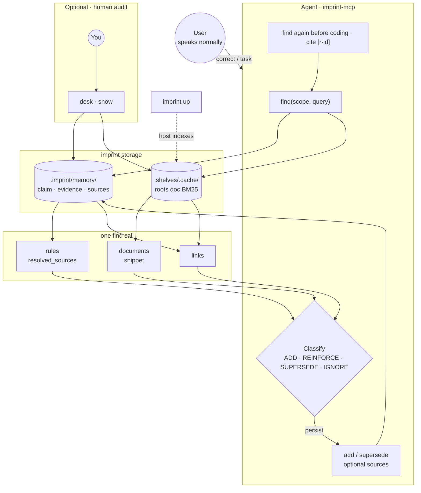
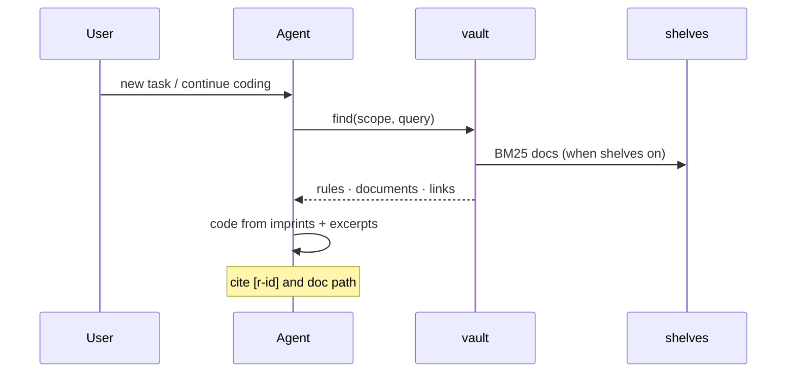

<div align="center">


# imprint

**Portable markdown memory for AI agents**

English · [中文](README.zh.md)

[](https://github.com/SteamedBread2333/imprint/releases)


</div>

User corrections become durable rules in `.imprint/memory/`. Agents recall them before the next edit. **You talk normally; the agent maintains the vault.**

---

## Quick start

```bash
go install github.com/SteamedBread2333/imprint/cmd/imprint@latest
go install github.com/SteamedBread2333/imprint/cmd/imprint-mcp@latest
cd your-project && imprint init
```

Optional: merge [docs/examples/cursor-mcp.json](docs/examples/cursor-mcp.json) into `.cursor/mcp.json` and restart the editor. Without MCP, agents can use `imprint --json` directly.

| | You | imprint |
| --- | --- | --- |
| **1** | Install + `init` | Writes editor rules (Cursor, Claude Code, Codex, Trae, Workbuddy) |
| **2** | Code and correct in plain language | Agent `find` (vault + shelves) → classify → `add`/`reinforce`/… (optional `sources`) |
| **3** | Browser audit (optional) | `imprint up` → `imprint desk open` |



<details>
<summary>Before coding (sequence)</summary>



</details>

---

## CLI

Global flags: `--vault PATH` · `--global` · `--json` (machine-readable stdout for agents)

### Everyday — vault

Direct read/write. **No host required.**

| Command | What it does |
| --- | --- |
| `imprint init` | Write agent rules; does not write MCP config |
| `imprint find [--scope a,b] [--query TEXT]` | Recall imprints (scope **AND**); with query + shelves → also `documents`, `links` |
| `imprint add CLAIM --scope a,b --text ORIG` | Create an imprint (MCP may include `sources` linking docs) |
| `imprint reinforce ID [--evidence TEXT]` | Strengthen a rule (+0.1 confidence) |
| `imprint supersede OLD --claim NEW --scope a,b` | Replace a rule; old → `superseded` |
| `imprint forget ID` | Delete permanently |
| `imprint list` · `show` · `get ID` | Browse and inspect |
| `imprint sweep` · `export` | Decay stale rules · dump JSON |

```bash
imprint find --scope go,naming --query PascalCase
imprint add "Use snake_case" --scope python,naming --text "user said snake_case"
imprint get r-2026-09-11-001
```

### Everyday — local stack

For desk and the vault graph, **these two are enough**:

| Command | What it does |
| --- | --- |
| `imprint up` | Start the local stack (vault API, shelves, enabled desk, …) |
| `imprint down` | Stop the local stack |
| `imprint desk open` | Open desk in the browser (**does not start** services; run `up` first) |
| `imprint status` | Snapshot of running services |

```bash
imprint up && imprint desk open
# when done:
imprint down
```

After editing `imprint.yaml`: run `down` then `up`.

<details>
<summary>Advanced: split host / plugin control (debug)</summary>

| Command | What it does |
| --- | --- |
| `imprint host start` / `host stop` | Host only (includes shelves) |
| `imprint plugin start` / `plugin stop` | External plugins only |
| `plugin list` · `enable` · `disable` | Toggle plugins in yaml |

For everyday use, `up` / `down` is enough — you do not need these subcommands.

</details>

Shelves is **host config** (top-level `shelves:`), not a plugin. See [docs/shelves-builtin.md](docs/shelves-builtin.md).

### Debug & advanced

| Command | What it does |
| --- | --- |
| `imprint host serve [--listen ADDR]` | Foreground host (Ctrl+C) |
| `imprint migrate-shards [--dry-run]` | Import legacy `imprint-*.md` into `vault.db` (one-off) |
| `imprint clear --confirm --yes` | Delete every rule — irreversible |
| `imprint version` | Print version |

Run `imprint --help` or `imprint help <cmd>` for full flags.

---

## Vault layout

Default: `./.imprint/memory/` (walk up for `.imprint/`). `--global` → `~/.imprint`. Override with `--vault` or `IMPRINT_VAULT`.

```
.imprint/
  imprint.yaml          # host + shelves.roots + plugins
  memory/vault.db       # SQLite vault (rules, evidence, edges, sources)
  .shelves/.cache/      # doc index under roots (SQLite, gitignored)
docs/                   # typical root
.cursor/rules/          # typical root
```

Rules live in `memory/vault.db`. IDs: `r-YYYY-MM-DD-NNN`. Status: `active` | `dormant` | `superseded`. `supersede` marks old rules superseded; `sweep` decays stale rules to dormant; `forget` deletes. Interactive rule graph: **`imprint desk open`** (host `GET /graph`).

---

## Shelves & desk

| | Where it runs | Config |
| --- | --- | --- |
| **Shelves** | **host** | `shelves.enabled`, `config.roots` in [imprint.yaml](docs/examples/imprint.yaml) |
| **Desk** | External plugin | `plugins.desk` + [imprint-desk-plugin](https://github.com/SteamedBread2333/imprint-desk-plugin) |

**What shelves does:** Indexes markdown under `roots` in `imprint.yaml` (e.g. `docs/`, `.cursor/rules/`) — **not** “the LLM already read the whole repo.” Before coding, agents `find(scope, query)` get vault imprints, document snippets, and `links` in **one** call. Local BM25 index; no embedding API.

**Why `roots` matters:** Only listed directories are indexed and searchable — scope what agents recall and keep rebuilds fast. See [docs/shelves-builtin.md](docs/shelves-builtin.md).

**Linking:** After a user correction, agents can set vault `sources` (imprint→doc) on ADD **without editing project markdown**. `get r-…` returns `resolved_sources`. Design: [docs/imprint-shelves-linking.md](docs/imprint-shelves-linking.md).

One MCP mount (`imprint-mcp`). With shelves on and `find` + query, the response includes `rules`, `documents`, and `links`.

---

## Install & release

```bash
docker pull ghcr.io/steamedbread2333/imprint:latest   # or GitHub Releases binaries
make install          # from clone
make publish V=X.Y.Z  # tag + CI → Release + GHCR
```

Local builds without a tag print `devel`.

---

## Documentation

| Topic | English | 中文 |
| --- | --- | --- |
| MCP mount | [docs/mcp.md](docs/mcp.md) | [docs/mcp.zh.md](docs/mcp.zh.md) |
| Editor `init` | [docs/editors.md](docs/editors.md) | [docs/editors.zh.md](docs/editors.zh.md) |
| Shelves & linking | [docs/shelves-builtin.md](docs/shelves-builtin.md) · [docs/imprint-shelves-linking.md](docs/imprint-shelves-linking.md) | [docs/shelves-builtin.zh.md](docs/shelves-builtin.zh.md) · [docs/imprint-shelves-linking.zh.md](docs/imprint-shelves-linking.zh.md) |
| Correction loop | [docs/correction.md](docs/correction.md) | [docs/correction.zh.md](docs/correction.zh.md) |

MCP examples (merge manually): [cursor-mcp.json](docs/examples/cursor-mcp.json) · [cursor-mcp-global.json](docs/examples/cursor-mcp-global.json)

---

## Go module

```go
import "github.com/SteamedBread2333/imprint/pkg/imprint"

v, _ := imprint.Open("./.imprint/memory")
v.Add("Use gofmt", []string{"go"}, "gofmt", 0.6)
v.Find([]string{"go"}, "", 5)
```

Classification (ADD / REINFORCE / SUPERSEDE / IGNORE) and “should I write this?” are the **agent’s** job. imprint is the store: write, recall, reinforce, supersede, decay.

MIT
