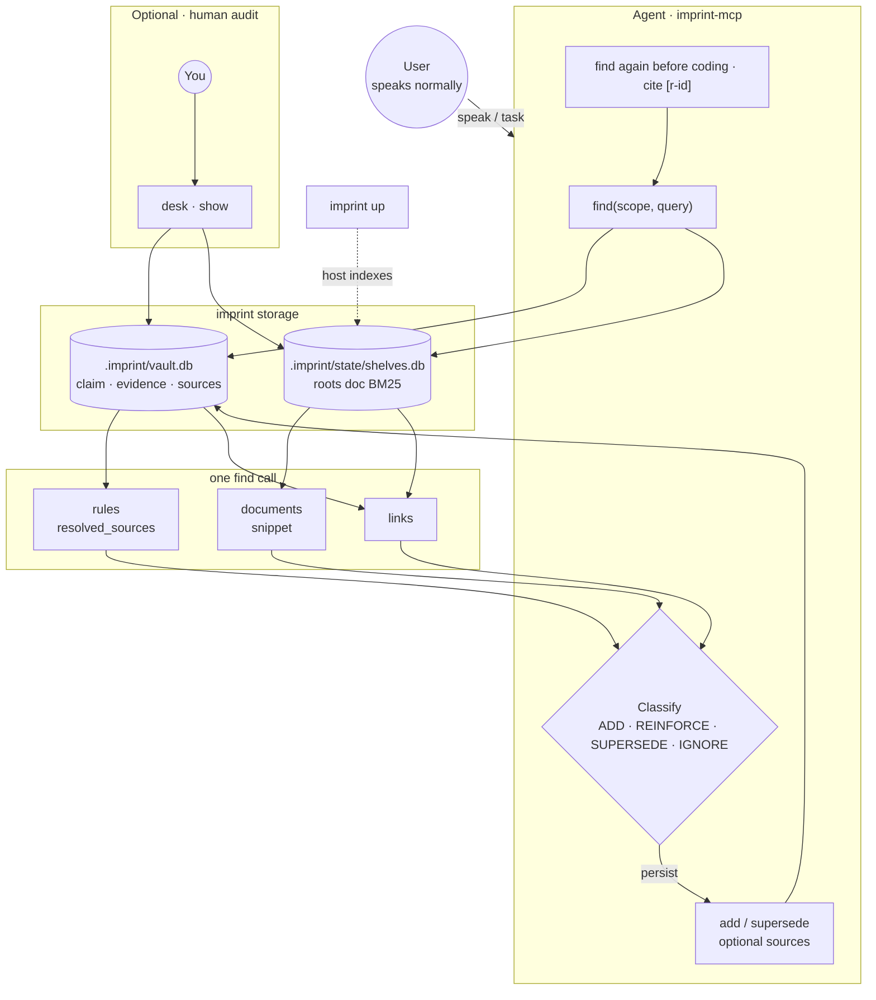
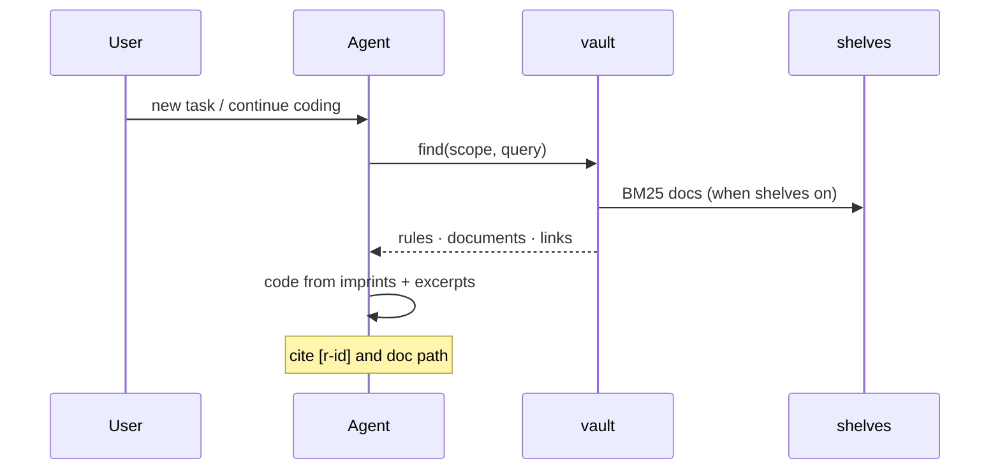

<div align="center">


# imprint

**A vault of project policy for AI agents**

English · [中文](README.zh.md)

[](https://github.com/SteamedBread2333/imprint/releases)


</div>

Conversation becomes durable rules. The agent classifies each turn, links rules to project docs, and recalls before the next edit. **You talk normally; you do not maintain the vault.**

## How it works

| | When | Example |
| --- | --- | --- |
| **ADD** | New long-term preference | Naming rule, workflow, architecture boundary |
| **REINFORCE** | Same policy again | “Yes, still PascalCase for exports” |
| **SUPERSEDE** | Policy changed | Narrow scope, widen scope, replace claim |
| **IGNORE** | Task-only turn | One-off refactor, chit-chat, secrets |

When the user rejects a stored rule (“don’t record that”), the agent `find`s and calls `forget`. Write loop: [Memory writes](docs/correction.md).

Vault holds claim, evidence, and optional doc pointers (`sources`). Shelves indexes markdown under `roots` so one `find` returns rules, snippets, and links.

## Quick start

```bash
go install github.com/SteamedBread2333/imprint/cmd/imprint@latest
go install github.com/SteamedBread2333/imprint/cmd/imprint-mcp@latest
cd your-project && imprint init
```

Mount imprint MCP in your editor ([docs/mcp.md](docs/mcp.md)). CLI fallback: `imprint --json`.

| | You | imprint |
| --- | --- | --- |
| **1** | Install + `init` | Writes `imprint.yaml` and editor rules (Cursor, Claude Code, Codex, Trae, Workbuddy) |
| **2** | Speak normally | Agent `find` (vault + shelves) → classify → `add` / `reinforce` / … (optional `sources`) |
| **3** | Browser audit (optional) | `imprint up` → `imprint desk open` |

<details>
<summary>Agent loop (flowchart)</summary>



</details>

<details>
<summary>Before coding (sequence)</summary>



</details>

## Storage

Commit `imprint.yaml` (roots, plugin switches, tunables). Private runtime is gitignored under `.imprint/`.

Default vault directory: `./.imprint/` (walk up for `imprint.yaml` or `.imprint/`). `--global` → `~/.imprint`. Override with `--vault` or `IMPRINT_VAULT`.

```
imprint.yaml            # git: host + shelves.roots + plugins + supersede.inheritance_alpha
.imprint/               # gitignore: private runtime
  vault.db              # SQLite vault (rules, evidence, edges, sources)
  vault.db-wal          # WAL journal; created while a process has the vault open
  vault.db-shm          # WAL shared-memory index (same lifetime)
  state/
    shelves.db          # rebuildable doc index (also uses WAL; may show -wal/-shm)
    plugins/            # plugin derived state
  export/               # optional md/json projections
docs/                   # typical shelves root
.cursor/rules/          # typical shelves root
```

Vault and shelves open SQLite in WAL mode so CLI, MCP, and host can read and write across processes. `-wal` / `-shm` next to a `*.db` are normal; they stay under `.imprint/` (gitignored). Do not commit them, and do not delete them while imprint is running.

Rules live in `vault.db`. IDs: `r-YYYY-MM-DD-NNN`. Status: `active` | `dormant` | `superseded`. `supersede` marks old rules superseded; `sweep` decays stale rules to dormant; `forget` deletes. Interactive graph: **`imprint desk open`** (host `GET /graph`).

| | Where it runs | Config |
| --- | --- | --- |
| **Shelves** | **host** | `shelves.enabled`, `config.roots` in [imprint.yaml](docs/examples/imprint.yaml) |
| **Desk** | External plugin | `plugins.desk` + [imprint-desk-plugin](https://github.com/SteamedBread2333/imprint-desk-plugin) |

Shelves indexes markdown under `roots` (e.g. `docs/`, `.cursor/rules/`). One MCP mount (`imprint-mcp`); with shelves on, `find` + query returns `rules`, `documents`, and `links`. See [docs/shelves-builtin.md](docs/shelves-builtin.md).

## CLI

Global flags: `--vault PATH` · `--global` · `--json` (machine-readable stdout for agents)

### Vault

| Command | What it does |
| --- | --- |
| `imprint init` | Write `imprint.yaml` (if missing) and editor agent rules |
| `imprint find [--scope a,b] [--query TEXT]` | Recall imprints (scope **AND**); with query + shelves → also `documents`, `links` |
| `imprint add CLAIM --scope a,b --text ORIG` | Create an imprint (MCP may include `sources` linking docs) |
| `imprint reinforce ID --evidence TEXT` | Strengthen a rule after explicit reaffirmation (diminishing gain, cap 0.95) |
| `imprint supersede OLD --claim NEW --scope a,b` | Replace a rule; old → `superseded` |
| `imprint forget ID` | Delete permanently (lifecycle event remains) |
| `imprint list` · `show` · `get ID` · `report` | Browse, inspect, and audit lifecycle / recall / telemetry |
| `imprint sweep` · `export` | Decay stale rules · write `.imprint/export/vault.json` or `vault.jsonl` (`--format jsonl`) |

```bash
imprint find --scope go,naming --query PascalCase
imprint add "Use snake_case" --scope python,naming --text "user said snake_case"
imprint get r-2026-09-11-001
```

### Local stack

| Command | What it does |
| --- | --- |
| `imprint up` | Start the local stack (vault API, shelves, enabled desk, …) |
| `imprint down` | Stop the local stack |
| `imprint desk open` | Open desk in the browser (requires `up` first) |
| `imprint status` | Snapshot of running services |

```bash
imprint up && imprint desk open
# when done:
imprint down
```

After editing `imprint.yaml`: run `down` then `up`.

<details>
<summary>Debug: host, plugins, irreversible clear</summary>

| Command | What it does |
| --- | --- |
| `imprint host start` / `host stop` | Host only (includes shelves) |
| `imprint plugin start` / `plugin stop` | External plugins only |
| `plugin list` · `enable` · `disable` | Toggle plugins in yaml |
| `imprint host serve [--listen ADDR]` | Foreground host (Ctrl+C) |
| `imprint clear --confirm --yes` | Delete every rule — irreversible |
| `imprint version` | Print version |

</details>

Run `imprint --help` or `imprint help <cmd>` for full flags.

## Writes & recall

- **Compact recall:** MCP `find` returns claim/count metadata and bounded document snippets by default; `get r-…` folds evidence and source text. Use `include_evidence` or `full` only for audit. Dormant rules can contribute at most one penalized `wake_candidate`; only an explicit `reinforce` wakes one.
- **Write safety:** `add`, `reinforce`, and `supersede` reject likely secrets and personal data. Source paths must remain inside the workspace and may not target credentials, `.env*`, `*.pem`, or `*.key`. `add` also rejects high-similarity active duplicates. `reinforce` requires non-empty evidence and uses diminishing confidence gain; find hits only update recall stats.
- **Supersede confidence:** successor decays the gap above 0.6 by `supersede.inheritance_alpha` in `imprint.yaml` (default 0.20; 0 copies old, 1 drops to baseline).
- **Scopes:** language tags (`ts`, `tsx`, `golang`) canonicalize via GitHub Linguist (go-enry); non-language tags pass through.
- **Audit:** `imprint report --days 30` summarizes lifecycle events, duplicates, conflicts, zero-recall rules, and telemetry latency. Telemetry is a daily JSONL under `.imprint/state/telemetry/` and never stores query, claim, evidence, or path text.
- **Linking:** vault `sources` point rules at doc paths or headings; compact `get r-…` returns pointers, `full:true` resolves excerpts. Design: [docs/imprint-shelves-linking.md](docs/imprint-shelves-linking.md).

## Documentation

| Topic | English | 中文 |
| --- | --- | --- |
| MCP mount | [docs/mcp.md](docs/mcp.md) | [docs/mcp.zh.md](docs/mcp.zh.md) |
| Editor `init` | [docs/editors.md](docs/editors.md) | [docs/editors.zh.md](docs/editors.zh.md) |
| Shelves & linking | [docs/shelves-builtin.md](docs/shelves-builtin.md) · [docs/imprint-shelves-linking.md](docs/imprint-shelves-linking.md) | [docs/shelves-builtin.zh.md](docs/shelves-builtin.zh.md) · [docs/imprint-shelves-linking.zh.md](docs/imprint-shelves-linking.zh.md) |
| Write loop & scenarios | [docs/correction.md](docs/correction.md) | [docs/correction.zh.md](docs/correction.zh.md) |
| Testing & acceptance | [docs/testing.md](docs/testing.md) | [docs/testing.zh.md](docs/testing.zh.md) |

MCP mount examples: [docs/mcp.md](docs/mcp.md) · [docs/mcp.zh.md](docs/mcp.zh.md)

## Install & library

```bash
docker pull ghcr.io/steamedbread2333/imprint:latest   # or GitHub Releases binaries
make install          # from clone
make publish V=X.Y.Z  # tag + CI → Release + GHCR
```

Local builds without a tag print `devel`.

```go
import "github.com/SteamedBread2333/imprint/pkg/imprint"

v, _ := imprint.Open("./.imprint")
v.Add("Use gofmt", []string{"go"}, "gofmt", 0.6)
v.Find([]string{"go"}, "", 5)
```

MIT
