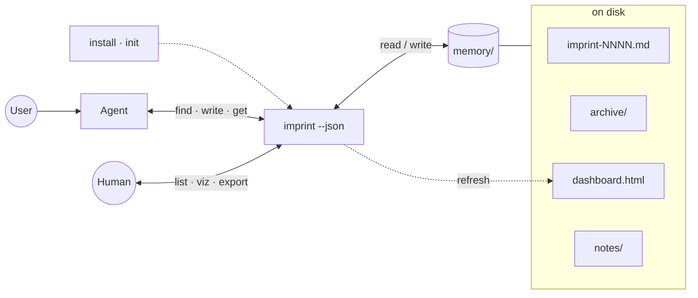
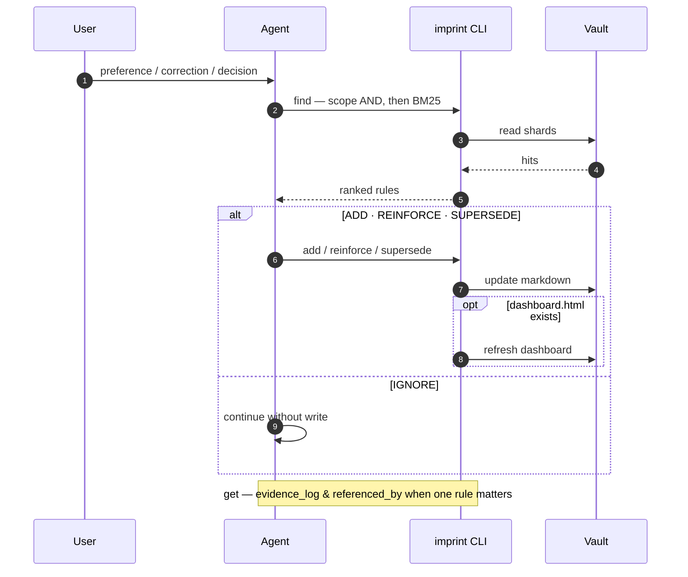

<div align="center">
  
  <h1>imprint</h1>
  <p><em>AI agent long-term memory</em></p>
  <p>
    <strong>English</strong> ·
    <a href="README.zh.md">中文</a>
  </p>
  <p>
    <a href="https://github.com/SteamedBread2333/imprint/releases"></a>
    
    
  </p>
</div>

User corrections → portable markdown. Go static binary, zero runtime, MIT.

Agents forget. Users repeat themselves. imprint is shared, file-backed memory: preferences and corrections in `./memory/`, recalled before the next edit. **You talk normally; the agent maintains the vault.**

## Quick start

**Three steps** (about two minutes):

```bash
go install github.com/SteamedBread2333/imprint/cmd/imprint@latest
go install github.com/SteamedBread2333/imprint/cmd/imprint-mcp@latest
cd your-project
imprint init
```

Optional — mount MCP in `.cursor/mcp.json` (merge [docs/examples/cursor-mcp.json](docs/examples/cursor-mcp.json)). Restart the editor. Skip MCP if you prefer `imprint --json` only.

| Step | You do | imprint does |
| --- | --- | --- |
| 1 | Install + `imprint init` | Writes agent rules for Cursor, Claude Code, Codex, Trae, Workbuddy |
| 2 | Code and correct in plain language | Agent `find` → ADD / REINFORCE / SUPERSEDE / IGNORE → writes `./memory/` |
| 3 | Open `memory/dashboard.html` when curious | List / graph view of what was recorded |

<p align="center">home: census list view (unfiltered).</p>


<p align="center">graph view: radial relation map, scope-colored nodes.</p>


Further reading → [Documentation](#documentation) (all files under `docs/`).





| Phase | What happens |
| --- | --- |
| **Bootstrap** | [Quick start](#quick-start) — `imprint init`; optional MCP ([docs/mcp.md](docs/mcp.md)). Vault: `./memory/`, or `~/.imprint` with `--global`, or `--vault` / `IMPRINT_VAULT`. |
| **Agent loop** | `find` recalls; the agent classifies **ADD / REINFORCE / SUPERSEDE / IGNORE**; writes go through `add`, `reinforce`, or `supersede` (old rule → `archive/`). `get` loads one rule with evidence and backlinks. |
| **Vault** | Rules pack into `imprint-NNNN.md` shards; `sweep` and `supersede` move copies to `archive/`; `forget` deletes and strips inbound links. |
| **Human views** | Same CLI: `list`, `show`, `get`, `export`. `viz` builds `dashboard.html` (list / graph, filters, URL state, EN/中文), mermaid on stdout, or read-only `notes/` cards. |
| **Not here** | Whether to write at all is the agent's judgment call (ADD / REINFORCE / SUPERSEDE / IGNORE). |

Agents use MCP tools or `imprint --json`. `notes/` is generated; do not hand-edit it.

## Install

See [Quick start](#quick-start). Also: [GitHub Releases](https://github.com/SteamedBread2333/imprint/releases) binaries, or:

```bash
docker pull ghcr.io/steamedbread2333/imprint:latest
```

From a clone:

```bash
make install
# or
make build   # writes ./imprint
make dist    # cross-compile darwin/linux/windows → dist/*.tar.gz|zip
make publish V=X.Y.Z   # tag vX.Y.Z and push (CI uploads Release + GHCR)
```

GitHub has no Go package registry. Publishing puts **binaries on the GitHub Release** and the **image on GHCR (Packages)**.

The version you type at publish time is the only one that matters: it becomes the git tag, the module version, `imprint version`, and the GHCR label. Local builds without a tag print `devel`.

## Vault

Default project vault is `./memory/` (or the nearest `memory/` walking up from cwd). `--global` uses `~/.imprint`. `--vault PATH` and `IMPRINT_VAULT` override both.

```
memory/
  imprint-0001.md
  archive/
    imprint-0001.md
  dashboard.html          # offline graph; regenerated on write if it already exists
  notes/                  # optional: imprint viz --format notes (read-only cards)
    r-2026-09-11-001.md
```

Rules are packed into `imprint-NNNN.md` shards (legacy `r-YYYY-MM-DD-NNN.md` files are still read and compacted on open). A new shard starts at **32768 lines** or **1 MiB**, whichever comes first — large enough that a typical project stays in one file, small enough that reinforce still rewrites well under a millisecond on SSD.

Several frontmatter documents live in one shard. `forget` removes one document, not the file, and strips that id from other rules’ `related` / `supersedes` / `conflicts_with`. Marshal may append a derived `See also: [[r-…]]` footer; YAML remains the source of truth.

```markdown
<!-- imprint pack (2 rules) -->
---
id: r-2026-09-11-001
claim: Python function names must always be snake_case
scope:
    - python
    - naming
confidence: 0.6
status: active
reinforcement_count: 0
created_at: 2026-09-11T12:00:00Z
updated_at: 2026-09-11T12:00:00Z
last_touched_at: 2026-09-11T12:00:00Z
supersedes: []
related: []
conflicts_with: []
evidence_log:
    - at: 2026-09-11T12:00:00Z
      kind: original
      text: use snake_case
---
---
id: r-2026-09-11-002
claim: Use 4-space indents
scope:
    - python
    - style
confidence: 0.85
status: active
...
---
```

IDs are `r-YYYY-MM-DD-NNN`. `forget` deletes the rule. `supersede` and `sweep` only archive.

## CLI

```bash
imprint add "Python function names must always be snake_case" \
  --scope python,naming --text "use snake_case"

imprint find --scope python,naming
imprint find --scope go --query PascalCase
imprint reinforce r-2026-09-11-001 --evidence "user confirmed again"
imprint supersede r-2026-09-11-001 \
  --claim "All JS/Python functions must use snake_case" \
  --scope javascript,python,naming \
  --reason "extended to frontend"

imprint list --status active --scope python,naming --min-confidence 0.85
imprint get r-2026-09-11-001          # includes evidence_log and referenced_by
imprint show
imprint sweep
imprint viz                          # ./memory/dashboard.html (no CDN)
imprint viz --format mermaid
imprint viz --format notes           # ./memory/notes/*.md, overwrite, do not edit
imprint export
imprint init                         # rules for Cursor, Claude, Codex, Trae, Workbuddy
imprint init --cursor --force        # one editor only
imprint forget r-2026-09-11-001
imprint clear --confirm --yes        # irreversible
```

`--json` prints machine-readable JSON on stdout so agents and scripts can parse it.

Global flags: `--vault PATH`, `--global`, `--json`.

## Documentation

Setup lives in [Quick start](#quick-start) above. Everything under [`docs/`](docs/) is **reference** — linked here so nothing is orphaned.

| Topic | English | 中文 |
| --- | --- | --- |
| AI editor `init` paths & flags | [docs/editors.md](docs/editors.md) | [docs/editors.zh.md](docs/editors.zh.md) |
| MCP server & mount | [docs/mcp.md](docs/mcp.md) | [docs/mcp.zh.md](docs/mcp.zh.md) |
| Memory correction & coding scenarios | [docs/correction.md](docs/correction.md) | [docs/correction.zh.md](docs/correction.zh.md) |

**MCP examples** (merge manually; `imprint init` does not write these):

| File | Use |
| --- | --- |
| [docs/examples/cursor-mcp.json](docs/examples/cursor-mcp.json) | Project vault `./memory` |
| [docs/examples/cursor-mcp-global.json](docs/examples/cursor-mcp-global.json) | Global vault `~/.imprint` |

## Release

```bash
# CI path (recommended): tests, tag, push; Actions uploads Release + GHCR
make publish V=X.Y.Z
# same as: scripts/publish.sh X.Y.Z

# From this machine instead of waiting for Actions
scripts/publish.sh X.Y.Z --local
```

Pushing tag `vX.Y.Z` runs [`.github/workflows/release.yml`](.github/workflows/release.yml) (binaries + GHCR). First GHCR image is private until you set the package to Public (GitHub → Packages → imprint → Package settings).

## Go module

```go
import "github.com/SteamedBread2333/imprint/pkg/imprint"

v, err := imprint.Open("./memory")
res, err := v.Add("Use gofmt", []string{"go"}, "gofmt", 0.6)
hits, err := v.Find([]string{"go"}, "", 5)
```

## What this binary does not do

Gatekeeper classification (ADD / REINFORCE / SUPERSEDE / IGNORE), sensitive-data refusal, and “should I write this?” judgment are the agent’s job. imprint is the honest store: write, recall, reinforce, supersede, decay.

## License

MIT
