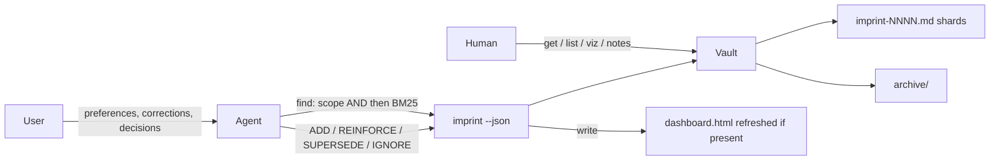

<div align="center">
  
  <h1>imprint</h1>
  <p><em>AI agent long-term memory</em></p>
  <p>
    <strong>English</strong> ·
    <a href="README.zh.md">中文</a>
  </p>
  <p>
    <a href="https://github.com/SteamedBread2333/imprint/releases"></a>
    
    
  </p>
</div>

User corrections → portable markdown. Go static binary, zero runtime, MIT.

Agents forget. Users repeat themselves. imprint is the file-backed memory they share: preferences, corrections, and decisions, stored as ordinary markdown, recalled by scope (AND) plus BM25 keyword ranking, superseded instead of stacked.

Agents never talk to a server. They run the global `imprint --json` CLI. Humans audit the same vault with `get`, `list`, `viz`, or the optional read-only `notes/` cards.



Writes go through the CLI. `notes/` is a generated microscope; do not hand-edit it. There is no MCP server.

## Install

```bash
go install github.com/SteamedBread2333/imprint/cmd/imprint@latest
```

Requires Go 1.23+. `CGO_ENABLED=0` — no libc, no database, no network at runtime.

Or download a platform archive from [GitHub Releases](https://github.com/SteamedBread2333/imprint/releases), or the container from GitHub Packages:

```bash
docker pull ghcr.io/steamedbread2333/imprint:latest
```

From a clone:

```bash
make install
# or
make build   # writes ./imprint
make dist    # cross-compile darwin/linux/windows → dist/*.tar.gz|zip
make publish V=X.Y.Z   # tag vX.Y.Z and push (CI uploads Release + GHCR)
```

GitHub has no Go package registry. Publishing puts **binaries on the GitHub Release** and the **image on GHCR (Packages)**.

The version you type at publish time is the only one that matters: it becomes the git tag, the module version, `imprint version`, and the GHCR label. Local builds without a tag print `devel`.

## Vault

Default project vault is `./memory/` (or the nearest `memory/` walking up from cwd). `--global` uses `~/.imprint`. `--vault PATH` and `IMPRINT_VAULT` override both.

```
memory/
  imprint-0001.md
  archive/
    imprint-0001.md
  dashboard.html          # offline graph; regenerated on write if it already exists
  notes/                  # optional: imprint viz --format notes (read-only cards)
    r-2026-09-11-001.md
```

Rules are packed into `imprint-NNNN.md` shards (legacy `r-YYYY-MM-DD-NNN.md` files are still read and compacted on open). A new shard starts at **32768 lines** or **1 MiB**, whichever comes first — large enough that a typical project stays in one file, small enough that reinforce still rewrites well under a millisecond on SSD.

Several frontmatter documents live in one shard. `forget` removes one document, not the file, and strips that id from other rules’ `related` / `supersedes` / `conflicts_with`. Marshal may append a derived `See also: [[r-…]]` footer; YAML remains the source of truth.

```markdown
<!-- imprint pack (2 rules) -->
---
id: r-2026-09-11-001
claim: Python function names must always be snake_case
scope:
    - python
    - naming
confidence: 0.6
status: active
reinforcement_count: 0
created_at: 2026-09-11T12:00:00Z
updated_at: 2026-09-11T12:00:00Z
last_touched_at: 2026-09-11T12:00:00Z
supersedes: []
related: []
conflicts_with: []
evidence_log:
    - at: 2026-09-11T12:00:00Z
      kind: original
      text: use snake_case
---
---
id: r-2026-09-11-002
claim: Use 4-space indents
scope:
    - python
    - style
confidence: 0.85
status: active
...
---
```

IDs are `r-YYYY-MM-DD-NNN`. `forget` deletes the rule. `supersede` and `sweep` only archive.

## CLI

```bash
imprint add "Python function names must always be snake_case" \
  --scope python,naming --text "use snake_case"

imprint find --scope python,naming
imprint find --scope go --query PascalCase
imprint reinforce r-2026-09-11-001 --evidence "user confirmed again"
imprint supersede r-2026-09-11-001 \
  --claim "All JS/Python functions must use snake_case" \
  --scope javascript,python,naming \
  --reason "extended to frontend"

imprint list --status active --scope python,naming --min-confidence 0.85
imprint get r-2026-09-11-001          # includes evidence_log and referenced_by
imprint show
imprint sweep
imprint viz                          # ./memory/dashboard.html (no CDN)
imprint viz --format mermaid
imprint viz --format notes           # ./memory/notes/*.md, overwrite, do not edit
imprint export
imprint init                         # alwaysApply Cursor rule
imprint forget r-2026-09-11-001
imprint clear --confirm --yes        # irreversible
```

`--json` prints machine-readable JSON on stdout so agents and scripts can parse it.

Global flags: `--vault PATH`, `--global`, `--json`.

## Cursor

Install the binary globally, then drop an `alwaysApply` rule in the project:

```bash
go install github.com/SteamedBread2333/imprint/cmd/imprint@latest
cd your-project
imprint init
```

That writes `.cursor/rules/imprint-memory.mdc`. Agents run `imprint --json` against `./memory/` (or `IMPRINT_VAULT` / `--global` for `~/.imprint`). There is no MCP server. `find` keeps scope as a hard AND filter, then ranks `--query` with field-weighted BM25 (claim > scope > evidence > body), including CJK character n-grams. `get` returns `referenced_by`. The HTML dashboard is self-contained (embedded D3, no CDN) and draws a radial dandelion: fill colour is scope, rings are hops, click a node to re-root. Open `dashboard.html` and press **?** for the legend. Filters are match-all; labels stay off until you zoom or hover.

## Release

```bash
# CI path (recommended): tests, tag, push; Actions uploads Release + GHCR
make publish V=X.Y.Z
# same as: scripts/publish.sh X.Y.Z

# From this machine instead of waiting for Actions
scripts/publish.sh X.Y.Z --local
```

Pushing tag `vX.Y.Z` runs [`.github/workflows/release.yml`](.github/workflows/release.yml). First GHCR image is private until you set the package to Public (GitHub → Packages → imprint → Package settings).

## Go module

```go
import "github.com/SteamedBread2333/imprint/pkg/imprint"

v, err := imprint.Open("./memory")
res, err := v.Add("Use gofmt", []string{"go"}, "gofmt", 0.6)
hits, err := v.Find([]string{"go"}, "", 5)
```

## What this binary does not do

Gatekeeper classification (ADD / REINFORCE / SUPERSEDE / IGNORE), sensitive-data refusal, and “should I write this?” judgment are the agent’s job. imprint is the honest store: write, recall, reinforce, supersede, decay.

## License

MIT
