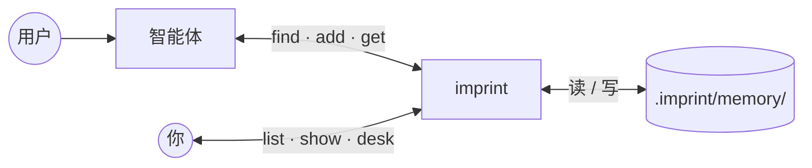

<div align="center">


# imprint

**智能体长期记忆 · 可携带的 markdown**

[English](README.md) · 中文

[](https://github.com/SteamedBread2333/imprint/releases)


</div>

用户纠正变成 `.imprint/memory/` 里的持久规则，下次写代码前召回。**你正常说话即可，vault 由智能体维护。**

---

## 快速开始

```bash
go install github.com/SteamedBread2333/imprint/cmd/imprint@latest
go install github.com/SteamedBread2333/imprint/cmd/imprint-mcp@latest
cd your-project && imprint init
```

可选：把 [docs/examples/cursor-mcp.json](docs/examples/cursor-mcp.json) 合并进 `.cursor/mcp.json` 并重启编辑器。不用 MCP 时，智能体可直接走 `imprint --json`。

| | 你 | imprint |
| --- | --- | --- |
| **1** | 安装 + `init` | 写入编辑器规则（Cursor、Claude Code、Codex、Trae、Workbuddy） |
| **2** | 正常写代码、正常纠正 | 智能体 `find` → ADD / REINFORCE / SUPERSEDE / IGNORE → 写入分片 |
| **3** | 浏览器审计 | `imprint up` → `imprint desk open` |



---

## CLI

全局参数：`--vault PATH` · `--global` · `--json`（stdout 输出 JSON，供智能体与脚本）

### 常用 — vault

直接读写。**不需要 host。**

| 命令 | 作用 |
| --- | --- |
| `imprint init` | 写入智能体规则；不写 MCP 配置 |
| `imprint find [--scope a,b] [--query TEXT]` | 召回规则（scope 标签 **AND**；可选 BM25） |
| `imprint add CLAIM --scope a,b --text ORIG` | 新建规则 |
| `imprint reinforce ID [--evidence TEXT]` | 加强规则（置信度 +0.1） |
| `imprint supersede OLD --claim NEW --scope a,b` | 替换规则；旧规则进 `archive/` |
| `imprint forget ID` | 永久删除 |
| `imprint list` · `show` · `get ID` | 浏览与查看 |
| `imprint sweep` · `export` | 衰减陈旧规则 · 导出 JSON |

```bash
imprint find --scope go,naming --query PascalCase
imprint add "函数名用 snake_case" --scope python,naming --text "用户要求 snake_case"
imprint get r-2026-09-11-001
```

### 常用 — 本地服务

开 desk、看 vault 图谱时，**记这两条就够了**：

| 命令 | 作用 |
| --- | --- |
| `imprint up` | 启动本地服务（vault API、shelves、已启用的 desk 等） |
| `imprint down` | 停止本地服务 |
| `imprint desk open` | 浏览器打开 desk（**不启动**服务；需先 `up`） |
| `imprint status` | 本地服务快照 |

```bash
imprint up && imprint desk open
# 用完：
imprint down
```

改 `imprint.yaml` 后：`down` 再 `up` 即可生效。

<details>
<summary>进阶：拆开控制 host / 插件（调试）</summary>

| 命令 | 作用 |
| --- | --- |
| `imprint host start` / `host stop` | 仅 host（含 shelves） |
| `imprint plugin start` / `plugin stop` | 仅外部插件 |
| `plugin list` · `enable` · `disable` | 改 yaml 里的插件开关 |

日常用 `up` / `down` 即可，不必记这些子命令。

</details>

shelves 是 **host 配置**（顶层 `shelves:`），不是插件。见 [docs/shelves-builtin.zh.md](docs/shelves-builtin.zh.md)。

### 调试与进阶

| 命令 | 作用 |
| --- | --- |
| `imprint host serve [--listen ADDR]` | 前台 host（Ctrl+C）— 调试 API |
| `imprint viz [--format mermaid\|notes] [--out PATH]` | 关系图或重新生成只读 `notes/` |
| `imprint clear --confirm --yes` | 删除全部规则 — 不可逆 |
| `imprint version` | 打印版本 |

完整参数：`imprint --help` 或 `imprint help <cmd>`。

---

## Vault 布局

默认 `./.imprint/memory/`（向上找 `.imprint/`）。`--global` → `~/.imprint`。可用 `--vault` 或 `IMPRINT_VAULT` 覆盖。

```
.imprint/
  imprint.yaml          # host + shelves + plugins
  memory/               # 规则（imprint-NNNN.md 分片）
  .shelves/.cache/      # 文档索引（SQLite，gitignore）
docs/                   # shelves 启用时会索引
```

规则打进 `imprint-NNNN.md` 分片（32768 行或 1 MiB 换新文件）。ID：`r-YYYY-MM-DD-NNN`。`supersede`、`sweep` 归档；`forget` 删除。

<details>
<summary>分片示例（一个文件两条规则）</summary>

```markdown
---
id: r-2026-09-11-001
claim: Python function names must always be snake_case
scope: [python, naming]
confidence: 0.6
status: active
evidence_log:
  - { at: 2026-09-11T12:00:00Z, kind: original, text: use snake_case }
---
---
id: r-2026-09-11-002
claim: Use 4-space indents
scope: [python, style]
confidence: 0.85
status: active
---
```

</details>

---

## Shelves 与 desk

| | 运行位置 | 配置 |
| --- | --- | --- |
| **Shelves** | **host** | `shelves` · [imprint.yaml](docs/examples/imprint.yaml) |
| **Desk** | 外部插件 | `plugins.desk` · [imprint-desk-plugin](https://github.com/SteamedBread2333/imprint-desk-plugin) |

只挂一个 MCP（`imprint-mcp`）。shelves 开启且 `find` 带 query 时，响应可有 `documents` 字段。

---

## 安装与发布

```bash
docker pull ghcr.io/steamedbread2333/imprint:latest   # 或 GitHub Releases 二进制
make install          # 从源码
make publish V=X.Y.Z  # 打 tag，CI 上传 Release + GHCR
```

未打 release tag 的本地构建显示 `devel`。

---

## 文档

| 主题 | 中文 | English |
| --- | --- | --- |
| MCP 挂载 | [docs/mcp.zh.md](docs/mcp.zh.md) | [docs/mcp.md](docs/mcp.md) |
| 编辑器 `init` | [docs/editors.zh.md](docs/editors.zh.md) | [docs/editors.md](docs/editors.md) |
| Shelves | [docs/shelves-builtin.zh.md](docs/shelves-builtin.zh.md) | [docs/shelves-builtin.md](docs/shelves-builtin.md) |
| 纠偏与编码场景 | [docs/correction.zh.md](docs/correction.zh.md) | [docs/correction.md](docs/correction.md) |

MCP 示例（需手动合并）：[cursor-mcp.json](docs/examples/cursor-mcp.json) · [cursor-mcp-global.json](docs/examples/cursor-mcp-global.json)

---

## Go 模块

```go
import "github.com/SteamedBread2333/imprint/pkg/imprint"

v, _ := imprint.Open("./.imprint/memory")
v.Add("Use gofmt", []string{"go"}, "gofmt", 0.6)
v.Find([]string{"go"}, "", 5)
```

分类（ADD / REINFORCE / SUPERSEDE / IGNORE）和「该不该写」由**智能体**判断。imprint 只负责存、召回、强化、替换、衰减。

MIT
