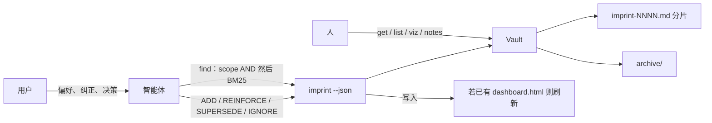

<div align="center">
  
  <h1>imprint</h1>
  <p><em>智能体长期记忆</em></p>
  <p>
    <a href="README.md">English</a> ·
    <strong>中文</strong>
  </p>
  <p>
    <a href="https://github.com/SteamedBread2333/imprint/releases"></a>
    
    
  </p>
</div>

用户纠正 → 可携带的 markdown。Go 静态二进制，零运行时依赖，MIT。

智能体会忘。用户会把同一句话再说一遍。imprint 是双方共用的文件记忆：偏好、纠正、决策，写成普通 markdown，按 scope **AND** 过滤，再用 BM25 给 `--query` 排序，用 supersede 替换而不是叠床架屋。

智能体不连服务，只跑全局 `imprint --json`。人用 `get` / `list` / `viz` 或只读的 `notes/` 卡片审计同一份 vault。



写入只走 CLI。`notes/` 是生成出来的显微镜，不要手改。没有 MCP 服务。

## 安装

```bash
go install github.com/SteamedBread2333/imprint/cmd/imprint@latest
```

需要 Go 1.23+。`CGO_ENABLED=0` — 不链 libc，没有数据库，运行时不访问网络。

也可以从 [GitHub Releases](https://github.com/SteamedBread2333/imprint/releases) 下载对应平台的压缩包，或从 GitHub Packages 拉容器：

```bash
docker pull ghcr.io/steamedbread2333/imprint:latest
```

从源码：

```bash
make install
# 或者
make build   # 写出 ./imprint
make dist    # 交叉编译 darwin/linux/windows → dist/*.tar.gz|zip
make publish V=X.Y.Z   # 打上 vX.Y.Z 并推送（CI 上传 Release + GHCR）
```

GitHub 没有 Go 包仓库。发布产物是 **GitHub Release 上的二进制** 和 **GHCR（Packages）上的镜像**。

发布时你只需要写一次版本号：它会变成 git tag、Go module 版本、`imprint version`，以及 GHCR 标签。未打 tag 的本地构建打印 `devel`。

## 仓库（Vault）

默认项目仓库是 `./memory/`（或从当前目录向上找到的最近 `memory/`）。`--global` 使用 `~/.imprint`。`--vault PATH` 和 `IMPRINT_VAULT` 覆盖以上两者。

```
memory/
  imprint-0001.md
  archive/
    imprint-0001.md
  dashboard.html          # 离线图；若文件已存在，写入后会刷新
  notes/                  # 可选：imprint viz --format notes（只读卡片）
    r-2026-09-11-001.md
```

规则打进 `imprint-NNNN.md` 分片（旧的一规则一文件 `r-YYYY-MM-DD-NNN.md` 仍会在打开时读取并压实）。新分片在 **32768 行** 或 **1 MiB** 时开始——大到一个典型项目通常只占一个文件，小到一次 reinforce 在 SSD 上仍远低于一毫秒。

一个分片里是多段 YAML frontmatter 文档。`forget` 删的是其中一条，不是整个文件，并会从其他规则的 `related` / `supersedes` / `conflicts_with` 清掉该 id。Marshal 可能在正文末尾加派生的 `See also: [[r-…]]`；YAML 仍是真相。

```markdown
<!-- imprint pack (2 rules) -->
---
id: r-2026-09-11-001
claim: Python function names must always be snake_case
scope:
    - python
    - naming
confidence: 0.6
status: active
reinforcement_count: 0
created_at: 2026-09-11T12:00:00Z
updated_at: 2026-09-11T12:00:00Z
last_touched_at: 2026-09-11T12:00:00Z
supersedes: []
related: []
conflicts_with: []
evidence_log:
    - at: 2026-09-11T12:00:00Z
      kind: original
      text: use snake_case
---
---
id: r-2026-09-11-002
claim: Use 4-space indents
scope:
    - python
    - style
confidence: 0.85
status: active
...
---
```

ID 形如 `r-YYYY-MM-DD-NNN`。`forget` 删除规则。`supersede` 和 `sweep` 只归档。

## CLI

```bash
imprint add "Python function names must always be snake_case" \
  --scope python,naming --text "use snake_case"

imprint find --scope python,naming
imprint find --scope go --query PascalCase
imprint reinforce r-2026-09-11-001 --evidence "user confirmed again"
imprint supersede r-2026-09-11-001 \
  --claim "All JS/Python functions must use snake_case" \
  --scope javascript,python,naming \
  --reason "extended to frontend"

imprint list --status active --scope python,naming --min-confidence 0.85
imprint get r-2026-09-11-001          # 含 evidence_log 与 referenced_by
imprint show
imprint sweep
imprint viz                          # ./memory/dashboard.html（无 CDN）
imprint viz --format mermaid
imprint viz --format notes           # ./memory/notes/*.md，覆盖写，不要手改
imprint export
imprint init                         # alwaysApply Cursor 规则
imprint forget r-2026-09-11-001
imprint clear --confirm --yes        # 不可逆
```

`--json` 在 stdout 打印机器可读的 JSON，方便智能体和脚本解析。

全局参数：`--vault PATH`、`--global`、`--json`。

## Cursor

先把二进制装到全局，再在项目里放下 `alwaysApply` 规则：

```bash
go install github.com/SteamedBread2333/imprint/cmd/imprint@latest
cd your-project
imprint init
```

这会写入 `.cursor/rules/imprint-memory.mdc`。智能体对 `./memory/` 执行 `imprint --json`（或用 `IMPRINT_VAULT` / `--global` 指向 `~/.imprint`）。没有 MCP 服务。`find` 的 scope 仍是硬 AND，`--query` 用字段加权 BM25（claim > scope > evidence > body），中文按字 n-gram。`get` 返回 `referenced_by`。HTML dashboard 自包含（内嵌 D3，无 CDN），图画径向蒲公英：填充色是 scope，环是跳数，点击节点会重新以它为根。打开 `dashboard.html` 按 **?** 看图例。筛选是全部命中；标签默认缩放到近处或悬停才出现。

## 发布

```bash
# CI 路径（推荐）：测试、打 tag、推送；Actions 上传 Release + GHCR
make publish V=X.Y.Z
# 等同于：scripts/publish.sh X.Y.Z

# 在本机打包上传，不等 Actions
scripts/publish.sh X.Y.Z --local
```

推送 tag `vX.Y.Z` 会跑 [`.github/workflows/release.yml`](.github/workflows/release.yml)。第一次推上 GHCR 的镜像默认是私有的，需要到 GitHub → Packages → imprint → Package settings 设为 Public。

## Go 模块

```go
import "github.com/SteamedBread2333/imprint/pkg/imprint"

v, err := imprint.Open("./memory")
res, err := v.Add("Use gofmt", []string{"go"}, "gofmt", 0.6)
hits, err := v.Find([]string{"go"}, "", 5)
```

## 这个二进制不做什么

门禁分类（ADD / REINFORCE / SUPERSEDE / IGNORE）、拒绝敏感数据、以及「该不该写」的判断，是智能体的职责。imprint 是诚实的存储：写入、召回、强化、替换、衰减。

## 许可

MIT
