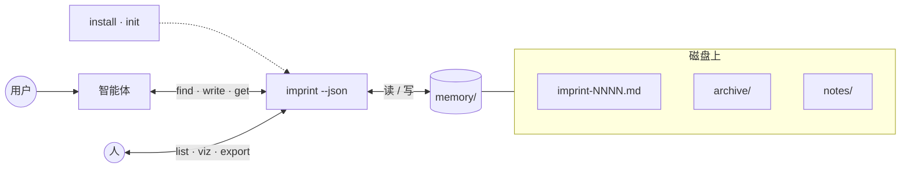
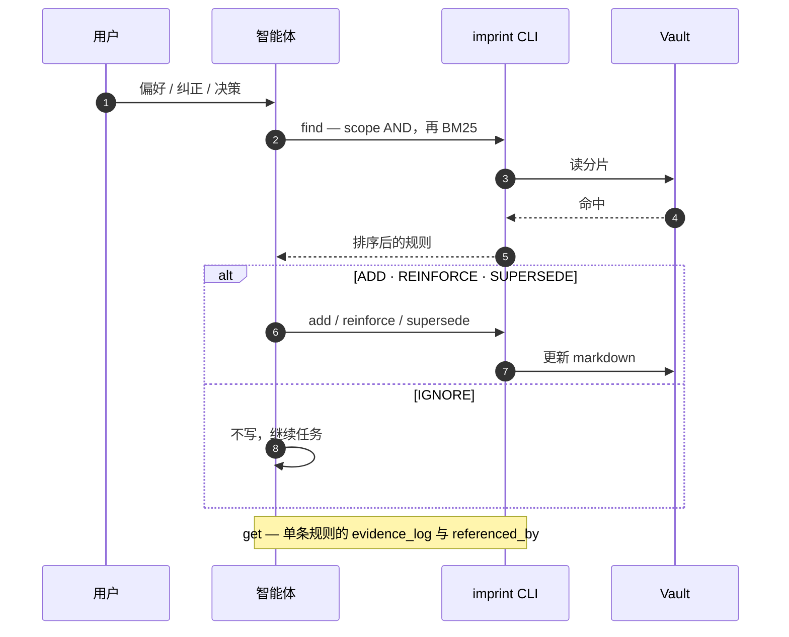

<div align="center">
  
  <h1>imprint</h1>
  <p><em>智能体长期记忆</em></p>
  <p>
    <a href="README.md">English</a> ·
    <strong>中文</strong>
  </p>
  <p>
    <a href="https://github.com/SteamedBread2333/imprint/releases"></a>
    
    
  </p>
</div>

用户纠正 → 可携带的 markdown。Go 静态二进制，零运行时依赖，MIT。

智能体会忘。imprint 把偏好和纠正写进 `./memory/`，下次写代码前召回。**你正常说话即可，vault 由智能体维护。**

## 快速开始

**三步**（约两分钟）：

```bash
go install github.com/SteamedBread2333/imprint/cmd/imprint@latest
go install github.com/SteamedBread2333/imprint/cmd/imprint-mcp@latest
cd your-project
imprint init
```

可选 — 在 `.cursor/mcp.json` 挂载 MCP（合并 [docs/examples/cursor-mcp.json](docs/examples/cursor-mcp.json)），重启编辑器。不用 MCP 也可以，智能体走 `imprint --json`。

| 步骤 | 你做什么 | imprint 做什么 |
| --- | --- | --- |
| 1 | 安装 + `imprint init` | 为 Cursor、Claude Code、Codex、Trae、Workbuddy 写入规则 |
| 2 | 正常写代码、正常纠正 | 智能体 `find` → ADD / REINFORCE / SUPERSEDE / IGNORE → 写入 `./memory/` |
| 3 | `imprint host serve` + `imprint desk open` 想审计时 | desk 插件实时列表 / 关系图 |

更多细节 → [文档](#文档)（`docs/` 下全部文件）。Desk 截图 → [imprint-desk-plugin](https://github.com/SteamedBread2333/imprint-desk-plugin)。





| 阶段 | 做什么 |
| --- | --- |
| **初始化** | [快速开始](#快速开始) — `imprint init`；可选 MCP（[docs/mcp.zh.md](docs/mcp.zh.md)）。Vault：`./memory/`、`~/.imprint`（`--global`）或 `--vault` / `IMPRINT_VAULT`。 |
| **智能体循环** | `find` 召回；智能体判 **ADD / REINFORCE / SUPERSEDE / IGNORE**；写入走 `add`、`reinforce`、`supersede`（旧规则进 `archive/`）。`get` 拉单条证据与反向引用。 |
| **Vault** | 规则打进 `imprint-NNNN.md` 分片；`sweep` 与 `supersede` 归档到 `archive/`；`forget` 硬删并清理入链。 |
| **人工视图** | 同一套 CLI：`list`、`show`、`get`、`export`。`viz` 输出 mermaid 或只读 `notes/` 卡片。交互式列表 / 关系图用 **desk** 插件。 |
| **不负责** | 要不要写由智能体判断（ADD / REINFORCE / SUPERSEDE / IGNORE）。 |

智能体用 MCP 工具或 `imprint --json`。`notes/` 是生成出来的，不要手改。

## 安装

见 [快速开始](#快速开始)。亦可从 [GitHub Releases](https://github.com/SteamedBread2333/imprint/releases) 下载二进制，或：

```bash
docker pull ghcr.io/steamedbread2333/imprint:latest
```

从源码：

```bash
make install
# 或者
make build   # 写出 ./imprint
make dist    # 交叉编译 darwin/linux/windows → dist/*.tar.gz|zip
make publish V=X.Y.Z   # 打上 vX.Y.Z 并推送（CI 上传 Release + GHCR）
```

GitHub 没有 Go 包仓库。发布产物是 **GitHub Release 上的二进制** 和 **GHCR（Packages）上的镜像**。

发布时你只需要写一次版本号：它会变成 git tag、Go module 版本、`imprint version`，以及 GHCR 标签。未打 tag 的本地构建打印 `devel`。

## 仓库（Vault）

默认项目仓库是 `./memory/`（或从当前目录向上找到的最近 `memory/`）。`--global` 使用 `~/.imprint`。`--vault PATH` 和 `IMPRINT_VAULT` 覆盖以上两者。

```
memory/
  imprint-0001.md
  archive/
    imprint-0001.md
  notes/                  # 可选：imprint viz --format notes（只读卡片）
    r-2026-09-11-001.md
```

规则打进 `imprint-NNNN.md` 分片（旧的一规则一文件 `r-YYYY-MM-DD-NNN.md` 仍会在打开时读取并压实）。新分片在 **32768 行** 或 **1 MiB** 时开始——大到一个典型项目通常只占一个文件，小到一次 reinforce 在 SSD 上仍远低于一毫秒。

一个分片里是多段 YAML frontmatter 文档。`forget` 删的是其中一条，不是整个文件，并会从其他规则的 `related` / `supersedes` / `conflicts_with` 清掉该 id。Marshal 可能在正文末尾加派生的 `See also: [[r-…]]`；YAML 仍是真相。

```markdown
<!-- imprint pack (2 rules) -->
---
id: r-2026-09-11-001
claim: Python function names must always be snake_case
scope:
    - python
    - naming
confidence: 0.6
status: active
reinforcement_count: 0
created_at: 2026-09-11T12:00:00Z
updated_at: 2026-09-11T12:00:00Z
last_touched_at: 2026-09-11T12:00:00Z
supersedes: []
related: []
conflicts_with: []
evidence_log:
    - at: 2026-09-11T12:00:00Z
      kind: original
      text: use snake_case
---
---
id: r-2026-09-11-002
claim: Use 4-space indents
scope:
    - python
    - style
confidence: 0.85
status: active
...
---
```

ID 形如 `r-YYYY-MM-DD-NNN`。`forget` 删除规则。`supersede` 和 `sweep` 只归档。

## CLI

```bash
imprint add "Python function names must always be snake_case" \
  --scope python,naming --text "use snake_case"

imprint find --scope python,naming
imprint find --scope go --query PascalCase
imprint reinforce r-2026-09-11-001 --evidence "user confirmed again"
imprint supersede r-2026-09-11-001 \
  --claim "All JS/Python functions must use snake_case" \
  --scope javascript,python,naming \
  --reason "extended to frontend"

imprint list --status active --scope python,naming --min-confidence 0.85
imprint get r-2026-09-11-001          # 含 evidence_log 与 referenced_by
imprint show
imprint sweep
imprint viz                          # stdout 输出 mermaid
imprint viz --format mermaid --out graph.mmd
imprint viz --format notes           # ./memory/notes/*.md，覆盖写，不要手改
imprint export
imprint init                         # Cursor / Claude / Codex / Trae / Workbuddy
imprint init --cursor --force        # 仅某一编辑器
imprint host serve                   # vault 只读 HTTP API（供插件）
imprint plugin list|enable|disable|reload
imprint desk open                    # 打开 desk 插件 UI
imprint forget r-2026-09-11-001
imprint clear --confirm --yes        # 不可逆
```

`--json` 在 stdout 打印机器可读的 JSON，方便智能体和脚本解析。

全局参数：`--vault PATH`、`--global`、`--json`。

## 插件

可选 UI 与文档检索在**独立仓库**，通过 [`.imprint/plugins.yaml`](.imprint/plugins.yaml) 启用：

| 插件 | 仓库 | 职责 |
| --- | --- | --- |
| **desk** | [imprint-desk-plugin](https://github.com/SteamedBread2333/imprint-desk-plugin) | 实时 dashboard SPA（列表 / 关系图、筛选、URL 状态、中英） |
| **shelves** | [imprint-shelves-plugin](https://github.com/SteamedBread2333/imprint-shelves-plugin) | 工作区文档索引；`doc_search` 经 **imprint-mcp** 代理 |

```bash
imprint host serve
imprint plugin reload
imprint desk open
```

Agent 仍只挂 **imprint-mcp** 一个 MCP；工具名来自各插件 `imprint.plugin.json`，宿主不写死 shelves API。

## 文档

上手见上文 [快速开始](#快速开始)。[`docs/`](docs/) 内为**参考文档**，在此集中索引，避免与 README 脱节。

| 主题 | 中文 | English |
| --- | --- | --- |
| 各编辑器 `init` 路径与参数 | [docs/editors.zh.md](docs/editors.zh.md) | [docs/editors.md](docs/editors.md) |
| MCP 服务与挂载 | [docs/mcp.zh.md](docs/mcp.zh.md) | [docs/mcp.md](docs/mcp.md) |
| 记忆纠偏与编码场景 | [docs/correction.zh.md](docs/correction.zh.md) | [docs/correction.md](docs/correction.md) |

**MCP 示例**（需手动合并；`imprint init` 不会写入）：

| 文件 | 用途 |
| --- | --- |
| [docs/examples/cursor-mcp.json](docs/examples/cursor-mcp.json) | 项目 vault `./memory` |
| [docs/examples/cursor-mcp-global.json](docs/examples/cursor-mcp-global.json) | 全局 vault `~/.imprint` |

## 发布

```bash
# CI 路径（推荐）：测试、打 tag、推送；Actions 上传 Release + GHCR
make publish V=X.Y.Z
# 等同于：scripts/publish.sh X.Y.Z

# 在本机打包上传，不等 Actions
scripts/publish.sh X.Y.Z --local
```

推送 tag `vX.Y.Z` 会跑 [`.github/workflows/release.yml`](.github/workflows/release.yml)（二进制 + GHCR）。第一次推上 GHCR 的镜像默认是私有的，需要到 GitHub → Packages → imprint → Package settings 设为 Public。

## Go 模块

```go
import "github.com/SteamedBread2333/imprint/pkg/imprint"

v, err := imprint.Open("./memory")
res, err := v.Add("Use gofmt", []string{"go"}, "gofmt", 0.6)
hits, err := v.Find([]string{"go"}, "", 5)
```

## 这个二进制不做什么

门禁分类（ADD / REINFORCE / SUPERSEDE / IGNORE）、拒绝敏感数据、以及「该不该写」的判断，是智能体的职责。imprint 是诚实的存储：写入、召回、强化、替换、衰减。

## 许可

MIT
