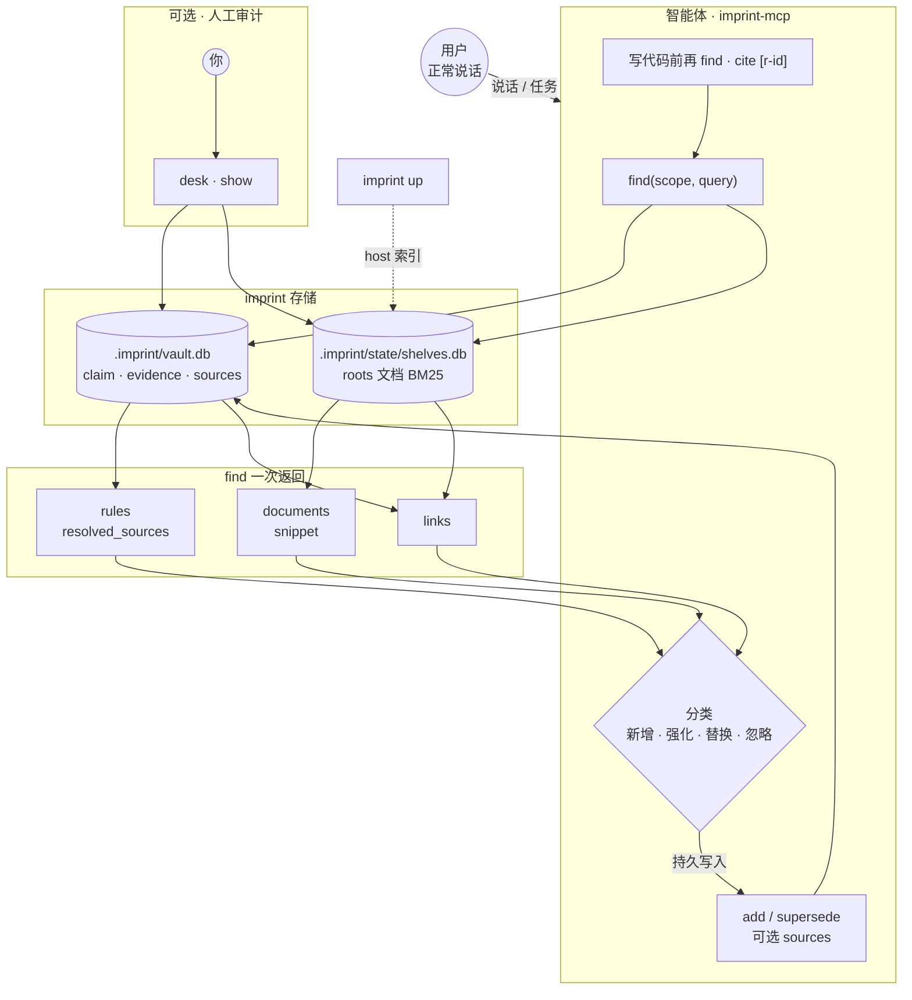
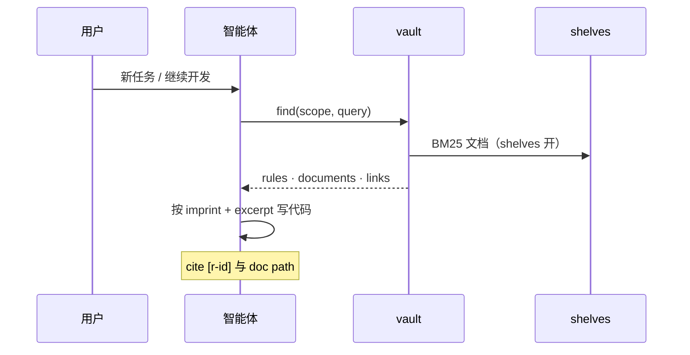

<div align="center">


# imprint

**项目策略的长期记忆，给智能体用**

[English](README.md) · 中文

[](https://github.com/SteamedBread2333/imprint/releases)


</div>

日常对话会落成可召回的规则。智能体每轮分类、把规则和项目文档连上，写代码前再召回。**你正常说话即可，不必自己维护 vault。**

## 怎么工作

| | 何时 | 例子 |
| --- | --- | --- |
| **新增** | 新的长期偏好 | 命名规则、工作流、架构边界 |
| **强化** | 同一政策再次确认 | 「对，export 还是 PascalCase」 |
| **替换** | 政策变更 | 收窄 scope、扩大 scope、替换 claim |
| **忽略** | 仅当次任务 | 一次性重构、闲聊、密钥 |

用户否定已存规则（「别记了」）→ 智能体 `find` 后 `forget`。写入循环：[记忆写入](docs/correction.zh.md)。

Vault 存 claim、evidence 和可选文档指针（`sources`）。Shelves 在 `roots` 下索引 markdown，一次 `find` 同时返回规则、snippet 和 links。

## 快速开始

```bash
go install github.com/SteamedBread2333/imprint/cmd/imprint@latest
go install github.com/SteamedBread2333/imprint/cmd/imprint-mcp@latest
cd your-project && imprint init
```

在编辑器里挂载 imprint MCP（[docs/mcp.zh.md](docs/mcp.zh.md)）。CLI 回退：`imprint --json`。

| | 你 | imprint |
| --- | --- | --- |
| **1** | 安装 + `init` | 写入 `imprint.yaml` 与编辑器规则（Cursor、Claude Code、Codex、Trae、Workbuddy） |
| **2** | 正常说话 | 智能体 `find`（vault + shelves）→ 分类 → `add` / `reinforce` / …（可选 `sources`） |
| **3** | 浏览器审计（可选） | `imprint up` → `imprint desk open` |

<details>
<summary>智能体循环（flowchart）</summary>



</details>

<details>
<summary>写代码前召回（sequence）</summary>



</details>

## 存储

把 `imprint.yaml` 提交进 git（roots、插件开关、可调参数）。私有运行时全部在 gitignore 的 `.imprint/`。

默认 vault 目录：`./.imprint/`（向上找 `imprint.yaml` 或 `.imprint/`）。`--global` → `~/.imprint`。可用 `--vault` 或 `IMPRINT_VAULT` 覆盖。

```
imprint.yaml            # 进 git：host + shelves.roots + plugins + supersede.inheritance_alpha
.imprint/               # gitignore：私有运行时
  vault.db              # SQLite vault（规则、证据、边、sources）
  vault.db-wal          # WAL 日志；有进程打开 vault 时出现
  vault.db-shm          # WAL 共享内存索引（同期出现）
  state/
    shelves.db          # 可重建的文档索引（同样走 WAL，也可能有 -wal/-shm）
    plugins/            # 插件派生状态
  export/               # 可选 md/json 投影
docs/                   # 常见 shelves root
.cursor/rules/          # 常见 shelves root
```

Vault 和 shelves 都以 WAL 模式打开 SQLite，方便 CLI、MCP、host 跨进程读写。`*.db` 旁边的 `-wal` / `-shm` 是正常现象，都在 gitignore 的 `.imprint/` 里。不要提交；imprint 还在跑时也不要手删。

规则存于 `vault.db`。ID：`r-YYYY-MM-DD-NNN`。状态：`active` | `dormant` | `superseded`。`supersede` 将旧规则标为 superseded；`sweep` 衰减至 dormant；`forget` 删除。交互式规则图：**`imprint desk open`**（host `GET /graph`）。

| | 运行位置 | 配置 |
| --- | --- | --- |
| **Shelves** | **host** | `shelves` · [imprint.yaml](docs/examples/imprint.yaml) |
| **Desk** | 外部插件 | `plugins.desk` · [imprint-desk-plugin](https://github.com/SteamedBread2333/imprint-desk-plugin) |
| **Embed** | 外部 sidecar（插件协议） | `plugins.embed` · [imprint-embed-sidecar](https://github.com/SteamedBread2333/imprint-embed-sidecar) |

Embed 给 `add` 加语义查重门禁——词面 Jaccard 只抓得到近同词面，改述会漏；默认关，sidecar 缺席/慢时降级回词面路径。`imprint-mcp` 在端口不健康时拉起 sidecar（已健康则复用）；`imprint plugin start embed` 每次先 stop 再 fork；停它用 `imprint plugin stop embed`。`imprint up` / `down` 不碰 embed。完整链路、标定数据、调优见 [docs/semantic-dedup.zh.md](docs/semantic-dedup.zh.md)。

Shelves 在 `roots` 下建文档索引（如 `docs/`、`.cursor/rules/`）。挂载一次 MCP（`imprint-mcp`）；shelves 开且 `find` 带 query 时，响应含 `rules`、`documents`、`links`。见 [docs/shelves-builtin.zh.md](docs/shelves-builtin.zh.md)。

## CLI

全局参数：`--vault PATH` · `--global` · `--json`（stdout 输出 JSON，供智能体与脚本）

### Vault

| 命令 | 作用 |
| --- | --- |
| `imprint init` | 写入 `imprint.yaml`（若尚无）和编辑器智能体规则 |
| `imprint find [--scope a,b] [--query TEXT]` | 召回 imprint（scope **AND**）；shelves 开且带 query → 含 documents、links |
| `imprint add CLAIM --scope a,b --text ORIG` | 新建 imprint（MCP 可带 `sources` 关联文档） |
| `imprint reinforce ID --evidence TEXT` | 用户明确重申后加强规则（递减增益，上限 0.95） |
| `imprint supersede OLD --claim NEW --scope a,b` | 替换规则；旧规则标记 `superseded` |
| `imprint forget ID` | 永久删除（生命周期事件保留） |
| `imprint list` · `show` · `get ID` · `report` | 浏览、查看，以及生命周期 / 召回 / telemetry 审计 |
| `imprint sweep` · `export` | 衰减陈旧规则 · 写入 `.imprint/export/vault.json`，或用 `--format jsonl` 写 `vault.jsonl` |

```bash
imprint find --scope go,naming --query PascalCase
imprint add "函数名用 snake_case" --scope python,naming --text "用户要求 snake_case"
imprint get r-2026-09-11-001
```

### 本地服务

| 命令 | 作用 |
| --- | --- |
| `imprint up` | 启动本地服务（vault API、shelves、已启用的 desk 等）。**不起也不停** embed |
| `imprint down` | 停止本地服务。embed 继续跑（`imprint plugin stop embed`） |
| `imprint desk open` | 浏览器打开 desk（需先 `up`） |
| `imprint status` | 本地服务快照 |

```bash
imprint up && imprint desk open
# 用完：
imprint down
```

改 `imprint.yaml` 后：`down` 再 `up` 即可生效。

<details>
<summary>调试：host、插件、不可逆清空</summary>

| 命令 | 作用 |
| --- | --- |
| `imprint host start` / `host stop` | 仅 host（含 shelves） |
| `imprint plugin start ID` / `plugin stop ID` | 仅外部插件（必须带 id；传 `embed` 才起停 sidecar） |
| `plugin list` · `enable` · `disable` | 改 yaml 里的插件开关 |
| `imprint host serve [--listen ADDR]` | 前台 host（Ctrl+C）— 调试 API |
| `imprint clear --confirm --yes` | 删除全部规则 — 不可逆 |
| `imprint version` | 打印版本 |

</details>

完整参数：`imprint --help` 或 `imprint help <cmd>`。

## 写入与召回

- **紧凑召回：** MCP `find` 默认只返回 claim、计数与有上限的文档 snippet。文档条数由 `shelves.config.find_top_k` 约束（默认 2，每 path 一条），与规则 `top_k` 无关；snippet 是对准查询词的窗口（`snippet_runes` 默认 80）。`get r-…` 默认折叠 evidence 和来源正文。仅审计时使用 `include_evidence` 或 `full`。dormant 规则最多以一条降权 `wake_candidate` 入场，只有明确 `reinforce` 才会唤醒。
- **写入安全：** `add`、`reinforce`、`supersede` 会拒绝疑似 secret 和个人信息。source 必须位于工作区内，且不能指向 credentials、`.env*`、`*.pem` 或 `*.key`。`add` 还会拒绝高相似 active 重复。`reinforce` 必须带非空 evidence，confidence 用递减增益；find 命中只更新召回统计。
- **替换置信度：** 新规则按 `imprint.yaml` 的 `supersede.inheritance_alpha` 对高出 0.6 的缺口衰减（默认 0.20；0=完全不衰减，1=跌到基线）。
- **Scope：** 语言类标签（`ts`、`tsx`、`golang`）由 GitHub Linguist（go-enry）归一；非语言标签原样保留。
- **审计：** `imprint report --days 30` 汇总生命周期事件、重复、冲突、零召回规则和 telemetry 延迟。telemetry 按日写入 `.imprint/state/telemetry/`，不存 query、claim、evidence 或 path 正文。
- **关联：** vault 的 `sources` 指向文档 path 或 heading；紧凑 `get r-…` 返回来源指针，`full:true` 才解析正文。设计：[docs/imprint-shelves-linking.zh.md](docs/imprint-shelves-linking.zh.md)。

## 文档

| 主题 | 中文 | English |
| --- | --- | --- |
| MCP 挂载 | [docs/mcp.zh.md](docs/mcp.zh.md) | [docs/mcp.md](docs/mcp.md) |
| 编辑器 `init` | [docs/editors.zh.md](docs/editors.zh.md) | [docs/editors.md](docs/editors.md) |
| Shelves 与关联 | [docs/shelves-builtin.zh.md](docs/shelves-builtin.zh.md) · [docs/imprint-shelves-linking.zh.md](docs/imprint-shelves-linking.zh.md) | [docs/shelves-builtin.md](docs/shelves-builtin.md) · [docs/imprint-shelves-linking.md](docs/imprint-shelves-linking.md) |
| 写入循环与场景 | [docs/correction.zh.md](docs/correction.zh.md) | [docs/correction.md](docs/correction.md) |
| 测试与验收 | [docs/testing.zh.md](docs/testing.zh.md) | [docs/testing.md](docs/testing.md) |

MCP 挂载示例：[docs/mcp.zh.md](docs/mcp.zh.md) · [docs/mcp.md](docs/mcp.md)

## 安装与库

```bash
docker pull ghcr.io/steamedbread2333/imprint:latest   # 或 GitHub Releases 二进制
make install          # 从源码
make publish V=X.Y.Z  # 打 tag，CI 上传 Release + GHCR
```

未打 release tag 的本地构建显示 `devel`。

```go
import "github.com/SteamedBread2333/imprint/pkg/imprint"

v, _ := imprint.Open("./.imprint")
v.Add("Use gofmt", []string{"go"}, "gofmt", 0.6)
v.Find([]string{"go"}, "", 5)
```

MIT
