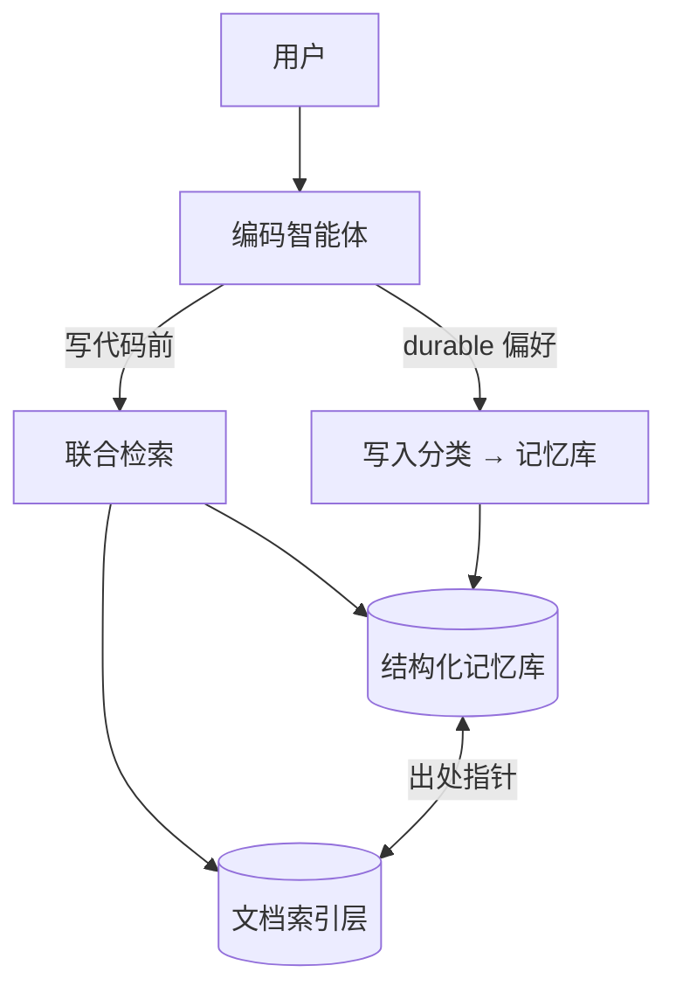

# 智能体长期记忆：架构索引

> **文档性质：** 纯架构与方案设计，不涉及传输协议（MCP / CLI 等）选型。

本主题拆为两份独立文档，分别讨论两类核心问题。共享基础设施（双库模型、检索流水线）见 [数据存储与检索技术说明](storage-retrieval.zh.md)。

---

## 两类核心问题

| 问题 | 典型表现 | 专题文档 |
| --- | --- | --- |
| **Token 浪费** | 每轮重复注入大段规则、整文件文档、冗长摘要 | [Token 节约技术架构](agent-memory-token.zh.md) |
| **偏好层幻觉** | 从未说过的规范被「记住」；一次性指令变成永久政策 | [防幻觉技术架构](agent-memory-hallucination.zh.md) |
| **政策漂移** | 改口后旧规范仍生效；新旧并存 | [防幻觉技术架构](agent-memory-hallucination.zh.md) |
| **依据缺失** | 声称按规范却无法指向文档段落 | [防幻觉技术架构](agent-memory-hallucination.zh.md) |

---

## 共享架构一览

| 组件 | 职责 |
| --- | --- |
| **结构化记忆库** | 短条目、依据、置信度、标签、条目关系、出处指针 |
| **文档索引层** | Markdown 分块、全文检索、文档内条目引用 |
| **联合检索** | 读时合并两库，Top-N + 摘要片段（Token 专题） |
| **写入分类** | 新增 / 强化 / 替换 / 忽略 / 删除（防幻觉专题） |

---

## 文档地图

| 文档 | 内容 |
| --- | --- |
| [Token 节约技术架构](agent-memory-token.zh.md) | 双库分离、窄标签预筛、摘要截断、合并检索、写代码前召回 |
| [防幻觉技术架构](agent-memory-hallucination.zh.md) | 陈述/依据分离、写入四分法、替换链、出处指针、审计 |
| [数据存储与检索技术说明](storage-retrieval.zh.md) | 存储模型、索引流水线、关联机制、待定参数 |
| [记忆写入循环](correction.zh.md) | 写入场景示例（实现参考） |
