# 智能体长期记忆：Token 节约与防幻觉技术架构

> **文档性质：** 纯架构与方案设计，不涉及传输协议（MCP / CLI 等）选型。侧重 Token 成本控制、偏好漂移与幻觉抑制；可与 IDE 内置能力对照阅读。

---

## 1. 背景：两类核心损耗

| 问题             | 典型表现                           | 根因                    |
| -------------- | ------------------------------ | --------------------- |
| **Token 浪费**   | 每次会话重复注入大段规则、整文件文档、冗长聊天摘要      | 上下文「全量预载」而非「任务相关按需召回」 |
| **AI 幻觉（偏好层）** | 智能体「记得」用户从未说过的规范；或把一次性指令当成永久政策 | 无结构化写入、无证据链、无版本与否定机制  |
| **政策漂移**       | 用户改口后旧规范仍生效；或新旧规范并存互相矛盾        | 覆盖写而非可追溯替换；缺少显式废止     |
| **依据缺失**       | 智能体声称「按项目规范」却无法指向具体文档段落        | 规则与项目文档之间无持久、可解析的关联   |

本架构通过 **规则库 + 文档索引层** 分离存储、**窄范围检索**、**结构化写入生命周期** 与 **规则→文档溯源**，在 IDE 智能体之上提供一层可审计、低 Token 的记忆基础设施。

---

## 2. 总体架构

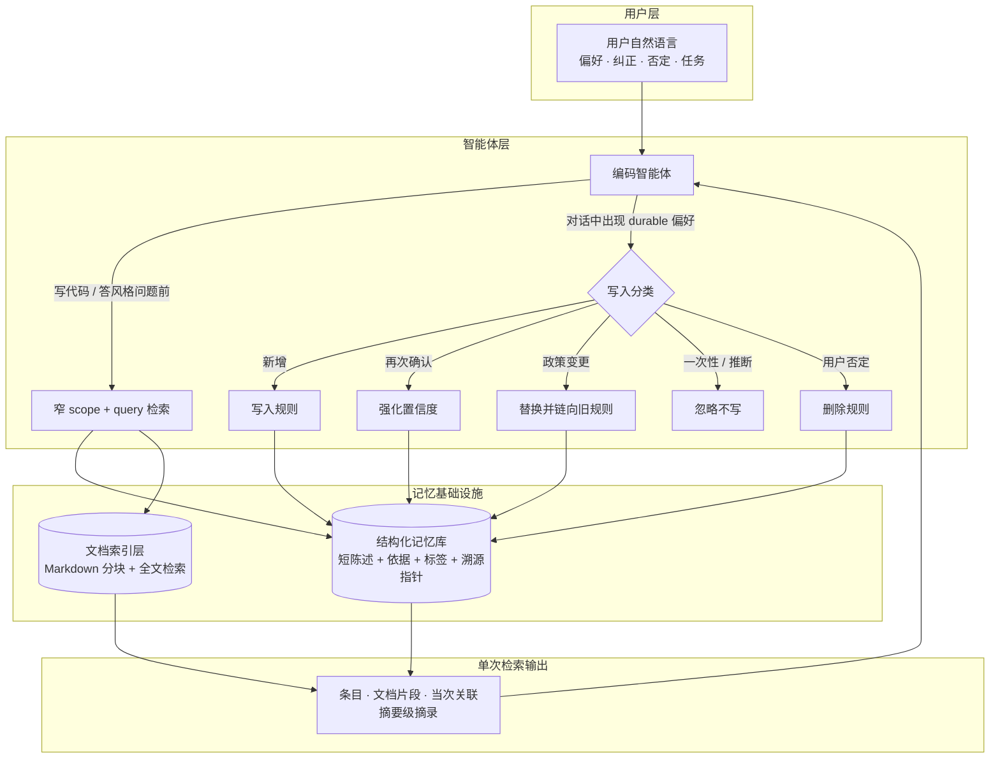

**核心设计原则**

1. **规则短、文档长** — 持久记忆只存可执行陈述（claim）与用户原话摘要（evidence）；长文留在项目 Markdown，由索引层按需切片返回。
2. **按需召回、窄标签** — 写代码前一次联合检索，只拉与当前任务相关的 Top-N 条条目与文档片段，而非整库注入上下文。
3. **显式写入、禁止推断** — 智能体必须分类后再写库；不把任务指令、闲聊或自行推断的偏好写入长期记忆。
4. **溯源优先于共现** — 持久关联靠规则上的文档指针；同次检索的「共现提示」仅辅助判断，不持久化，避免假关联固化成幻觉依据。

---

## 3. 与 Cursor 现有方案对照

Cursor 已提供多种上下文与记忆机制；本架构在其上**叠加**结构化记忆层，而非替代 IDE 原生能力。

| 维度              | Cursor 常见做法                                              | 本架构增强                                                          |
| --------------- | -------------------------------------------------------- | -------------------------------------------------------------- |
| **项目规则**        | `.cursor/rules/*.mdc`：`alwaysApply` 或 glob 匹配时**整段注入**会话 | 规则拆为短条目 + 标签；**仅 find 命中时**进入上下文；大规范留在 `docs/` 由索引层 excerpt 召回 |
| **内置 Memories** | 云端/本地记忆，格式与生命周期对智能体**不完全透明**                             | 本地结构化记忆库；陈述 / 依据 / 置信度 / 状态 **字段化**；读写可审计                      |
| **文档上下文**       | `@` 文件、语义搜索、读文件工具 — 智能体**自行多轮**打开                        | 一次联合检索并行返回条目 + **按标题分块的摘要片段**，减少整文件读入                          |
| **代码索引**        | 代码库 embedding / grep — 面向**实现位置**                        | 面向**政策与说明文档**（`docs/`、编辑器规则目录等）；与「用户偏好规则」同屏对照                  |
| **政策变更**        | 改 rules 文件或依赖新对话覆盖                                       | **替换（supersede）** 保留旧规则为 `superseded` 并链向新规则；可回答「何时、为何变更」      |
| **用户否定**        | 「别这么做了」依赖新对话或手动删 rules                                   | 口语否定 → 智能体检索后 **删除**条目；无需用户维护存储细节                              |
| **置信与衰减**       | 无统一模型                                                    | 置信度可强化 / 定期衰减 / 休眠；策略参数待定                                      |
| **规则依据**        | rules 与 STYLE.md 等文档**无结构化链接**                           | 条目可带 **出处指针**；点查时解析为文档摘录                                       |
| **Token 成本**    | alwaysApply 规则 + 长 chat 摘要常驻                             | 本地词频检索、无 embedding API；Top-N 与摘要截断                             |
| **人工审计**        | 直接编辑 rules 或查 Memories UI                                | **条目关系图 / 文档层次图 / 统一关联图**；依据事件链                                |

**协作关系（非替代）**

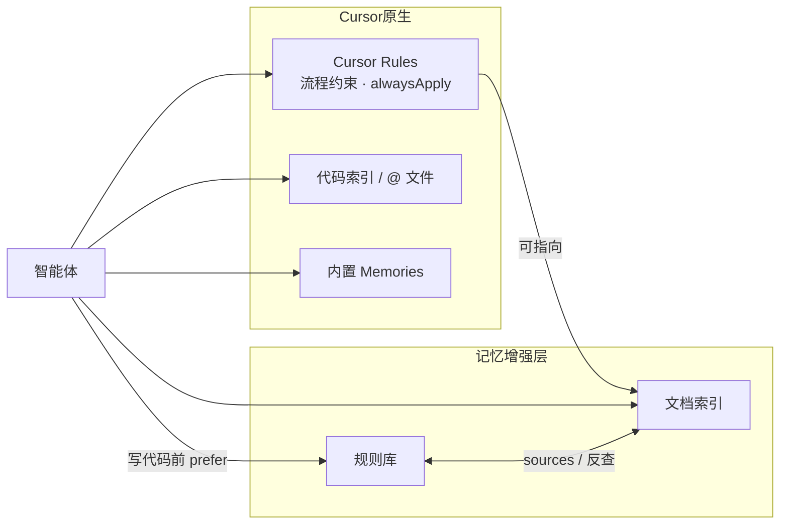

- **Cursor Rules** 仍适合「每轮必须遵守的编辑器级流程」（如：必须先 find 再写代码）。
- **本架构** 适合「会演化、需溯源、需按需召回」的项目偏好与政策条目。

---

## 4. Token 节约：技术点详解

### 4.1 双库分离 — 不把长文档写进记忆库

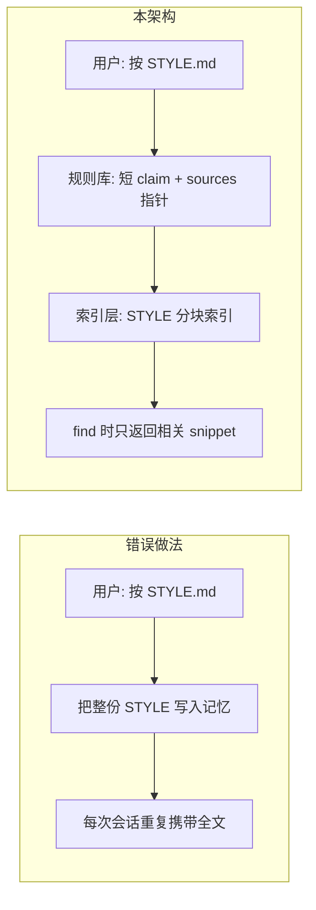

| 存储位置   | 内容体量        | 进入 LLM 的方式              |
| ------ | ----------- | ----------------------- |
| 结构化记忆库 | 短陈述 + 短依据   | Top-N 检索                |
| 文档索引层  | 完整 Markdown | **仅命中 chunk 的 snippet** |
| 聊天历史   | 无界增长        | **不**作为长期记忆主存储          |

**节约机制**：记忆库体积有上界；文档侧按需切片，避免「为了记住规范而把整本规范塞进记忆库」。

### 4.2 窄 scope + AND 语义预筛

检索请求携带 **scope 标签列表**（如 `go,naming`），规则必须**同时**拥有全部标签才进入候选（AND，非 OR）。

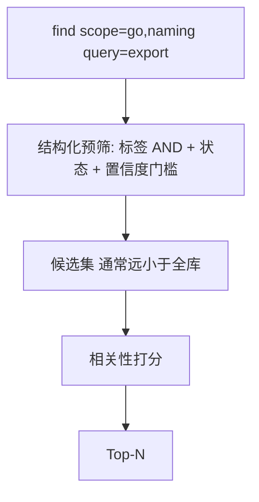

**对比 Cursor**：`alwaysApply: true` 的规则**无条件**进入每轮上下文；本架构用标签把召回面限制在与当前语言/主题相关的子集。

### 4.3 本地 BM25，零 embedding API Token

| 方案              | Token / 费用  | 语义能力       | 适用                   |
| --------------- | ----------- | ---------- | -------------------- |
| 云端 embedding 索引 | 索引与查询均可能计费  | 语义近邻强      | 超大规模、跨语言模糊匹配         |
| **本地 BM25**     | **无外部 API** | 关键词 / 字面匹配 | 可控 roots 下的政策文档与中短规则 |

文档与规则共用同一 query 做 BM25，一次工具返回两侧排序结果，避免智能体为「找规则」和「找文档」各发起多轮读文件。

### 4.4 分块（Chunking）与 snippet 截断

文档索引策略：

1. 按 Markdown `#` 标题切 section；
2. 同一 section 内按**可配置行数上限**或 section 边界 flush 为一个 chunk；
3. 检索命中返回**摘要片段**（长度可配置），而非全文。

**对比**：智能体用读文件工具常返回**整文件**或需多次 grep；snippet 在保持「段落级上下文」的同时压低单次工具结果的 Token 体积。

### 4.5 增量索引（指纹跳过 rebuild）

对 roots 下待索引文件聚合 `路径 : 大小 : 修改时间` 指纹；未变化则加载磁盘缓存，跳过全量分块。

**节约**：开发迭代中避免每次启动全量扫描；索引计算在本地完成，不占用 LLM 上下文。

### 4.6 单次 find 合并三路输出

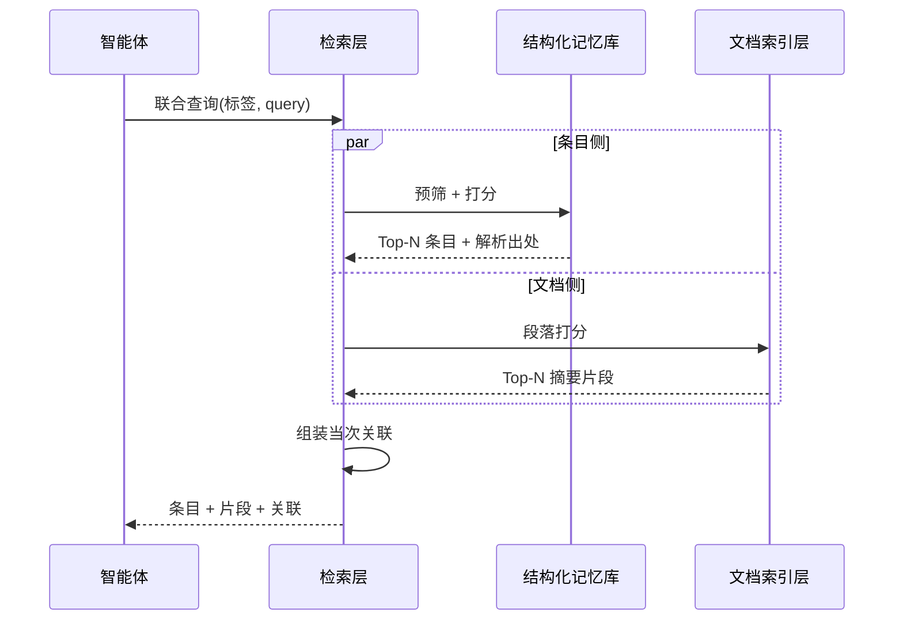

**对比**：无统一层时，典型路径为 `grep` → `read file` → `再 grep rules` → 多次往返；合并检索减少**工具调用次数**与**重复 query 文本**。

---

## 5. 防幻觉：技术点详解

### 5.1 claim 与 evidence 分离

| 字段                 | 用途           | 防幻觉作用                          |
| ------------------ | ------------ | ------------------------------ |
| **claim**          | 给智能体执行的可执行陈述 | 短、无歧义、可检索                      |
| **evidence（text）** | 用户原话摘录       | 审计时可对照「是否用户说过」；禁止智能体改写为用户未说的偏好 |
| **confidence**     | 有上下界的浮点      | 可按 utterance 强度赋初值；强化时递增；衰减时递减 |

**对比 Cursor Memories**：内置记忆往往缺少「原话 vs 摘要」分层，智能体容易在回放时**过度概括**或**补全**未陈述的细节。

### 5.2 写入四分法 — 避免「什么都记」

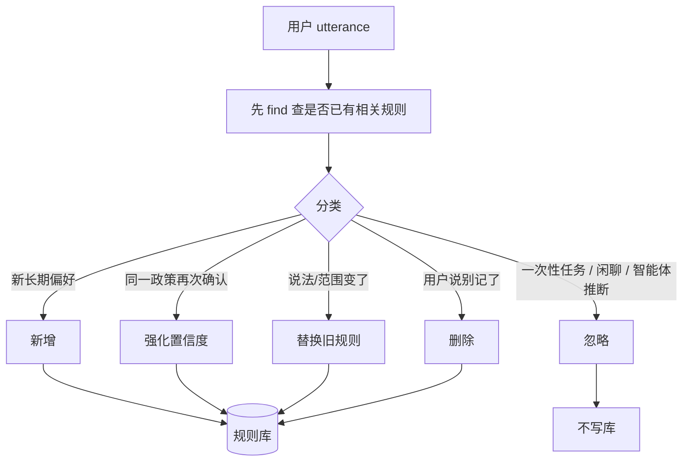

| 分类     | 防幻觉场景                                             |
| ------ | ------------------------------------------------- |
| **忽略** | 「帮我把 handler 拆两个文件」— 任务指令，**不得**沉淀为架构偏好           |
| **替换** | 用户收窄范围（「只有跨包导出才 PascalCase」）— **归档**过宽旧规则，避免双规范并存 |
| **删除** | 「之前那个命名约定不用了」— 显式废止，而非留库碰运气                       |
| **强化** | 用户重复确认 — 提高 confidence，**不是**新建重复条目               |

### 5.3 supersede 链 — 政策版本可追溯

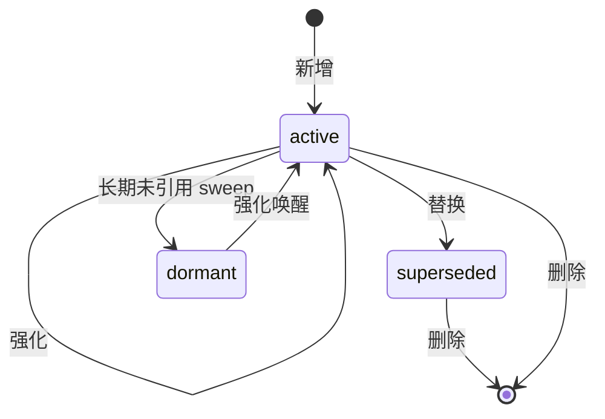

旧规则状态变为 `superseded`，新规则带 `supersedes` 边指向旧 id。

**防幻觉**：智能体 recall 时 SQL 预筛默认 **active + confidence≥0.3**，已替换条目不会与现行政策并列命中；审计界面仍可查看历史链，避免「模型编造从未存在的变更过程」。

### 5.4 sources 溯源 — 规则必须能落地到文档

用户说「命名看 STYLE.md」时，写入规则同时附带 **sources** 指针（path + 可选 heading），**不修改**项目 Markdown。

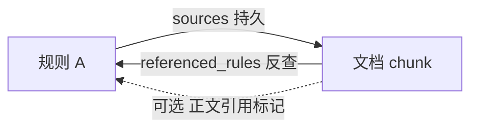

| 关联类型                 | 持久？   | 含义                             |
| -------------------- | ----- | ------------------------------ |
| **sources**          | 是     | 规则 → 文档；写入时由智能体附带              |
| **referenced_rules** | 是     | 文档 → 规则；读 chunk 时扫规则库反查        |
| **cited_by**         | 可选    | 维护者在正文显式 @ 规则；索引 rebuild 扫描    |
| **co_search**        | **否** | 同次 find 的 BM25 共现；**仅辅助**，不写回库 |

**防幻觉**：智能体 cite 规范时可指向 **resolved_sources** 摘录，而非泛泛声称「根据项目习惯」；共现链接不持久化，避免弱相关被误当作正式依据。

### 5.5 只记用户原话，禁止推断偏好

写入循环约束：

- **text / evidence** 必须来自用户原话；
- **不得**存储密钥；
- **不得**把智能体推测的偏好 add 进库（应走 **忽略**）。

**对比**：无约束时，智能体常在任务结束后「总结用户风格」并写入记忆，形成**从未被用户确认**的 "幻影政策"。

### 5.6 sweep 衰减 — 降低陈旧偏好误召回

长期未触达的条目：置信度按策略衰减；低于阈值 → `dormant`，不参与检索预筛。

**防幻觉**：一年前随口一提的偏好不应与今日高置信政策同等召回；dormant 仍保留在库中，用户再次确认可通过强化唤醒。

---

## 6. 检索流水线（Find）详解

### 6.1 规则侧：SQL 预筛 + BM25

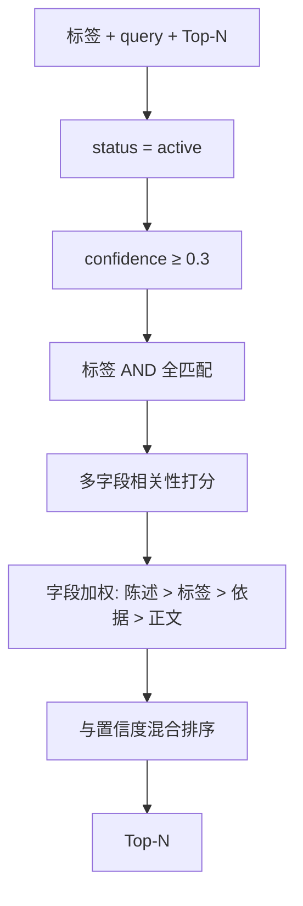

候选算法为 BM25 或同类词频模型；需支持中英文混合分词。具体参数见 [存储与检索说明](storage-retrieval.zh.md) §12。

### 6.2 文档侧：chunk 级 BM25

- scope **不**过滤文档（文档靠 path roots 配置界定范围）；
- 返回 path、heading、score、snippet。

### 6.3 links 组装（会话级）

| kind     | score       | 说明                      |
| -------- | ----------- | ----------------------- |
| sources  | 1.0         | 规则 sources 指向本次命中 chunk |
| cited_by | 1.0         | chunk 正文引用某规则           |
| 检索共现     | (条目分+文档分)/2 | Top-N 笛卡尔积排除已有边；**不持久** |

---

## 7. 端到端流程

### 7.1 写代码前召回（降 Token + 降幻觉）

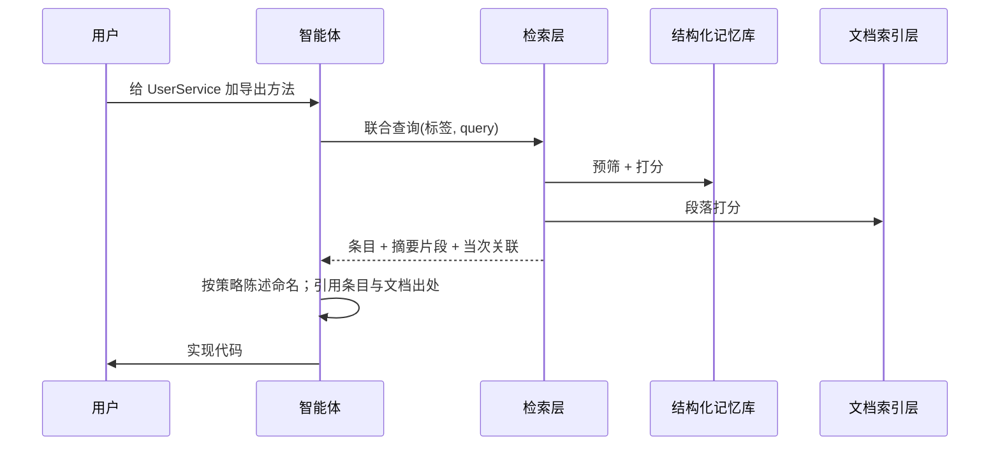

**要点**：编码**之后**才打开大段实现文件；**之前**用窄检索拉政策，避免无政策裸写导致风格幻觉。

### 7.2 对话中写入（结构化、可审计）

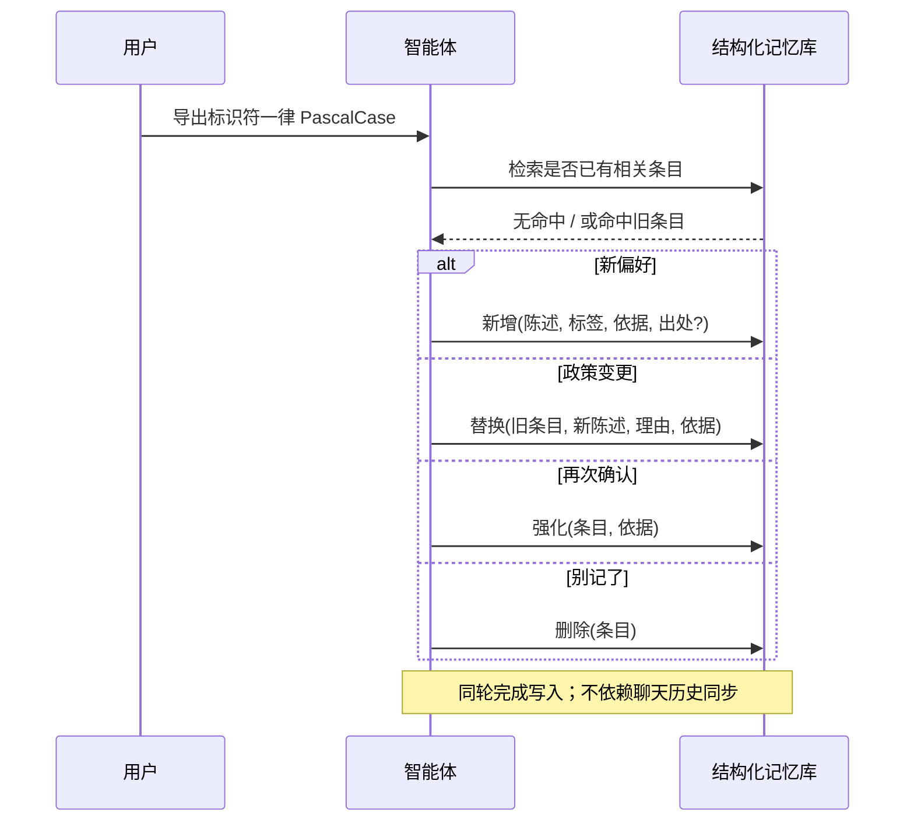

**对比 Cursor**：改 rules 文件需用户或智能体**手动编辑**；内置 Memories 无替换 / 删除的标准生命周期。本架构由智能体在**同轮对话**内完成分类与持久化。

### 7.3 人工审计（可选）

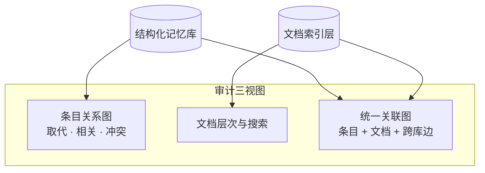

人工可核对：某条生效中条目是否有**解析后的出处摘录**；文档段落是否被**反向条目引用**；统一图中出处指针与文档内引用是否与预期一致。

---

## 8. 效果归纳

| 目标          | 手段                              | 相对 Cursor 原生                   |
| ----------- | ------------------------------- | ------------------------------ |
| **少 Token** | Top-N、摘要片段、标签预筛、本地词频检索、双库分离     | 替代 alwaysApply 大段 rules 与整文件复读 |
| **少幻觉**     | 依据原话、四分法写入、替换链、删除、出处指针          | 补结构化生命周期与文档 grounding          |
| **可审计**     | evidence_log、规则图、统一图、confidence | 补版本链与跨文档边                      |
| **低运维**     | 用户自然说话；智能体维护库                   | 用户不必记 id 或命令                   |
| **可携带**     | 结构化记忆库随项目迁移                     | 较云端 Memories 更透明、可导出           |

---

## 9. 已知权衡

| 选择             | 收益               | 代价                        |
| -------------- | ---------------- | ------------------------- |
| 无向量嵌入          | 零 embedding 成本   | 语义近邻弱于 embedding          |
| 文档 BM25 全内存扫描  | 实现简单             | roots 过大时变慢；需配置 roots     |
| scope AND      | 召回精准             | 标签设计不当会漏召回                |
| co_search 不持久  | 避免假关联            | 智能体需辨别临时 link             |
| chunk ID 随行号变化 | path+heading 更耐久 | 精确 chunk 指针可能 stale，需降级解析 |

**推荐实践**：为规则设计**窄而稳定**的 scope 标签；项目规范正文放在 `docs/` 等 roots 内；编辑器级流程仍用 Cursor Rules 的 `alwaysApply` 约束智能体「先检索再编码」。

---

## 参见

- [数据存储与检索技术说明](storage-retrieval.zh.md) — 双库模型、检索流水线、待定参数
- [记忆写入循环](correction.zh.md) — 写入分类与场景（实现参考）
- [文档索引与条目关联](imprint-shelves-linking.zh.md) — 出处指针与文档侧引用（实现参考）

