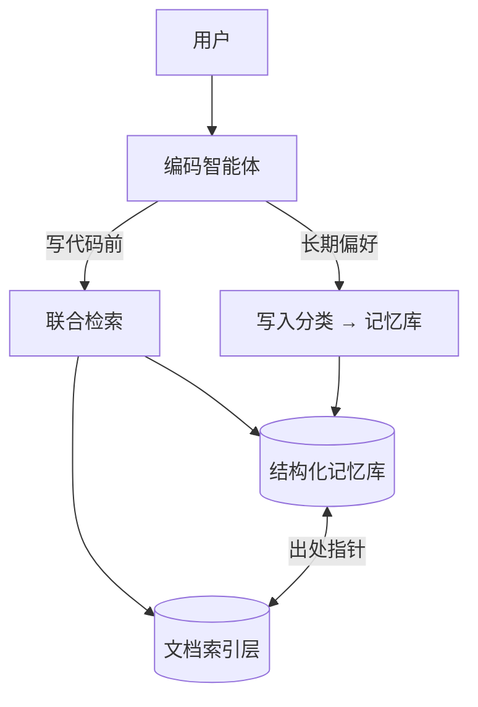

# 智能体长期记忆：架构索引

智能体长期记忆围绕两条主线：**Token 节约**（按需召回、摘要注入）与**偏好可信**（结构化写入、文档溯源）。双库模型与检索流水线见 [数据存储与检索技术说明](storage-retrieval.zh.md)。

---

## 设计目标

| 目标 | 手段 | 专题文档 |
| --- | --- | --- |
| **上下文更省** | Top-N 召回、摘要片段、窄标签预筛 | [Token 节约技术架构](agent-memory-token.zh.md) |
| **偏好可核对** | 陈述 / 依据分离、出处指针、审计视图 | [防幻觉技术架构](agent-memory-hallucination.zh.md) |
| **政策可演进** | 替换链、置信度、休眠与强化 | [防幻觉技术架构](agent-memory-hallucination.zh.md) |
| **规范可落地** | 条目关联文档段落，点查返回摘录 | [防幻觉技术架构](agent-memory-hallucination.zh.md) |

---

## 共享架构一览

| 组件 | 职责 |
| --- | --- |
| **结构化记忆库** | 短条目、依据、置信度、标签、条目关系、出处指针 |
| **文档索引层** | Markdown 分块、全文检索、文档内条目引用 |
| **联合检索** | 读时合并两库，Top-N + 摘要片段 |
| **写入分类** | 新增 / 强化 / 替换 / 忽略 / 删除 |

---

## 文档地图

| 文档 | 内容 |
| --- | --- |
| [Token 节约技术架构](agent-memory-token.zh.md) | 双库分离、窄标签预筛、摘要截断、合并检索、写代码前召回 |
| [防幻觉技术架构](agent-memory-hallucination.zh.md) | 陈述/依据分离、写入四分法、替换链、出处指针、审计 |
| [数据存储与检索技术说明](storage-retrieval.zh.md) | 存储模型、索引流水线、关联机制 |
| [记忆写入循环](correction.zh.md) | 写入场景示例 |
