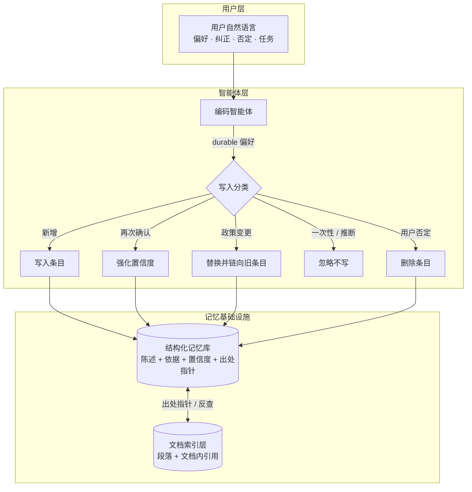
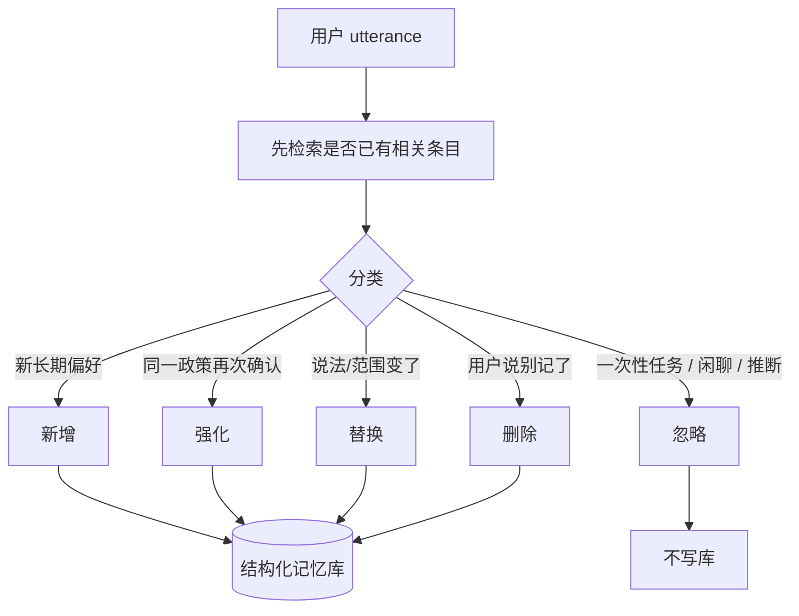
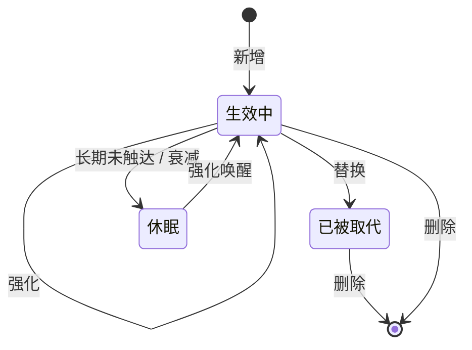
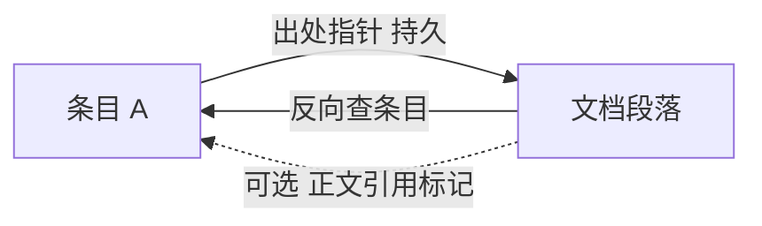
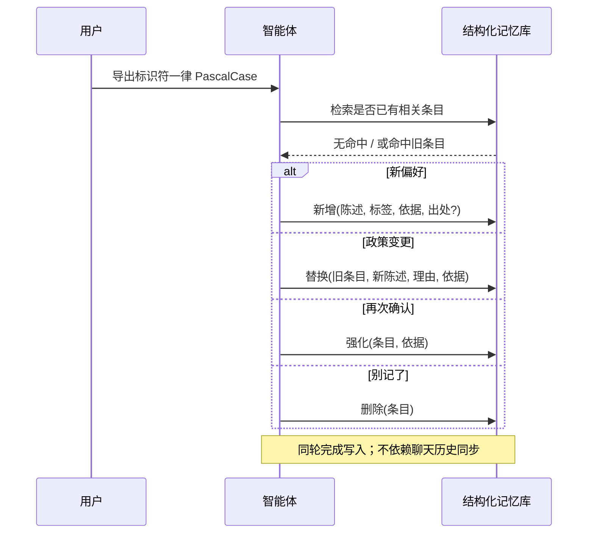
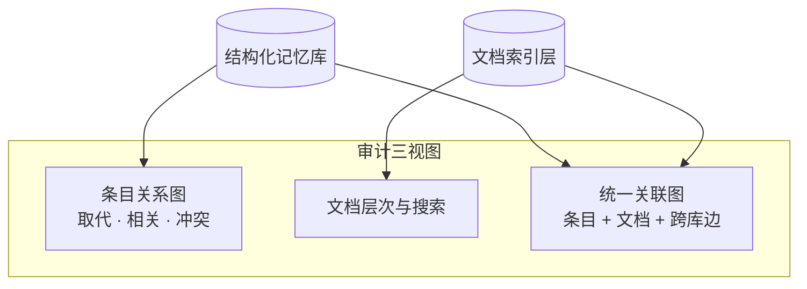

# 智能体长期记忆：防幻觉技术架构

> **文档性质：** 纯架构与方案设计，不涉及传输协议选型。本文只讨论**如何抑制偏好层幻觉与政策漂移**；Token 节约、检索效率见 [Token 节约技术架构](agent-memory-token.zh.md)。

---

## 1. 背景：偏好层幻觉从哪来

| 问题 | 典型表现 | 根因 |
| --- | --- | --- |
| **AI 幻觉（偏好层）** | 智能体「记得」用户从未说过的规范；或把一次性指令当成永久政策 | 无结构化写入、无证据链、无版本与否定机制 |
| **政策漂移** | 用户改口后旧规范仍生效；新旧规范并存互相矛盾 | 覆盖写而非可追溯替换；缺少显式废止 |
| **依据缺失** | 声称「按项目规范」却无法指向具体文档段落 | 条目与项目文档之间无持久、可解析的关联 |
| **幻影政策** | 任务结束后智能体「总结用户风格」并写入记忆 | 把推断当偏好、把任务当政策 |

**应对思路：** 陈述与依据分离、写入四分法、替换链与删除、出处指针与文档 grounding、置信度与休眠。

---

## 2. 总体架构（写入与溯源侧）

**与本主题相关的设计原则**

1. **显式写入、禁止推断** — 必须分类后再写库；任务指令、闲聊、智能体推断不得沉淀为长期偏好。
2. **溯源优先于共现** — 持久关联靠出处指针与文档内引用；同次检索的共现仅辅助，不持久化。
3. **可审计** — 依据事件链、条目关系图、统一关联图支持人工核对。

---

## 3. 与 IDE 方案对照（幻觉与生命周期）

| 维度 | IDE 常见做法 | 本架构取向 |
| --- | --- | --- |
| **内置 Memories** | 格式与生命周期对智能体不完全透明 | 陈述 / 依据 / 置信度 / 状态字段化；读写可审计 |
| **政策变更** | 改 rules 文件或依赖新对话覆盖 | **替换**保留旧条目为「已被取代」并链向新条目 |
| **用户否定** | 依赖新对话或手动删 rules | 口语否定 → 检索后 **删除**；用户不维护存储细节 |
| **置信与衰减** | 无统一模型 | 可强化 / 定期衰减 / 休眠；陈旧偏好降权 |
| **规则依据** | rules 与 STYLE.md 等**无结构化链接** | **出处指针**；点查解析为文档摘录 |
| **人工审计** | 直接编辑 rules 或查 Memories UI | 条目关系图 / 文档图 / 统一关联图；依据事件链 |

---

## 4. 陈述与依据分离

| 字段 | 用途 | 防幻觉作用 |
| --- | --- | --- |
| **策略陈述** | 给智能体执行的可执行声明 | 短、无歧义、可检索 |
| **依据原文** | 用户原话摘录 | 审计对照「是否用户说过」；禁止改写为未陈述的偏好 |
| **置信度** | 有上下界的浮点 | 可按 utterance 强度赋初值；强化递增；衰减递减 |

**对比内置记忆**：缺少「原话 vs 摘要」分层时，回放容易过度概括或补全细节。

---

## 5. 写入四分法 — 避免「什么都记」

| 分类 | 防幻觉场景 |
| --- | --- |
| **忽略** | 「帮我把 handler 拆两个文件」— 任务指令，不得沉淀为架构偏好 |
| **替换** | 用户收窄范围 — 归档过宽旧条目，避免双规范并存 |
| **删除** | 「之前那个约定不用了」— 显式废止 |
| **强化** | 用户重复确认 — 提高置信度，**不是**新建重复条目 |

场景示例见 [记忆写入循环](correction.zh.md)。

---

## 6. 替换链 — 政策版本可追溯

旧条目标记「已被取代」，新条目带取代边指向旧 ID。

**防幻觉**：检索预筛通常仅**生效中**且高于置信度门槛；已取代条目不与现行政策并列命中；审计仍可查历史链，避免编造变更过程。

---

## 7. 出处指针 — 条目必须能落地到文档

用户说「命名看 STYLE.md」时，写入条目同时附带**出处指针**（路径 + 可选章节），**不修改**项目 Markdown。

| 关联类型 | 持久？ | 含义 |
| --- | --- | --- |
| **出处指针** | 是 | 条目 → 文档；写入时附带 |
| **反向出处** | 是 | 文档 → 条目；读段落时反查记忆库 |
| **文档内引用** | 可选 | 维护者在正文显式标记；索引重建扫描 |
| **检索共现** | **否** | 同次查询共现；**仅辅助**，不写回库 |

**防幻觉**：cite 规范时指向**解析后的出处摘录**，而非「根据项目习惯」；共现不持久化，避免弱相关固化为依据。

---

## 8. 只记用户原话，禁止推断偏好

写入约束：

- **依据**必须来自用户原话；
- **不得**存储密钥；
- **不得**把智能体推测的偏好写入库（应走 **忽略**）。

---

## 9. 置信度衰减与休眠

长期未触达的条目：置信度按策略衰减；低于阈值 → **休眠**，不参与检索预筛。

**防幻觉**：陈旧随口偏好不应与高置信政策同等召回；休眠条目仍保留，用户再次确认可通过强化唤醒。

---

## 10. 端到端：对话中写入

**对比**：手动改 rules 无标准替换/删除语义；本架构由智能体在**同轮对话**内分类并持久化。

---

## 11. 人工审计（可选）

人工可核对：生效中条目是否有**解析后的出处摘录**；段落是否被**反向条目引用**；统一图中出处指针与文档内引用是否一致。

---

## 12. 效果与权衡

| 目标 | 手段 |
| --- | --- |
| **少幻觉** | 依据原话、四分法写入、替换链、删除、出处指针 |
| **可审计** | 依据事件链、关系图、统一图、置信度 |
| **低运维** | 用户自然说话；智能体维护库 |

| 选择 | 收益 | 代价 |
| --- | --- | --- |
| 检索共现不持久 | 避免假关联固化 | 智能体需辨别当次关联 |
| 段落 ID 随行号变化 | 路径+标题更耐久 | 精确段落指针可能失效，需降级解析 |
| 标签 AND | 召回精准 | 标签设计不当会漏召回 |

---

## 参见

- [Token 节约技术架构](agent-memory-token.zh.md) — Top-N、摘要、合并检索
- [数据存储与检索技术说明](storage-retrieval.zh.md) — 双库模型与关联机制
- [记忆写入循环](correction.zh.md) — 写入分类与场景（实现参考）
- [文档索引与条目关联](imprint-shelves-linking.zh.md) — 出处指针设计（实现参考）
- [智能体长期记忆架构索引](agent-memory-architecture.zh.md)
