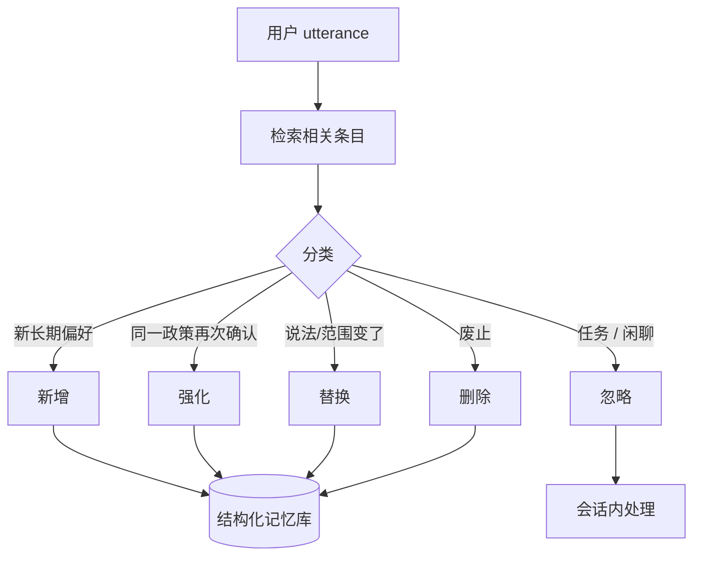
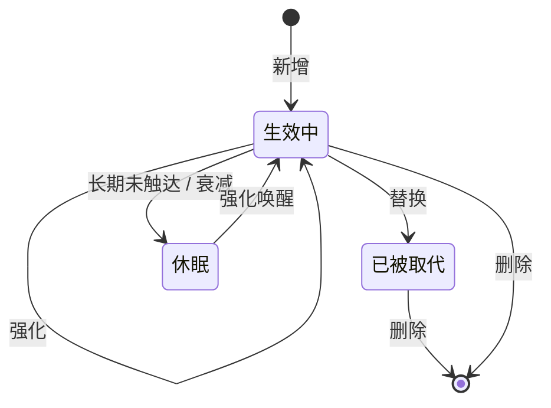
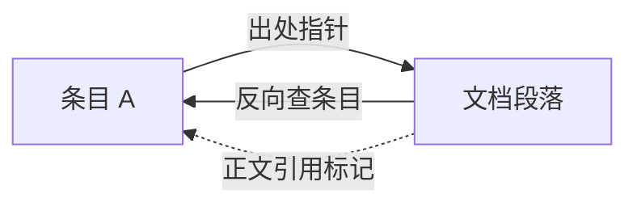
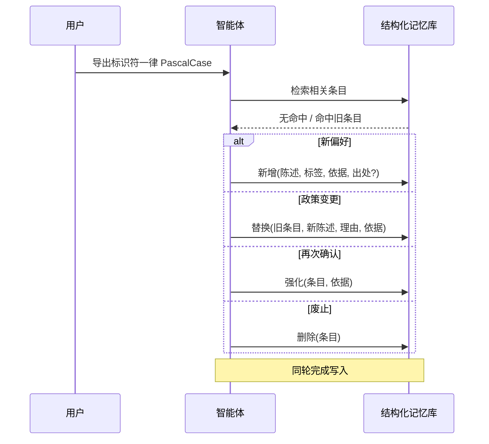
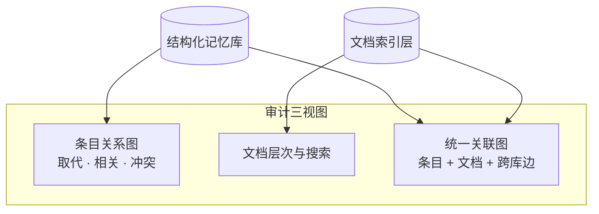

# 智能体长期记忆：防幻觉技术架构

---

## 1. 设计目标

| 目标 | 做法 |
| --- | --- |
| **偏好有据可查** | 策略陈述与用户原话依据分字段存储 |
| **政策可演进** | 替换链保留版本；删除与休眠显式表达废止 |
| **规范可落地** | 出处指针关联文档段落；点查返回摘录 |
| **写入有分类** | 新增 / 强化 / 替换 / 忽略 / 删除，同轮完成 |

架构基础见 [数据存储与检索技术说明](storage-retrieval.zh.md)。

---

## 2. 总体架构（写入与溯源侧）

**设计原则**

1. **分类后写入** — 智能体先检索、再分类，长期偏好才进入记忆库。
2. **溯源优先** — 持久关联靠出处指针与文档内引用；同次检索的共现作会话内辅助。
3. **可审计** — 依据事件链、条目关系图、统一关联图支持人工核对。

---

## 3. 与 IDE 方案对照（生命周期与溯源）

| 维度 | IDE 常见做法 | 本架构取向 |
| --- | --- | --- |
| **内置 Memories** | 格式与生命周期透明度有限 | 陈述 / 依据 / 置信度 / 状态字段化；读写可审计 |
| **政策变更** | 改 rules 文件或依赖新对话覆盖 | 替换保留旧条目为「已被取代」并链向新条目 |
| **用户废止** | 手动删 rules 或依赖新对话 | 口语废止 → 检索后删除条目 |
| **置信与衰减** | 无统一模型 | 强化 / 定期衰减 / 休眠 |
| **规则依据** | rules 与 STYLE.md 等并列存在 | 出处指针；点查解析为文档摘录 |
| **人工审计** | 编辑 rules 或 Memories UI | 条目关系图 / 文档图 / 统一关联图 |

---

## 4. 陈述与依据分离

| 字段 | 用途 | 作用 |
| --- | --- | --- |
| **策略陈述** | 可执行声明 | 短、可检索、供智能体执行 |
| **依据原文** | 用户原话摘录 | 审计时对照 utterance；写入时的锚点 |
| **置信度** | 有上下界的浮点 | 按 utterance 强度赋初值；强化递增；衰减递减 |

原话与摘要分层，回放时有明确对照对象。

---

## 5. 写入四分法

| 分类 | 典型场景 |
| --- | --- |
| **新增** | 首次表达的长期偏好 |
| **强化** | 用户再次确认同一政策 |
| **替换** | 范围收窄或表述变更；旧条目归档 |
| **忽略** | 一次性任务、闲聊 |
| **删除** | 用户废止某条已存偏好 |

场景示例见 [记忆写入循环](correction.zh.md)。

---

## 6. 替换链 — 政策版本可追溯

旧条目标记「已被取代」，新条目带取代边指向旧 ID。检索预筛面向生效中条目；审计视图保留完整版本链。

---

## 7. 出处指针 — 条目关联文档段落

用户说「命名看 STYLE.md」时，写入条目同时附带**出处指针**（路径 + 可选章节）；项目 Markdown 保持原样。

| 关联类型 | 持久 | 含义 |
| --- | --- | --- |
| **出处指针** | 是 | 条目 → 文档；写入时附带 |
| **反向出处** | 是 | 文档 → 条目；读段落时反查记忆库 |
| **文档内引用** | 可选 | 正文显式标记；索引重建扫描 |
| **检索共现** | 会话内 | 同次查询共现；辅助判断 |

cite 规范时指向**解析后的出处摘录**；持久关联以出处指针与文档内引用为准。

---

## 8. 依据锚定在用户原话

- **依据**字段记录用户原话；
- 长期偏好经**忽略**分类过滤任务与闲聊；
- 推断出的风格总结停留在会话内，待用户确认后再**新增**。

---

## 9. 置信度衰减与休眠

长期未触达的条目按策略降低置信度；低于阈值进入**休眠**，检索预筛优先面向生效中条目。用户再次确认时通过**强化**唤醒。

---

## 10. 端到端：对话中写入

智能体在同轮对话内完成分类与持久化；替换与删除有标准语义。

---

## 11. 人工审计

核对生效中条目的出处摘录、段落的反向条目引用，以及统一图中的跨库边。

---

## 12. 效果与权衡

| 目标 | 手段 |
| --- | --- |
| **偏好可信** | 依据原话、四分法写入、替换链、删除、出处指针 |
| **可审计** | 依据事件链、关系图、统一图、置信度 |
| **低运维** | 用户自然说话；智能体维护库 |

| 选择 | 收益 | 代价 |
| --- | --- | --- |
| 共现仅会话内 | 关联边界清晰 | 智能体需阅读当次关联 |
| 段落 ID 随行号变化 | 路径+标题更耐久 | 精确段落指针需降级解析 |
| 标签 AND | 召回精准 | 依赖标签设计质量 |

---

## 参见

- [Token 节约技术架构](agent-memory-token.zh.md)
- [数据存储与检索技术说明](storage-retrieval.zh.md)
- [记忆写入循环](correction.zh.md)
- [文档索引与条目关联](imprint-shelves-linking.zh.md)
- [智能体长期记忆架构索引](agent-memory-architecture.zh.md)
