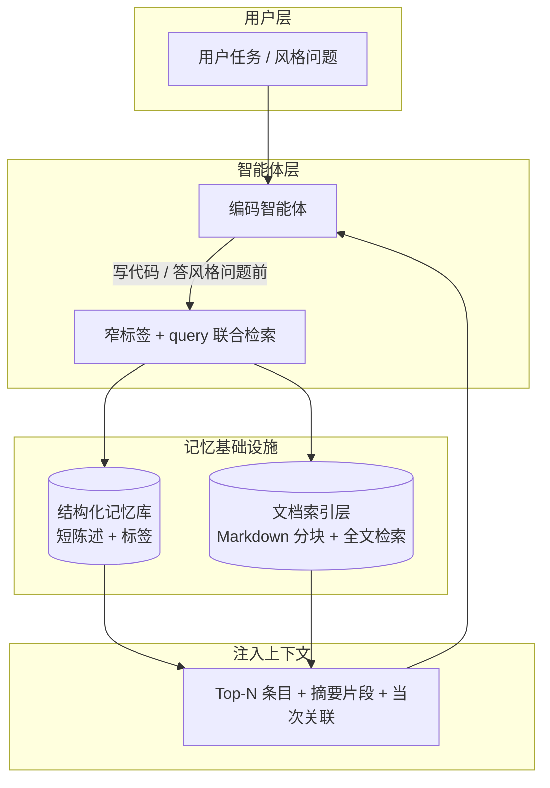
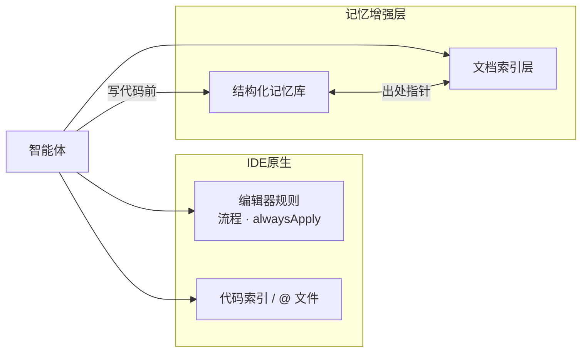
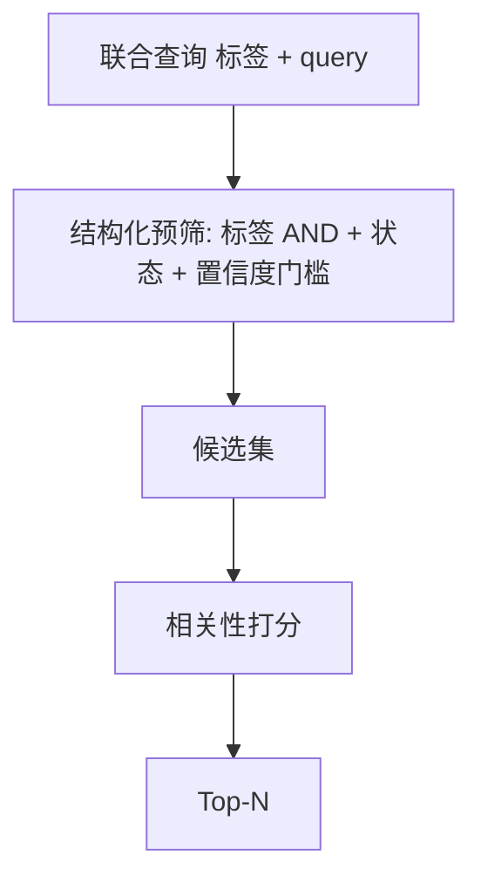
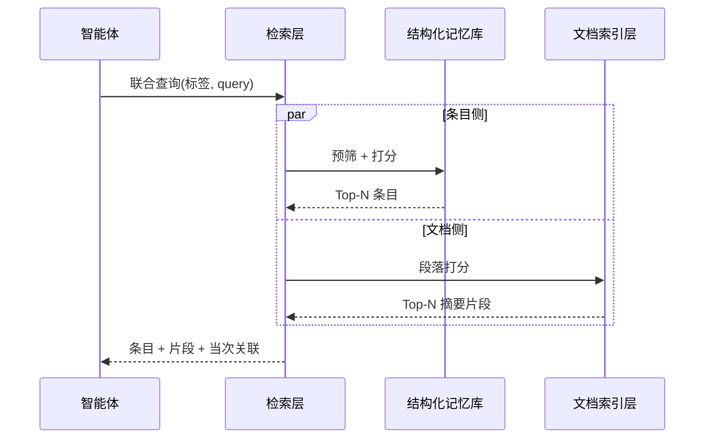
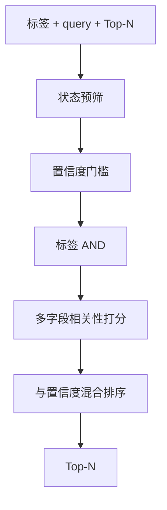
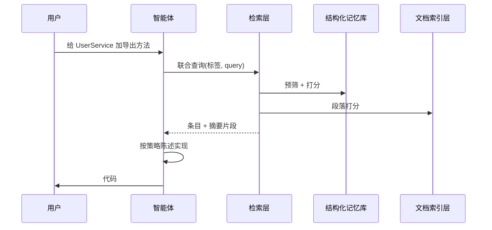

# 智能体长期记忆：Token 节约技术架构

---

## 1. 设计目标

| 目标 | 做法 |
| --- | --- |
| **任务相关上下文** | 写代码前联合检索，Top-N 条目 + 摘要片段注入 LLM |
| **条目与文档分工** | 记忆库存短陈述；长规范留在 Markdown，索引层按段落切片 |
| **单次召回合并** | 同一 query 并行返回条目侧与文档侧排序，一次往返 |
| **本地检索** | 词频模型（如 BM25）在可控语料上运行，零 embedding API 成本 |

架构基础见 [数据存储与检索技术说明](storage-retrieval.zh.md)。

---

## 2. 总体架构（检索侧）

**设计原则**

1. **条目短、文档长** — 记忆库存陈述与依据；规范正文由索引层按需切片返回。
2. **按需召回、窄标签** — 一次联合检索，拉取与当前任务相关的 Top-N。
3. **摘要优先** — 命中段落以可配置长度的 excerpt 进入上下文。

---

## 3. 与 IDE 方案对照（Token 维度）

| 维度 | IDE 常见做法 | 本架构取向 |
| --- | --- | --- |
| **项目规则** | `alwaysApply` 或 glob 匹配时整段注入 | 短条目 + 标签；检索命中后进入上下文 |
| **文档上下文** | `@` 文件、读文件工具多轮打开 | 联合检索返回按标题分块的摘要片段 |
| **Token 成本** | 大段 rules + 长 chat 摘要常驻 | 本地词频检索；Top-N 与摘要截断 |
| **代码索引** | embedding / grep 面向实现位置 | 政策与说明文档与偏好条目同屏召回 |

**与 IDE 能力分工**

编辑器规则承载每轮流程约束；本架构承载会演化、需按需切片召回的项目偏好与政策文档。

---

## 4. 双库分离：短条目与文档切片

| 存储位置 | 内容体量 | 进入 LLM 的方式 |
| --- | --- | --- |
| 结构化记忆库 | 短陈述 + 短依据 | Top-N 检索 |
| 文档索引层 | 完整 Markdown | 命中段落的摘要 |
| 聊天历史 | 会话内滚动 | 长期记忆的主存储落在上述两库 |

---

## 5. 窄标签 + AND 预筛

检索携带**标签列表**（如 `backend,naming`），条目须**同时**拥有全部标签才进入候选（AND 语义）。

标签把召回面收束到与当前语言、主题相关的子集，控制进入上下文的条目数量。

---

## 6. 本地词频检索

| 方案 | Token / 费用 | 语义能力 | 适用 |
| --- | --- | --- | --- |
| 云端 embedding | 索引与查询均可能计费 | 语义近邻强 | 超大规模、跨语言模糊匹配 |
| **本地 BM25（或同类）** | 无外部 API | 关键词 / 字面匹配 | 可控扫描根目录下的政策文档与中短条目 |

条目与文档共用同一 query，一次联合检索返回两侧排序。

---

## 7. 分块与摘要截断

1. 按 Markdown 标题切 section；
2. 同一 section 内按可配置行数上限或 section 边界 flush 为 chunk；
3. 命中返回摘要片段（长度可配置）。

摘要在保留段落级上下文的同时，压低单次注入的 Token 体积。

---

## 8. 增量索引（指纹跳过重建）

对扫描根目录下文件聚合 `路径 : 大小 : 修改时间` 指纹；指纹未变则加载缓存，跳过全量分块。索引计算在本地完成。

---

## 9. 单次联合检索合并输出

合并检索把条目查找与文档查找合成一次往返。

---

## 10. 检索流水线（效率视角）

文档侧由扫描根目录界定范围；返回路径、标题、分数、摘要。算法细节见 [数据存储与检索技术说明](storage-retrieval.zh.md)。

---

## 11. 端到端：写代码前召回

先窄检索拉政策与文档 excerpt，再打开实现文件；上下文携带与任务相关的政策片段。

---

## 12. 效果与权衡

| 目标 | 手段 |
| --- | --- |
| **上下文更省** | Top-N、摘要片段、标签预筛、本地词频检索、双库分离、合并检索 |

| 选择 | 收益 | 代价 |
| --- | --- | --- |
| 词频模型 | 零 embedding 成本 | 语义近邻弱于 embedding |
| 文档全内存扫描 | 实现简单 | 扫描根目录过大时变慢 |
| 标签 AND | 召回精准、语料小 | 依赖标签设计质量 |

为条目设计窄而稳定的标签；长规范放在扫描根目录内的 `docs/` 等路径；流程级约束由编辑器 `alwaysApply` 规则承载，与按需召回分工协作。

---

## 参见

- [防幻觉技术架构](agent-memory-hallucination.zh.md)
- [数据存储与检索技术说明](storage-retrieval.zh.md)
- [智能体长期记忆架构索引](agent-memory-architecture.zh.md)
