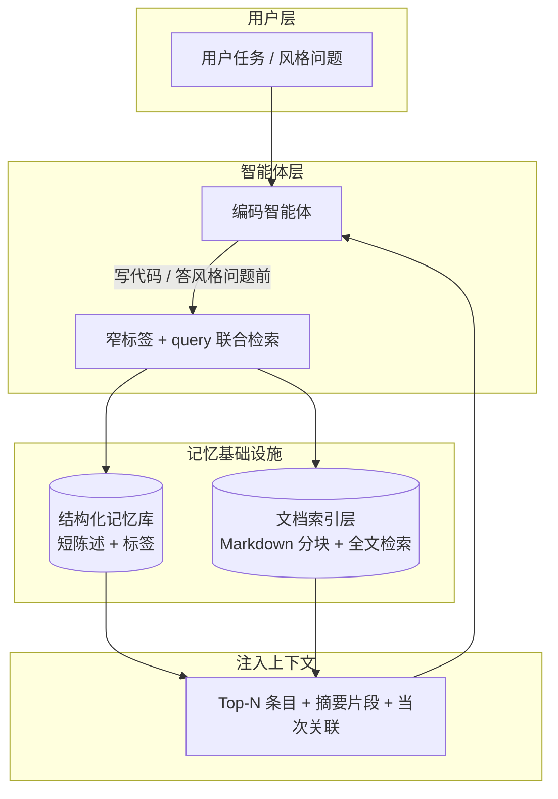
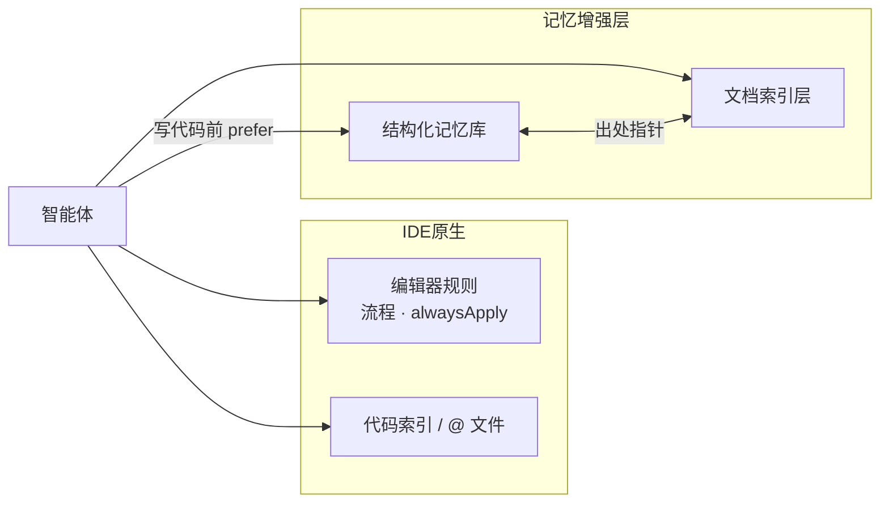
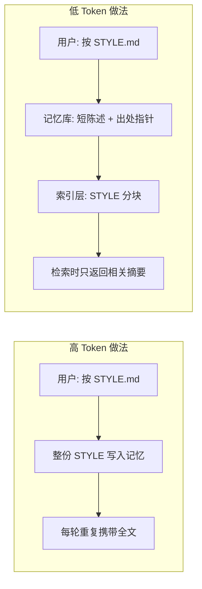
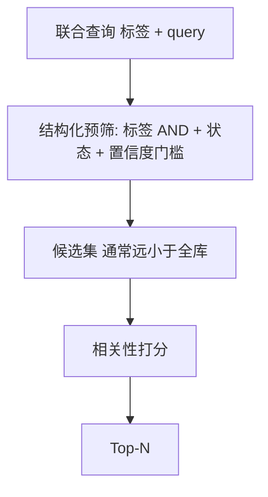
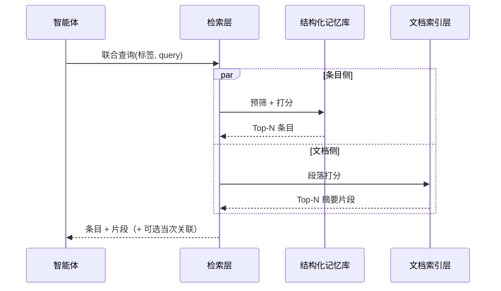
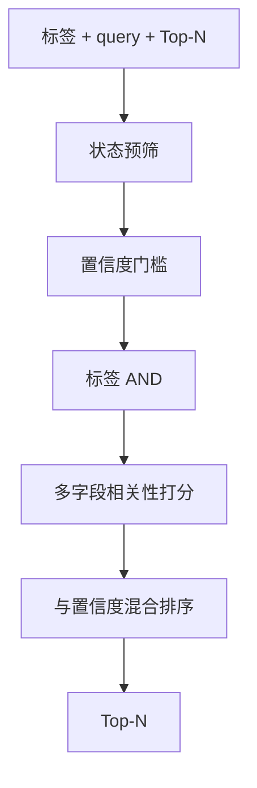
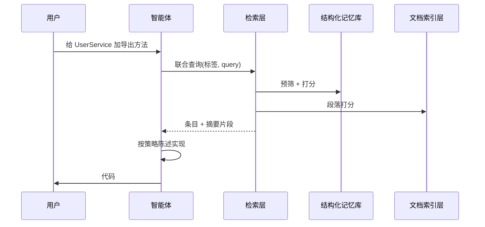

# 智能体长期记忆：Token 节约技术架构

> **文档性质：** 纯架构与方案设计，不涉及传输协议选型。本文只讨论**如何用更少 Token 携带有效记忆**；防幻觉、写入生命周期见 [防幻觉技术架构](agent-memory-hallucination.zh.md)。

---

## 1. 背景：Token 从哪浪费

| 问题 | 典型表现 | 根因 |
| --- | --- | --- |
| **Token 浪费** | 每轮会话重复注入大段规则、整文件文档、冗长聊天摘要 | 上下文「全量预载」而非「任务相关按需召回」 |
| **文档复读** | 智能体为多轮 grep / read file 反复打开同一规范 | 无统一检索层，规则与文档分开找 |
| **规则常驻** | `alwaysApply` 类规则无条件进入每轮上下文 | 无标签预筛与 Top-N 截断 |

**应对思路：** **结构化记忆库**（短条目）+ **文档索引层**（长文分块）分离存储；写代码前**一次联合检索**，只向 LLM 注入 Top-N 条目与摘要片段。

---

## 2. 总体架构（检索侧）

**与本主题相关的设计原则**

1. **条目短、文档长** — 记忆库不存长文；规范正文留在 Markdown，索引层按需切片。
2. **按需召回、窄标签** — 一次联合检索，只拉与当前任务相关的 Top-N，而非整库注入。
3. **摘要而非全文** — 命中段落返回可配置长度的 excerpt，不默认读整文件。

---

## 3. 与 IDE 方案对照（Token 维度）

| 维度 | IDE 常见做法 | 本架构取向 |
| --- | --- | --- |
| **项目规则** | `alwaysApply` 或 glob 匹配时**整段注入** | 短条目 + 标签；**仅检索命中时**进入上下文 |
| **文档上下文** | `@` 文件、读文件工具 — **自行多轮**打开 | 一次联合检索返回**按标题分块的摘要片段** |
| **Token 成本** | 大段 rules + 长 chat 摘要常驻 | 本地词频检索、无 embedding API；Top-N 与摘要截断 |
| **代码索引** | embedding / grep — 面向**实现位置** | 面向**政策与说明文档**；与偏好条目同屏召回，减少重复 query |

**协作关系（非替代）**

- **编辑器规则**仍适合「每轮必须遵守的流程约束」。
- **本架构**适合「会演化、需按需切片召回」的项目偏好与政策文档。

---

## 4. 双库分离 — 不把长文档写进记忆库

| 存储位置 | 内容体量 | 进入 LLM 的方式 |
| --- | --- | --- |
| 结构化记忆库 | 短陈述 + 短依据 | Top-N 检索 |
| 文档索引层 | 完整 Markdown | **仅命中段落的摘要** |
| 聊天历史 | 无界增长 | **不**作为长期记忆主存储 |

---

## 5. 窄标签 + AND 预筛

检索携带**标签列表**（如 `backend,naming`），条目须**同时**拥有全部标签才进入候选（AND，非 OR）。

**对比**：无条件注入的规则每轮都占 Token；标签把召回面限制在与当前语言/主题相关的子集。

---

## 6. 本地词频检索，零 embedding API

| 方案 | Token / 费用 | 语义能力 | 适用 |
| --- | --- | --- | --- |
| 云端 embedding | 索引与查询均可能计费 | 语义近邻强 | 超大规模、跨语言模糊匹配 |
| **本地 BM25（或同类）** | **无外部 API** | 关键词 / 字面匹配 | 可控扫描根目录下的政策文档与中短条目 |

条目与文档共用同一 query，**一次联合检索**返回两侧排序，避免「找条目」和「找文档」各发起多轮读文件。

---

## 7. 分块与摘要截断

文档索引策略：

1. 按 Markdown 标题切 section；
2. 同一 section 内按**可配置行数上限**或 section 边界 flush 为 chunk；
3. 命中返回**摘要片段**（长度可配置），而非全文。

**对比**：读文件工具常返回整文件；摘要在保持段落级上下文的同时压低单次结果的 Token 体积。

---

## 8. 增量索引（指纹跳过重建）

对扫描根目录下文件聚合 `路径 : 大小 : 修改时间` 指纹；未变化则加载缓存，跳过全量分块。

索引计算在本地完成，不占用 LLM 上下文；开发迭代中避免每次启动全量扫描。

---

## 9. 单次联合检索合并输出

**对比**：无统一层时典型路径为 grep → read file → 再查规则 → 多次往返；合并检索减少**往返次数**与**重复 query 文本**。

---

## 10. 检索流水线（效率视角）

文档侧：标签**不**过滤文档（范围由扫描根目录配置）；返回路径、标题、分数、摘要。

算法与待定参数见 [数据存储与检索技术说明](storage-retrieval.zh.md)。

---

## 11. 端到端：写代码前召回

**要点**：先窄检索拉政策与文档 excerpt，再打开大段实现文件；避免无上下文裸写，也避免预载整库。

---

## 12. 效果与权衡

| 目标 | 手段 |
| --- | --- |
| **少 Token** | Top-N、摘要片段、标签预筛、本地词频检索、双库分离、合并检索 |

| 选择 | 收益 | 代价 |
| --- | --- | --- |
| 无向量嵌入 | 零 embedding 成本 | 语义近邻弱于 embedding |
| 文档全内存扫描 | 实现简单 | 扫描根目录过大则变慢 |
| 标签 AND | 召回精准、语料小 | 标签设计不当会漏召回 |

**推荐实践**：为条目设计**窄而稳定**的标签；长规范放在扫描根目录内的 `docs/` 等路径；流程级约束仍可用编辑器 `alwaysApply` 规则，与按需召回分工。

---

## 参见

- [防幻觉技术架构](agent-memory-hallucination.zh.md) — 写入分类、溯源、审计
- [数据存储与检索技术说明](storage-retrieval.zh.md) — 双库模型与检索流水线
- [智能体长期记忆架构索引](agent-memory-architecture.zh.md)
