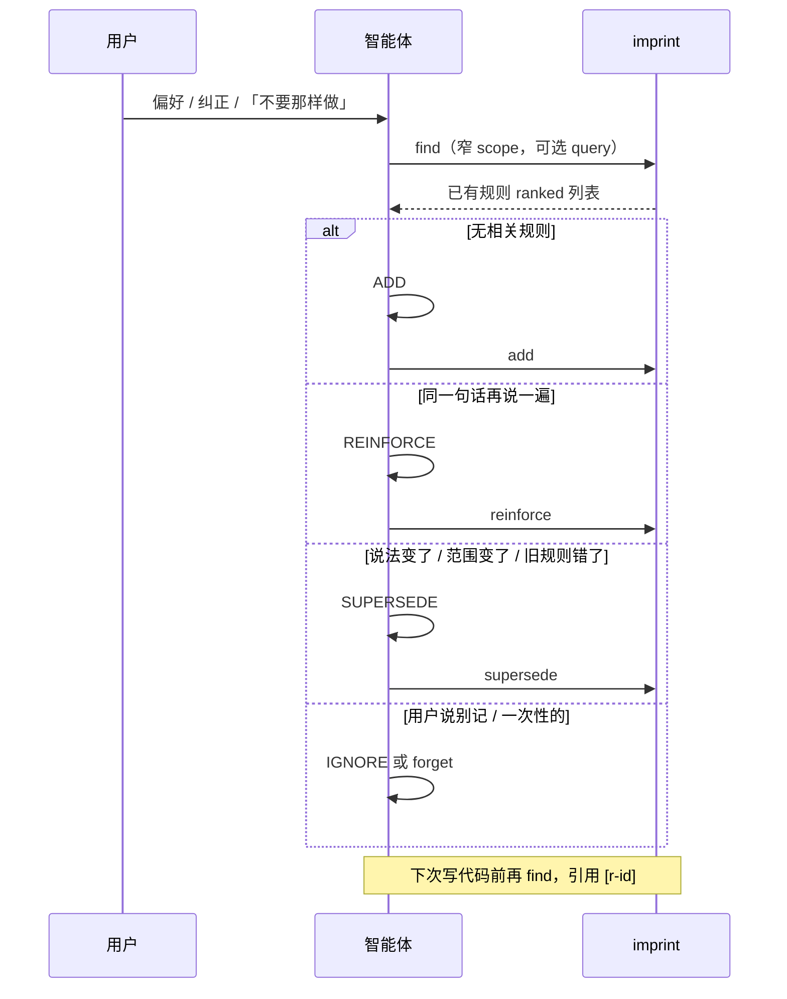

# 记忆纠偏

imprint 的「纠偏」指：**用户纠正智能体后，如何把偏好写进 vault，并在下次编码时召回到正确行为**——不是模型训练，也不是 embedding 微调，而是 **markdown 规则 + 显式生命周期**。

智能体在每次写入前必须 **`find` → 分类 → 选操作**；imprint 只负责诚实存储，不替智能体决定「该不该写」。

## 纠偏循环



| 步骤 | 谁做 | 做什么 |
| --- | --- | --- |
| **召回** | 智能体 | `find --scope tag,tag`（标签 **AND**），必要时加 `--query` BM25 |
| **分类** | 智能体 | ADD / REINFORCE / SUPERSEDE / IGNORE（见下表） |
| **写入** | imprint | `add` / `reinforce` / `supersede` / `forget` |
| **审计** | 人 | `get`、`show`、`viz`；旧规则在 `archive/`，可追溯 |

优先 **MCP 工具**；未挂载时用 **`imprint --json`**（见 [mcp.zh.md](mcp.zh.md)）。

## 四种写入分类

| 分类 | 何时用 | 命令 | 对 vault 的影响 |
| --- | --- | --- | --- |
| **ADD** | `find` 无匹配；用户**新**偏好 | `add` | 新 `active` 规则，默认 confidence **0.6** |
| **REINFORCE** | 已有规则；用户**再次确认**同一偏好 | `reinforce` | confidence **+0.1**（上限 **0.95**），`reinforcement_count++`，可唤醒 `dormant` |
| **SUPERSEDE** | 偏好**改了**、范围**扩大/缩小**、旧 claim **不再成立** | `supersede` | 旧规则 → `superseded` 并进 `archive/`；新规则 `active`，链上 `supersedes: [old_id]` |
| **IGNORE** | 一次性指令、闲聊、智能体**推断**出的偏好 | （不写） | 无 |

额外：

| 操作 | 何时用 |
| --- | --- |
| **forget** | 用户明确「忘记 / 不要记录这条」 |
| **sweep** | 定期衰减长期未触达规则（默认 90 天 −0.05；低于 0.3 → `dormant` 归档） |

### 置信度约定（智能体侧）

写入 `add` 时可设 `--confidence` / MCP `confidence`：

| 用户原话强度 | 建议 confidence |
| --- | --- |
| 随口一提、首次偏好 | **0.6**（默认） |
| 明确纠正（「不对，应该…」） | **0.85** |
| 「从现在起永远…」 | **0.9** |

`reinforce` 在现有值上累加，不替代「纠正应 supersede + 高 confidence 新规则」。

### 只记用户原话

- **`--text` / `text`**：用户原话（evidence）
- **`claim`**：可执行的陈述句（给智能体读）
- 不要存密钥；不要推断用户没说的偏好

---

## 编码场景示例

以下用 **`./memory`** vault；MCP 与 CLI 等价，各举一种写法。

### 场景 1：新偏好 — ADD

**对话**

> 用户：Go 里 exported 标识符一律 PascalCase，别用 snake_case export。

**智能体**

1. `find --scope go,naming --query PascalCase` → 无命中  
2. 分类：**ADD**

```bash
imprint --json --vault ./memory add \
  "Go exported identifiers must use PascalCase" \
  --scope go,naming \
  --text "Go 里 exported 标识符一律 PascalCase，别用 snake_case export"
```

MCP `add`：`claim` / `scope` / `text` 同上，`confidence` 省略（0.6）。

**下次**：写 Go 导出符号前先 `find --scope go,naming`，命中则按 `[r-…]` 执行。

---

### 场景 2：再次确认 — REINFORCE

**对话**

> 用户：对，导出还是要 PascalCase，上次说的没错。

**智能体**

1. `find --scope go,naming` → 命中 `r-2026-09-14-001`  
2. 分类：**REINFORCE**（不是 ADD，避免重复）

```bash
imprint --json --vault ./memory reinforce r-2026-09-14-001 \
  --evidence "用户再次确认 exported 用 PascalCase"
```

MCP `reinforce`：`id` + `evidence`。

**结果**：confidence 0.6 → 0.7；`evidence_log` 多一条 `kind: reinforce`。

---

### 场景 3：纠正错误规则 — SUPERSEDE

**对话**

> 用户：不对，我们 internal 包可以用 unexported camelCase，只有 **跨包导出** 才要 PascalCase。

**智能体**

1. `find --scope go,naming` → 旧规则过宽  
2. 分类：**SUPERSEDE**（不是改旧文件手编辑，不是 ADD  duplicate）

```bash
imprint --json --vault ./memory supersede r-2026-09-14-001 \
  --claim "Go identifiers exported across packages must use PascalCase; internal unexported names use camelCase" \
  --scope go,naming \
  --reason "narrowed to cross-package exports only" \
  --text "不对，我们 internal 包可以用 unexported camelCase，只有跨包导出才要 PascalCase"
```

MCP `supersede`：`old_id`, `claim`, `scope`, `reason`, `text`。

**结果**：旧 id → `superseded` + `archive/`；新 id `active`，继承旧 confidence 并链到旧规则。Dashboard 上可看 **supersedes** 边。

---

### 场景 4：范围扩大 — SUPERSEDE

**对话**

> 用户：前端 TS 也一样，export 的组件和函数用 PascalCase / 同名约定，跟 Go 对齐。

**智能体**

1. `find --scope go,naming` 或 `typescript,naming`  
2. 分类：**SUPERSEDE**（scope 从 go → go + typescript）

```bash
imprint --json --vault ./memory supersede r-2026-09-14-002 \
  --claim "Exported Go and TypeScript symbols follow PascalCase (TS functions/components aligned with Go exports)" \
  --scope go,typescript,naming \
  --reason "extended naming rule to frontend TS" \
  --text "前端 TS 也一样，export 的组件和函数用 PascalCase，跟 Go 对齐"
```

---

### 场景 5：智能体差点推断 — IGNORE

**对话**

> 用户：帮我把这个 handler  refactor 一下，拆两个文件。

**智能体**

- 这是**任务指令**，不是长期偏好  
- `find` 可不写 vault  
- 分类：**IGNORE**

不写 `add`。若误存，用户说「这个别记」→ `forget ID`。

---

### 场景 6：明确删除 — forget

**对话**

> 用户：别再记 PascalCase 那条了，我们项目改规范文档了，imprint 里删掉。

```bash
imprint --json --vault ./memory forget r-2026-09-14-003
```

MCP `forget`：`id`。

**结果**：规则从 shard 删除；其他规则里指向它的 `related` / `supersedes` / `conflicts_with` 会被清理。

---

### 场景 7：写代码前召回 — find

**对话**

> 用户：给 `UserService` 加个导出方法。

**智能体（编码前）**

```bash
imprint --json --vault ./memory find --scope go,naming --query export
```

命中 `[r-2026-09-14-002]` → 新方法名 `GetProfile` 而非 `get_profile`。在回复或 commit 说明中可 cite `[r-2026-09-14-002]`。

---

## 自然衰减 vs 主动纠偏

| 机制 | 触发 | 适用 |
| --- | --- | --- |
| **supersede / forget** | 用户纠正 | 规则**错了**或**作废** |
| **reinforce** | 用户重复确认 | 规则**仍对**，加强信心 |
| **sweep** | 运维 / 定期任务 | 长期未引用偏好**淡出**（默认 90 天未 touch −0.05；&lt; 0.3 → dormant） |

`sweep` 不会删规则内容；`dormant` 仍在 `archive/`，`reinforce` 可唤醒。

---

## 常用命令速查

```bash
# 写前召回
imprint --json --vault ./memory find --scope go,error-handling --query wrap

# 看单条证据链
imprint --json --vault ./memory get r-2026-09-14-002

# 高置信 active 规则
imprint --json --vault ./memory list --status active --scope go --min-confidence 0.85

# 全景
imprint --json --vault ./memory show
imprint --json --vault ./memory viz
```

---

## 参见

- [README.zh.md](../README.zh.md) — vault 布局与 CLI 全集  
- [mcp.zh.md](mcp.zh.md) — MCP 挂载与工具  
- [correction.md](correction.md) — English version  
- `.cursor/rules/imprint-memory.mdc` — 智能体必须遵守的 alwaysApply 规则
