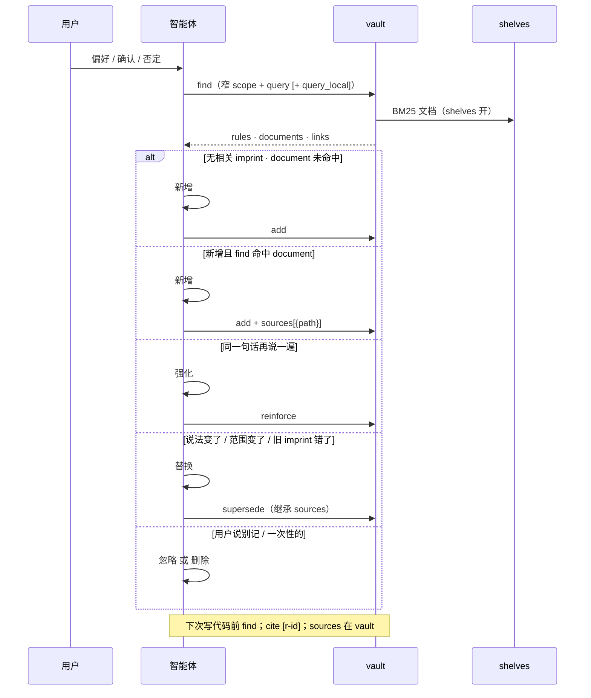

# 记忆写入

> **上手：** [README.zh.md](../README.zh.md#快速开始)。**参考：**写入循环、分类表与场景示例。

日常对话里的长期偏好写入 `.imprint/memory/`，下次任务前召回。智能体 **`find` → 分类 → 写入**；用户正常说话，不维护规则 id。

## 谁维护 vault

**用户**正常写代码、正常说话——偏好、确认、否定均可。无需了解 `imprint` 命令或规则 id。

**智能体**负责 `find`、分类、`add` / `reinforce` / `supersede` / `forget`。用户说「别记了」「那个不算了」「以后看 STYLE.md」时，查 vault 并执行，勿让用户复述命令或 id。

**人（可选）**用 `imprint desk open` 或 `show` 审计。查阅即可。

**Review + 剪枝：** 用户可说「帮我看看命名相关的记忆，过时的砍掉」——智能体 `show` / `get`、自然语言说明，确认后 `supersede` / `forget` / `sweep`。整理 vault 可以；让用户报 id 或跑命令不行。

文档里的 CLI / MCP 示例是**智能体执行面**，不是用户操作手册。

## 写入循环



| 步骤 | 谁做 | 做什么 |
| --- | --- | --- |
| **召回** | 智能体 | `find(scope, query[, query_local])` → rules、`documents`、`links`（shelves 开）；本地检索词与 `query` 不同时双传 |
| **分类** | 智能体 | 新增 / 强化 / 替换 / 忽略（见下表） |
| **写入** | imprint | `add`（可选 `sources`）/ `reinforce` / `supersede` / `forget` |
| **审计** | 人 | `get`、`show`、desk；superseded/dormant 规则在 `vault.db` |

优先 **MCP 工具**；未挂载时用 **`imprint --json`**（见 [mcp.zh.md](mcp.zh.md)）。

## 四种写入分类

| 分类 | 何时用 | 命令 | 对 vault 的影响 |
| --- | --- | --- | --- |
| **新增** | `find` 无匹配；用户**新**偏好（document 命中时可带 `sources`；已提炼本地检索词时同轮 `query_local` 落库） | `add` | 新 `active` imprint，默认 confidence **0.6** |
| **强化** | 已有规则；用户**再次确认**同一偏好 | `reinforce` | confidence **+0.1**（上限 **0.95**），`reinforcement_count++`，可唤醒 `dormant` |
| **替换** | 偏好**改了**、范围**扩大/缩小**、旧 claim **不再成立** | `supersede` | 旧规则 → `superseded` 状态；新规则 `active`，链上 `supersedes: [old_id]` |
| **忽略** | 一次性指令、闲聊、智能体**推断**出的偏好 | （不写） | 无 |

额外：

| 操作 | 何时用 |
| --- | --- |
| **删除** | 用户用**日常口语**否定某条（「别记了」「那个不算」）；由智能体 `find` 后 `forget`，用户不提 imprint |
| **sweep** | 定期衰减长期未触达规则（默认 90 天 −0.05；低于 0.3 → `dormant` 归档） |

### 置信度约定（智能体侧）

写入 `add` 时可设 `--confidence` / MCP `confidence`：

| 用户原话强度 | 建议 confidence |
| --- | --- |
| 随口一提、首次偏好 | **0.6**（默认） |
| 明确纠正（「不对，应该…」） | **0.85** |
| 「从现在起永远…」 | **0.9** |

`reinforce` 在现有值上累加，不替代「纠正应 supersede + 高 confidence 新规则」。

### 只记用户原话

- **`--text` / `text`**：用户原话（evidence）
- **`claim`**：可执行的陈述句（给智能体读）
- **`query_local`（可选）**：LLM 从用户输入提炼的**本地语言检索词**，与 `claim`/`query` 分离；同轮 `add`/`supersede`/`reinforce` 落库，供后续 `find` 双路 BM25；**不是**把 evidence 复制一遍
- 不要存密钥；不要推断用户没说的偏好

---

## 场景示例

以下用 **`./.imprint/memory`** vault；MCP 与 CLI 等价，各举一种写法。

### 场景 1：新偏好 — 新增

**对话**

> 用户：Go 里 exported 标识符一律 PascalCase，别用 snake_case export。

**智能体**

1. `find --scope go,naming --query PascalCase` → 无命中  
2. 分类：**新增**

```bash
imprint --json --vault ./.imprint/memory add \
  "Go exported identifiers must use PascalCase" \
  --scope go,naming \
  --text "Go 里 exported 标识符一律 PascalCase，别用 snake_case export"
```

MCP `add`：`claim` / `scope` / `text` 同上，`confidence` 省略（0.6）。

**下次**：写 Go 导出符号前先 `find --scope go,naming`，命中则按 `[r-…]` 执行。

---

### 场景 2：再次确认 — 强化

**对话**

> 用户：对，导出还是要 PascalCase，上次说的没错。

**智能体**

1. `find --scope go,naming` → 命中 `r-2026-09-14-001`  
2. 分类：**强化**（policy 已存在）

```bash
imprint --json --vault ./.imprint/memory reinforce r-2026-09-14-001 \
  --evidence "用户再次确认 exported 用 PascalCase"
```

MCP `reinforce`：`id` + `evidence`。

**结果**：confidence 0.6 → 0.7；`evidence_log` 多一条 `kind: reinforce`。

---

### 场景 3：政策变更 — 替换

**对话**

> 用户：不对，我们 internal 包可以用 unexported camelCase，只有 **跨包导出** 才要 PascalCase。

**智能体**

1. `find --scope go,naming` → 旧规则过宽  
2. 分类：**替换**（归档旧规则，写新 active）

```bash
imprint --json --vault ./.imprint/memory supersede r-2026-09-14-001 \
  --claim "Go identifiers exported across packages must use PascalCase; internal unexported names use camelCase" \
  --scope go,naming \
  --reason "narrowed to cross-package exports only" \
  --text "不对，我们 internal 包可以用 unexported camelCase，只有跨包导出才要 PascalCase"
```

MCP `supersede`：`old_id`, `claim`, `scope`, `reason`, `text`。

**结果**：旧 id → `superseded` 状态；新 id `active`，继承旧 confidence 并链到旧规则。`imprint desk open` 上可看 **supersedes** 边。

---

### 场景 4：范围扩大 — 替换

**对话**

> 用户：前端 TS 也一样，export 的组件和函数用 PascalCase / 同名约定，跟 Go 对齐。

**智能体**

1. `find --scope go,naming` 或 `typescript,naming`  
2. 分类：**替换**（scope 从 go → go + typescript）

```bash
imprint --json --vault ./.imprint/memory supersede r-2026-09-14-002 \
  --claim "Exported Go and TypeScript symbols follow PascalCase (TS functions/components aligned with Go exports)" \
  --scope go,typescript,naming \
  --reason "extended naming rule to frontend TS" \
  --text "前端 TS 也一样，export 的组件和函数用 PascalCase，跟 Go 对齐"
```

---

### 场景 5：智能体差点推断 — 忽略

**对话**

> 用户：帮我把这个 handler  refactor 一下，拆两个文件。

**智能体**

- 这是**任务指令**，不是长期偏好  
- `find` 可不写 vault  
- 分类：**忽略**

不写 `add`。若误存，用户随口「这个别记」→ 智能体 **`find` + `forget`**，用户无需知道 id。

---

### 场景 6：偏好作废 — 用户只说话，智能体收尾

**对话**

> 用户：命名以后以仓库里的 `STYLE.md` 为准，之前说的 PascalCase 导出约定不用了。

**智能体**

1. `find --scope go,naming` → 命中旧规则 `r-2026-09-14-003`  
2. 分类：**替换**（政策迁到 `STYLE.md`，保留审计链）或 **删除**（用户否定「别记这类命名偏好」时）  
3. **用户全程不说 imprint**；下面命令由智能体执行

**首选 supersede**（可追溯）：

```bash
imprint --json --vault ./.imprint/memory supersede r-2026-09-14-003 \
  --claim "Follow STYLE.md for naming; imprint does not override the style guide" \
  --scope go,naming,docs \
  --reason "naming policy moved to STYLE.md" \
  --text "命名以后以仓库里的 STYLE.md 为准，之前说的 PascalCase 导出约定不用了"
```

**若用户是否定「不要再用 imprint 记命名」**（口语「别记这些了」）→ `forget`：

```bash
imprint --json --vault ./.imprint/memory forget r-2026-09-14-003
```

MCP：同上，`supersede` 或 `forget`，参数由智能体从对话解析。

**回复用户**：确认已按 `STYLE.md` 执行即可，**不要**让用户确认规则 id 或选择命令。

---

### 场景 7：写代码前召回 — find

**对话**

> 用户：给 `UserService` 加个导出方法。

**智能体（编码前）**

```bash
imprint --json --vault ./.imprint/memory find --scope go,naming --query export
```

命中 `[r-2026-09-14-002]` → 新方法名 `GetProfile` 而非 `get_profile`。在回复或 commit 说明中可 cite `[r-2026-09-14-002]`。

---

## 自然衰减 vs 显式写入

| 机制 | 触发 | 适用 |
| --- | --- | --- |
| **supersede / forget** | 用户日常口语纠正 | 规则**错了**或**作废**（智能体执行，用户不维护 vault） |
| **reinforce** | 用户重复确认 | 规则**仍对**，加强信心 |
| **sweep** | 运维 / 定期任务 | 长期未引用偏好**淡出**（默认 90 天未 touch −0.05；&lt; 0.3 → dormant） |

`sweep` 不会删规则内容；`dormant` 仍在 `vault.db`，`reinforce` 可唤醒。

---

## 常用命令速查

```bash
# 写前召回
imprint --json --vault ./.imprint/memory find --scope go,error-handling --query wrap

# 看单条证据链
imprint --json --vault ./.imprint/memory get r-2026-09-14-002

# 高置信 active 规则
imprint --json --vault ./.imprint/memory list --status active --scope go --min-confidence 0.85

# 全景
imprint --json --vault ./.imprint/memory show
imprint desk open
```

---

## 参见

- [README.zh.md](../README.zh.md) — vault 布局与 CLI（常用 / 调试）
- [mcp.zh.md](mcp.zh.md) — MCP 挂载与工具  
- [correction.md](correction.md) — English version  
- `.cursor/rules/imprint-memory.mdc` — 智能体必须遵守的 alwaysApply 规则
