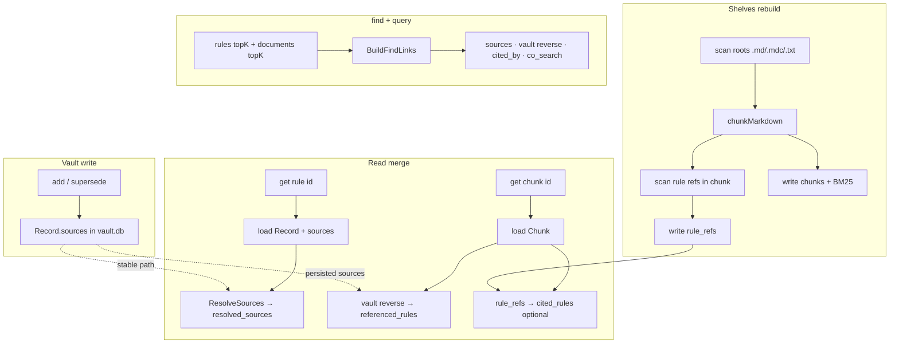

# imprint ↔ shelves data linking design

> **Status:** P0–P2 implemented (2026-09-16)  
> **Audience:** Developers working on imprint, shelves, and desk  
> **See also:** [shelves-builtin.md](shelves-builtin.md) · [correction.md](correction.md) · [mcp.md](mcp.md)

[中文](imprint-shelves-linking.zh.md)

---

## 1. Problem

**imprint** (vault rules) and **shelves** (workspace document index) are two separate systems today:

| System | Storage | ID shape | Graph |
| --- | --- | --- | --- |
| **imprint** | `.imprint/vault.db` | `r-YYYY-MM-DD-NNN` | `/graph` — rule-to-rule `supersedes` / `related` / `conflicts_with` |
| **shelves** | `.imprint/state/shelves.db` | 16-char hex chunk id | `/docs/graph` — file / directory / chunk hierarchy |

The only overlap: when `find` includes a `query`, MCP and host return `rules` and `documents` in parallel — **no cross-references, no unified graph, no durable links**.

Typical gaps:

1. User says “follow `STYLE.md` from now on” → rule lands in the vault with no traceable link to the doc.
2. Agent `get r-…` sees the claim but not the source passage; `get <chunk>` sees the doc but not related rules.
3. Desk shows rule and document graphs separately — cannot answer “where did this rule come from?” or “which rules cite this doc?”

---

## 2. Goals and non-goals

### Goals

1. **Traceability** — rules point at source docs (path or chunk); docs list inbound rules.
2. **Discoverability** — `find` / `get` return related items on the other side (rule ↔ document).
3. **Auditability** — desk can show cross-system edges, not just two isolated subgraphs.
4. **Low burden** — users speak normally; links are attached by the agent on write, or parsed from markdown on rebuild.
5. **Stable IDs** — chunk ids are content hashes; rule ids are stable; links survive rebuild when path-level refs are used.

### Non-goals (this phase)

- Embedding / vector semantic auto-linking (BM25 co-occurrence is **runtime boost only**, not persisted).
- Copying shelves documents **into** vault.db (docs stay indexed only).
- Users maintaining link tables or running link commands by hand.
- Cross-workspace / cross-vault global knowledge graphs.

---

## 3. Design principles

1. **Explicit over inferred** — durable links from YAML `sources` and parseable `[[r-…]]` in markdown; heuristics are auxiliary.
2. **Path over chunk** — `sources` default to `path` (+ optional `heading`); chunk id for precision, re-resolved after rebuild via path+heading.
3. **Write one way, read both ways** — vault owns `sources`; shelves rebuild scans doc → rule refs; read APIs merge into a bidirectional view.
4. **Backward compatible** — no links means today’s behaviour; new fields are optional.
5. **forget / supersede hygiene** — deleting a rule drops inbound doc-side edges (symmetric to today’s `referenced_by` cleanup on rules).

---

## 3.1 Recommended: vault sources by default

Most projects link via vault `sources`; `[[r-…]]` in doc bodies is optional.

| Need | Approach | Edit docs? |
| --- | --- | --- |
| “Which doc supports this imprint?” | vault `sources` + `resolved_sources` | **No** |
| “Which imprints reference this chunk?” (**durable**) | **`referenced_rules`** on `get chunk` (vault reverse scan) | **No** |
| “What matches this task right now?” | `find` `links` (session-only) | **No** |
| Maintainer @ in doc body | Optional `[[r-…]]` → `cited_rules` | Yes (**optional**) |

**Default agent path:** user speaks → `find` → document hit → ADD with `sources`. Bidirectional read; links live in vault.

---

## 4. Link model

### 4.1 Link kinds

| Kind | Direction | Persisted in | Created by |
| --- | --- | --- | --- |
| `sources` | rule → doc | vault YAML `sources` | agent `add` / `supersede` / future `link` |
| `cited_by` | doc → rule | shelves SQLite `rule_refs` | rebuild scans markdown |
| `scope_match` | rule ↔ doc | **not persisted** | **P4** — runtime in `find` (scope vs path prefix; not implemented) |
| `co_search` | rule ↔ doc | **not persisted** | BM25 co-occurrence in one `find` call |

### 4.2 DocRef (rule-side reference)

```yaml
# new field in imprint rule frontmatter
sources:
  - path: docs/style.md
    heading: Naming          # optional; omit for whole file
  - path: .cursor/skills/go/SKILL.md
  - chunk: a1b2c3d4e5f67890  # optional precise chunk; degrades to path+heading if stale
```

JSON (API / MCP):

```json
{
  "path": "docs/style.md",
  "heading": "Naming",
  "chunk": "a1b2c3d4e5f67890",
  "line_start": 42,
  "line_end": 58
}
```

Resolution:

- `chunk` present and in index → return full chunk + snippet.
- `path` / `heading` only → match chunk after rebuild: markdown inline to plain text (link label, not target), then drop `5.2`-style numbers; exact then bidirectional substring. No match → `heading_unresolved: true` (keep the declared heading; **do not** fall back to the file’s first chunk). Path with no heading → first chunk.
- Paths are workspace-relative, consistent with shelves `roots`.

### 4.3 Document-side rule reference syntax

On rebuild, scan chunk text (aligned with vault `See also: [[r-…]]`):

```markdown
Follow [[r-2026-09-11-001]] for naming.

<!-- optional explicit prefix -->
See [imprint:r-2026-09-14-002] for error handling.
```

Regex (draft):

- `\[\[(r-[0-9]{4}-[0-9]{2}-[0-9]{2}-[0-9]{3})\]\]`
- `\[imprint:(r-[0-9]{4}-[0-9]{2}-[0-9]{2}-[0-9]{3})\]`

Results go to shelves table `rule_refs(chunk_id, rule_id, line_no)`.

---

## 5. Storage schema

### 5.1 Vault — extension

```yaml
---
id: r-2026-09-16-001
claim: Python function names must be snake_case
scope: [python, naming]
confidence: 0.85
sources:
  - path: docs/style.md
    heading: Python naming
---
```

- `sources` lives in frontmatter, git-tracked like `related` / `supersedes`.
- `forget`: remove rule; doc files unchanged (inbound refs disappear on next rebuild).
- `supersede`: new rule may inherit or replace `sources` (agent decides).

### 5.2 Shelves SQLite — new tables

```sql
CREATE TABLE rule_refs (
  chunk_id  TEXT NOT NULL,
  rule_id   TEXT NOT NULL,
  line_no   INTEGER NOT NULL DEFAULT 0,
  PRIMARY KEY (chunk_id, rule_id, line_no)
);
CREATE INDEX idx_rule_refs_rule ON rule_refs(rule_id);

CREATE TABLE file_rule_refs (
  path      TEXT NOT NULL,
  rule_id   TEXT NOT NULL,
  PRIMARY KEY (path, rule_id)
);
```

`rule_refs` is fully rebuilt on each `index.Rebuild` (same strategy as `chunks`).  
Vault `sources` are **not** written back into markdown (avoid mass doc edits).

---

## 6. Index and resolution flow



**Rebuild triggers:** shelves enabled → `imprint up`, fingerprint change, `POST /docs/rebuild`. Vault changes do **not** trigger shelves rebuild.

**Stale chunks:** if `sources[].chunk` missing from index → API returns `resolved: { path, heading, stale_chunk: true }` and falls back to path.

---

## 7. API / MCP changes

### 7.1 `add` / `supersede` — optional `sources`

```json
{
  "claim": "...",
  "scope": "python,naming",
  "text": "user words",
  "sources": [{ "path": "docs/style.md", "heading": "Python naming" }]
}
```

CLI:

```bash
imprint add "..." --scope python,naming --text "..." \
  --source docs/style.md#Python-naming
```

### 7.2 `get` — enriched responses

**Rule:** adds `resolved_sources` (snippets from shelves index).

**Chunk:** adds `referenced_rules` (vault `sources` pointing here) and `cited_rules` (from `rule_refs`).

### 7.3 `find` — optional `links` array

Keeps `{ rules, documents }`; adds edges among top-K hits:

1. rule `sources` → chunk (`kind=sources`, score=1)
2. vault `sources` reverse on each document hit (`kind=sources`, even if rule not in rules topK)
3. markdown `[[r-…]]` on chunk (`kind=cited_by`)
4. co-search boost in same query (`kind=co_search`, not persisted)

Without query: may attach `resolved_sources` for scope-matched rules only.

### 7.4 New endpoint: `GET /graph/unified`

Merges vault `/graph` and shelves `/docs/graph` with cross edges (`sources`, `cited_by`, existing rule-rule edges). Desk can offer rule / document / unified views.

### 7.5 Optional: `link` / `unlink`

```
imprint link r-2026-09-16-001 --source docs/style.md#Python-naming
```

Phase 1 can rely on `sources` in `add`/`supersede` only.

---

## 8. Agent workflows

See the Chinese doc §8 for full scenarios (user points at `STYLE.md`, CONTRIBUTING section, doc cites `[[r-…]]`, SUPERSEDE inherits sources).

---

## 9. Phased rollout

| Phase | Scope | Deliverable |
| --- | --- | --- |
| **P0** | `Record.sources` + add/supersede/get resolution | vault stores readable sources |
| **P1** | rebuild scans `[[r-…]]` → `rule_refs` | doc → rule back-edges |
| **P2** | enriched get/find; host `/find` aligned with MCP | agent recall sees links |
| **P3** | `GET /graph/unified` + desk unified view | **done** — host `/graph/unified`; desk **unified** tab |
| **P4** | link/unlink tools; scope_match boost | ergonomics |

**MVP recommendation:** P0 + P1.

---

## 10. Migration

- Old rules: empty `sources`; behaviour unchanged.
- Old SQLite: `CREATE TABLE IF NOT EXISTS rule_refs` on open.
- MCP `get`: still dispatches by id shape; new fields optional.
- `export` includes `sources`.

---

## 11. Performance

- Reverse index (rules → path): in-memory map from vault scan; invalidate on vault write. Typical rule counts are small.
- `rule_refs`: same pass as chunk scan during rebuild.
- `find` links: join on top-K only.

---

## 12. Test plan

| Case | Assert |
| --- | --- |
| add with sources | get rule returns resolved_sources |
| markdown with `[[r-…]]` | rebuild → get chunk.cited_rules |
| stale chunk id | stale_chunk=true, path fallback |
| heading `协议层…query_local` vs indexed `5.2 … \`query_local\`` | resolved chunk is that section, not H1 |
| heading miss on an indexed file | `heading_unresolved: true`, no snippet |
| forget rule | cited_rules gone after rebuild |
| shelves disabled | no resolved_sources/links from index; vault sources still readable |

---

## 13. Open questions for review

1. **Sources outside shelves roots?** — Allow storing path; mark `out_of_index: true` if not indexed.
2. **Auto-write `[[r-…]]` into docs?** — **No**; vault→doc edges live in `sources` and unified graph only.
3. **Unified graph include archived rules?** — `include_archived` query param, default false.
4. **scope_match by default?** — Only with query, low weight.
5. **Cross-doc conflicts?** — Out of scope; explicit `sources` + `cited_by` only.

---

## 14. Code mapping

| Concept | Location | Change |
| --- | --- | --- |
| Record | `pkg/imprint/record.go` | +`Sources []DocRef` |
| AddRecord | `pkg/imprint/vault.go` | +sources |
| rebuild | `internal/shelves/index/rebuild.go` | +rule ref scan |
| MCP find/get | `internal/mcp/tools.go` | +links / resolved fields |
| Host find | `internal/host/server.go` | align with MCP |
| Unified graph | new module | compose vault + shelves graphs |

---

**Next:** Review §13 → confirm MVP (P0+P1) → implementation PR.
