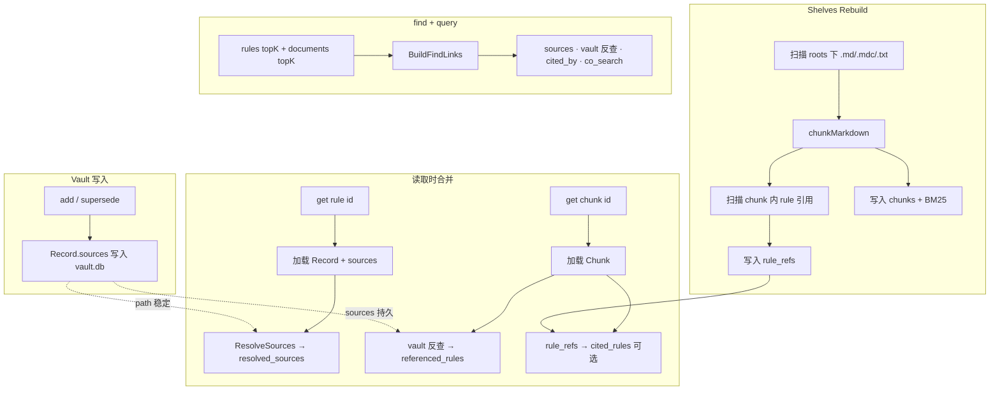

# imprint ↔ shelves 数据关联设计

> **状态：** P0–P2 已实现（2026-09-16）  
> **读者：** 维护 imprint / shelves / desk 的开发者  
> **相关：** [shelves-builtin.zh.md](shelves-builtin.zh.md) · [correction.zh.md](correction.zh.md) · [mcp.zh.md](mcp.zh.md)

---

## 1. 问题

imprint（vault 规则）和 shelves（工作区文档索引）目前是**两套独立数据**：

| 系统 | 存储 | ID 形态 | 图 |
| --- | --- | --- | --- |
| **imprint** | `.imprint/memory/vault.db` | `r-YYYY-MM-DD-NNN` | `/graph` — 规则间 `supersedes` / `related` / `conflicts_with` |
| **shelves** | `.imprint/.shelves/.cache/index.db` | 16 位 hex chunk id | `/docs/graph` — 文件 / 目录 / chunk 层级 |

仅有的交集（改造前）：`find` 带 `query` 时并行返回 rules + documents。**现已实现** vault `sources`、`referenced_rules` 反查、`find` 的 `links`；见下文。

改造前的典型缺口：

1. 用户说「以后按 `STYLE.md` 来」→ 规则写进 vault，但和文档之间没有可追溯的 `sources` 链。
2. 智能体 `get r-…` 看到 claim，看不到对应文档段落；`get <chunk>` 看到文档，看不到相关规则。
3. desk 只能分别看规则图和文档图，无法回答「这条规则从哪份文档来的？」「这份文档被哪些规则引用？」

---

## 2. 目标与非目标

### 目标

1. **可追溯**：规则能指向来源文档（路径或 chunk）；文档能反向列出引用它的规则。
2. **可发现**：`find` / `get` 在召回时附带关联侧的结果（规则 ↔ 文档）。
3. **可审计**：desk 能展示跨系统的边，而不只是两个独立子图。
4. **低心智负担**：用户仍正常说话；链接由智能体在写入时附带，或由索引在 rebuild 时从 markdown 解析。
5. **稳定 ID**：chunk id 已是内容哈希；规则 id 不变；链接不因 rebuild 大面积失效（路径级链接优先于 chunk 级）。

### 非目标（本阶段不做）

- 用 embedding / 向量做语义自动关联（BM25 共现仅作**运行时 boost**，不持久化）。
- 把 shelves 文档**复制进** vault.db（文档仍只索引，不双写）。
- 用户手动维护链接表或跑链接命令。
- 跨 workspace / 跨 vault 的全局知识图谱。

---

## 3. 设计原则

1. **显式优先于推断**：持久链接以 YAML `sources` 和 markdown 内可解析的 `[[r-…]]` 为主；启发式只作辅助。
2. **路径优于 chunk**：`sources` 默认存 `path`（+ 可选 heading）；chunk id 用于精确定位，rebuild 后由 path+heading 重新解析。
3. **单向写入、双向可读**：规则上的 `sources` 由 vault 写入；文档里的 rule 引用由 shelves rebuild 扫描；读 API 合并成双向视图。
4. **兼容现有 API**：无链接时行为与今天一致；新字段 optional。
5. **forget / supersede 清理**：删除规则时剥离文档侧缓存中的 inbound 边（与 today 的 `referenced_by` 清理对称）。

---

## 3.1 推荐：默认用 vault sources

多数项目在 vault 写 `sources` 即可；正文 `[[r-…]]` 为可选项。

| 需求 | 做法 | 改文档？ |
| --- | --- | --- |
| 「这条 imprint 依据哪段文档？」 | vault `sources` + `resolved_sources` | **否** |
| 「这段文档被哪些 imprint 引用？」（**持久**） | 同上 — `get chunk` 的 **`referenced_rules`**（扫 vault 反查） | **否** |
| 「写这个任务时 imprint 和文档怎么对上？」 | `find` 的 `links`（当次有效） | **否** |
| 维护者在正文里显式 @ imprint | 可选 `[[r-…]]` → `cited_rules` | 是（**可选**） |

**Agent 默认路径：** 用户说话 → `find` → document 命中 → ADD 带 `sources`。一次写入，双向可读；`sources` 写在 vault。

---

## 4. 链接模型

### 4.1 链接类型

| Kind | 方向 | 持久化位置 | 谁建立 |
| --- | --- | --- | --- |
| `sources` | rule → doc | vault YAML `sources` | 智能体 `add` / `supersede` / 后续 `link` |
| `cited_by` | doc → rule | shelves SQLite `rule_refs` | rebuild 扫描 markdown |
| `scope_match` | rule ↔ doc | **不持久化** | **P4** — `find` 运行时（scope vs path 前缀，未实现） |
| `co_search` | rule ↔ doc | **不持久化** | 同一次 `find` query 的 BM25 共现 boost |

### 4.2 DocRef（规则侧引用）

```yaml
# imprint 规则 frontmatter 新增字段
sources:
  - path: docs/style.md
    heading: Naming          # 可选；缺省表示整文件
  - path: .cursor/skills/go/SKILL.md
  - chunk: a1b2c3d4e5f67890  # 可选精确 chunk；rebuild 后若失效则降级为 path+heading
```

JSON 形态（API / MCP）：

```json
{
  "path": "docs/style.md",
  "heading": "Naming",
  "chunk": "a1b2c3d4e5f67890",
  "line_start": 42,
  "line_end": 58
}
```

解析规则：

- 有 `chunk` 且在 index 中存在 → 返回该 chunk 全文 + snippet。
- 仅有 `path` / `heading` → rebuild 后按 path 匹配 chunk（heading 精确或 BM25 最近）。
- 路径必须相对于 workspace root，与 shelves `roots` 下路径一致。

### 4.3 文档侧 rule 引用语法

rebuild 时从 chunk 文本扫描（与 vault `See also: [[r-…]]` 语法对齐）：

```markdown
Follow [[r-2026-09-11-001]] for naming.

<!-- 可选显式前缀，避免与普通 wiki 链接混淆 -->
See [imprint:r-2026-09-14-002] for error handling.
```

正则（草案）：

- `\[\[(r-[0-9]{4}-[0-9]{2}-[0-9]{2}-[0-9]{3})\]\]`
- `\[imprint:(r-[0-9]{4}-[0-9]{2}-[0-9]{2}-[0-9]{3})\]`

扫描结果写入 shelves 表 `rule_refs(chunk_id, rule_id, line_no)`。

---

## 5. 存储 schema

### 5.1 Vault（imprint）— 已有 + 扩展

```yaml
---
id: r-2026-09-16-001
claim: Python function names must be snake_case
scope: [python, naming]
confidence: 0.85
sources:
  - path: docs/style.md
    heading: Python naming
---
```

- `sources` 与 `related` / `supersedes` 一样进 frontmatter，git 跟踪。
- `forget`：删除规则；不修改文档文件（文档侧 inbound 在 rebuild 时自然消失）。
- `supersede`：新规则可继承或替换 `sources`（智能体决定）。

### 5.2 Shelves SQLite — 新增表

```sql
-- 文档 chunk → 规则（rebuild 时填充）
CREATE TABLE rule_refs (
  chunk_id  TEXT NOT NULL,
  rule_id   TEXT NOT NULL,
  line_no   INTEGER NOT NULL DEFAULT 0,
  PRIMARY KEY (chunk_id, rule_id, line_no)
);
CREATE INDEX idx_rule_refs_rule ON rule_refs(rule_id);

-- 可选：path 级聚合，加速「某文件引用了哪些规则」
CREATE TABLE file_rule_refs (
  path      TEXT NOT NULL,
  rule_id   TEXT NOT NULL,
  PRIMARY KEY (path, rule_id)
);
```

`rule_refs` 在每次 `index.Rebuild` 时全量重建（与 `chunks` 表相同策略）。  
vault 的 `sources` **不**反向写入 markdown 文件（避免惊群编辑 docs）。

---

## 6. 索引与解析流程



**Rebuild 触发：**

- shelves enabled：`imprint up`、指纹变化、`POST /docs/rebuild`
- vault 变更**不**触发 shelves rebuild（无耦合）

**Stale chunk 处理：**

- 规则 `sources[].chunk` 在 index 中不存在 → API 返回 `resolved: { path, heading, stale_chunk: true }` 并尝试 path 降级。

---

## 7. API / MCP 变更

### 7.1 `add` / `supersede` — 可选 `sources`

```json
{
  "claim": "...",
  "scope": "python,naming",
  "text": "用户原话",
  "sources": [
    { "path": "docs/style.md", "heading": "Python naming" }
  ]
}
```

CLI 对称：

```bash
imprint add "..." --scope python,naming --text "..." \
  --source docs/style.md#Python-naming
# 或 --source-json '[{"path":"docs/style.md"}]'
```

### 7.2 `get` —  enriched 响应

**规则：**

```json
{
  "id": "r-2026-09-16-001",
  "claim": "...",
  "sources": [ { "path": "docs/style.md", "heading": "Python naming" } ],
  "resolved_sources": [
    {
      "path": "docs/style.md",
      "heading": "Python naming",
      "chunk_id": "a1b2c3d4e5f67890",
      "snippet": "...",
      "line_start": 42,
      "line_end": 58
    }
  ],
  "referenced_by": [ ... ]
}
```

**文档 chunk：**

```json
{
  "id": "a1b2c3d4e5f67890",
  "path": "docs/style.md",
  "heading": "Python naming",
  "text": "...",
  "referenced_rules": [
    { "id": "r-2026-09-16-001", "kind": "sources", "claim": "..." }
  ],
  "cited_rules": [
    { "id": "r-2026-09-11-002", "kind": "cited_by", "line_no": 15 }
  ]
}
```

- `referenced_rules`：vault `sources` 指向此 chunk/path 的规则（反向查 vault，带缓存）。
- `cited_rules`：`rule_refs` 表中文档主动引用规则。

### 7.3 `find` — 关联扩展

当 shelves enabled 且带 `query` 时，现有 `{ rules, documents }` 保持不变，**新增可选字段**：

```json
{
  "rules": [ ... ],
  "documents": [ ... ],
  "links": [
    {
      "rule_id": "r-2026-09-16-001",
      "chunk_id": "a1b2c3d4e5f67890",
      "kind": "sources",
      "score": 1.0
    },
    {
      "rule_id": "r-2026-09-11-002",
      "chunk_id": "b2c3d4e5f6789012",
      "kind": "co_search",
      "score": 0.42
    }
  ]
}
```

`links` 构建顺序：

1. 命中规则上的 `sources` 解析到 chunk（kind=`sources`，score=1）
2. 命中 chunk 上 vault `sources` 反查（kind=`sources`，即使规则未进 rules topK）
3. 命中 chunk 的 markdown `[[r-…]]`（kind=`cited_by`）
4. 同一 query 下 rules 与 documents 共现（kind=`co_search`，不持久化）

`find` 无 query 时：若 `--scope` 命中规则，可附带这些规则的 `resolved_sources`（不跑文档 BM25）。

### 7.4 新端点：`GET /graph/unified`

合并 vault `/graph` 与 shelves `/docs/graph`：

```json
{
  "generated_at": "...",
  "nodes": [
    { "id": "r-2026-09-16-001", "kind": "rule", "label": "..." },
    { "id": "file:docs/style.md", "kind": "file", "path": "docs/style.md" },
    { "id": "a1b2c3d4...", "kind": "chunk", "heading": "..." }
  ],
  "edges": [
    { "source": "r-2026-09-16-001", "target": "file:docs/style.md", "kind": "sources" },
    { "source": "file:docs/style.md", "target": "a1b2c3d4...", "kind": "contains" },
    { "source": "a1b2c3d4...", "target": "r-2026-09-11-002", "kind": "cited_by" },
    { "source": "r-2026-09-16-002", "target": "r-2026-09-16-001", "kind": "related" }
  ]
}
```

desk 可切换「规则 / 文档 / 统一」三种视图；默认可先保持分离，统一图为 opt-in。

### 7.5 可选：`link` / `unlink` 工具

若不想在每次 `add` 时带 `sources`，可提供：

```
imprint link r-2026-09-16-001 --source docs/style.md#Python-naming
imprint unlink r-2026-09-16-001 --source docs/style.md
```

MCP 同名工具。Phase 1 可仅用 `add`/`supersede` 的 `sources` 参数，Phase 2 再加独立 link。

---

## 8. 智能体工作流（写入 + 文档）

### 8.1 用户指向项目文档

> 「命名规范看 `docs/style.md`，从现在起都按那个来。」

1. `find --scope naming --query style` → 规则 + 文档并行命中  
2. 分类 **ADD**  
3. `add` 带 `sources: [{ path: "docs/style.md" }]`  
4. 下次 `find` / `get` 可看到规则与文档段落

### 8.2 规则来自文档某节

> 「用 4 空格缩进，见 CONTRIBUTING 里 Python 那段。」

1. `find --query "4 space python"` → documents 命中 `docs/CONTRIBUTING.md` chunk  
2. **ADD** + `sources: [{ path: "docs/CONTRIBUTING.md", heading: "Python", chunk: "<id>" }]`

### 8.3 文档内显式引用规则

维护者在 `docs/style.md` 写：

```markdown
Project-specific overrides: [[r-2026-09-16-001]]
```

rebuild 后 `get <chunk>` 的 `cited_rules` 包含该规则；desk 统一图显示 `cited_by` 边。

### 8.4 SUPERSEDE 时继承来源

旧规则 `r-OLD` 有 `sources: [docs/style.md]`，用户改口：

- **SUPERSEDE** → 新规则默认复制 `sources`（除非智能体显式清空或改指向）

---

## 9. 实现分期

| 阶段 | 内容 | 交付 |
| --- | --- | --- |
| **P0** | `Record.sources` schema + `add`/`supersede`/`get` 解析 | vault 可存可读来源 |
| **P1** | shelves rebuild 扫描 `[[r-…]]` → `rule_refs` | 文档 → 规则反向边 |
| **P2** | `get` / `find` enriched；host `/find` 对齐 MCP | 智能体召回时看到关联 |
| **P3** | `GET /graph/unified` + desk 统一视图 | **已实现** — host `/graph/unified`；desk「统一」标签 |
| **P4** | `link`/`unlink` CLI + MCP；scope_match 运行时 boost | 完善 ergonomics |

建议 **P0 + P1** 作为 MVP：持久双向链接的最小闭环。

---

## 10. 迁移与兼容

- 旧规则无 `sources` → 空数组；行为与 today 一致。
- 旧 SQLite index 无 `rule_refs` → migration 在 `openDB` 时 `CREATE TABLE IF NOT EXISTS`。
- MCP `get`：仍用 id 形态分发（`r-*` vs 16-hex）；响应多 optional 字段。
- `export` JSON 含 `sources`；导入时保留。

---

## 11. 性能与缓存

- **反向索引**（哪些规则指向 path X）：启动时或首次 `get chunk` 扫描 vault 全量 `sources` 建内存 map；vault 写入后 invalidate。规则量级通常 < 数千，可接受。
- **rule_refs**：rebuild 时 O(chunks × lines)；与现有 chunk 扫描同 pass，无额外 IO。
- **find links**：仅对 topK 结果做 join，不扫全库。

---

## 12. 测试计划

| 场景 | 断言 |
| --- | --- |
| add 带 sources | get rule 返回 resolved_sources snippet |
| markdown 含 `[[r-…]]` | rebuild 后 get chunk.cited_rules 含该 id |
| chunk id stale | resolved_sources.stale_chunk=true，path 降级 |
| forget 规则 | cited_rules 下次 rebuild 消失；sources 边消失 |
| shelves disabled | get/find 无 resolved_sources / links；vault sources 仍可读 |
| 无 query find | 仅 rules；可选带 resolved_sources |

---

## 13. 待 review 问题

1. **`sources` 是否允许指向 vault 外路径**（如 `README.md` 不在 shelves roots）？  
   - 建议：允许存 path，但 `resolved_sources` 为空并标记 `out_of_index: true`。

2. **是否在文档中自动写回 `[[r-…]]`**？  
   - 建议：**否**；仅智能体/人主动编辑 docs。vault → doc 边只存在于 `sources` 与统一图。

3. **统一图是否默认包含 archived 规则**？  
   - 建议：query 参数 `include_archived`，默认 false，与 `/graph` 一致。

4. **scope_match 启发式是否默认开启**？  
   - 建议：仅 `find` 带 query 时作为低权重 link；避免无 query 时噪音。

5. **是否需要 `conflicts_with` 跨文档**（规则 A 与文档 B 中的规则引用冲突）？  
   - 建议：本阶段不做；仅显式 `sources` + `cited_by`。

---

## 14. 附录：与现有代码的映射

| 概念 | 现有位置 | 变更 |
| --- | --- | --- |
| Record | `pkg/imprint/record.go` | +`Sources []DocRef` |
| AddRecord | `pkg/imprint/vault.go` | +sources 参数 |
| shelves rebuild | `internal/shelves/index/rebuild.go` | +rule ref scan |
| Chunk scan | `internal/shelves/index/chunk.go` | +extractRuleRefs |
| MCP find/get | `internal/mcp/tools.go` | +links / resolved fields |
| Host find | `internal/host/server.go` | 对齐 MCP |
| Host unified graph | `internal/host/server.go` | `GET /graph/unified` |
| Unified graph builder | `internal/linking/unified.go` | vault + shelves + cross edges |
| Doc graph | `internal/shelves/graph.go` | 不变；统一图新模块 |
| Vault graph | `pkg/imprint/viz.go`（`Graph()`） | 不变；统一图新模块 |

---

**下一步：** review 本文 §13 开放问题 → 确认 MVP 范围（建议 P0+P1）→ 开 implementation issue / PR。
