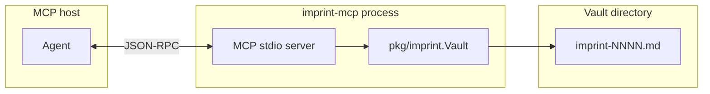

# imprint MCP server

> **Setup:** [README.md](../README.md#quick-start) — install, `imprint init`, optional MCP merge.  
> This page is **reference** (tools, flags, mount snippets).

**imprint-mcp** exposes vault operations over [MCP](https://modelcontextprotocol.io/) (stdio). Optional — CLI always works.

## Architecture



| Layer | Role |
| --- | --- |
| **Host** | Cursor, Claude Desktop, etc. spawns `imprint-mcp` and talks over stdin/stdout. |
| **Tools** | One MCP tool per vault command (`find`, `add`, …). Results are JSON text — same shapes as `imprint --json`. |
| **Vault** | Resolved once at startup: `--vault`, `--global`, `IMPRINT_VAULT`, walk-up `.imprint/memory/`, or `./.imprint/memory`. |
| **Judgment** | ADD / REINFORCE / SUPERSEDE / IGNORE stays on the agent. The server does not decide whether to write. |

Logging goes to **stderr** only so stdout stays clean for MCP framing.

## Install

```bash
go install github.com/SteamedBread2333/imprint/cmd/imprint-mcp@latest
```

Release archives include `imprint-mcp` next to `imprint`. Requires **Go 1.25+** to build from source (MCP SDK dependency).

## Server flags

Parsed before the process enters MCP mode (unknown flags are rejected):

| Flag | Effect |
| --- | --- |
| `--project PATH` | Repo root (parent of `.imprint/`). Vault defaults to `.imprint/memory`; plugin config from `.imprint/imprint.yaml`. **Use this in Cursor multi-root workspaces.** Alias: `--root`. |
| `--vault PATH` | Vault directory. With `--project`, relative paths join under the project root. |
| `--global` | Use `~/.imprint` (overrides walk-up / `./.imprint/memory` unless `--vault` is set). |
| `--version` | Print version and exit. |
| `-h`, `--help` | Print usage and exit. |

Environment: **`IMPRINT_PROJECT`** (same as `--project`), **`IMPRINT_VAULT`** (CLI walk-up when no `--project` / `--vault` / `--global`).

## Tools

Every tool returns **pretty-printed JSON** in the tool result text. On failure, `isError` is true and the body is `{"error":"…"}` (same as CLI `--json` errors).

| Tool | CLI equivalent | Notes |
| --- | --- | --- |
| `find` | `imprint find` | `scope` (comma-separated, AND filter), optional `query`, optional `top_k` (default 5). When shelves is enabled and `query` is set, returns `{ rules, documents }` instead of a bare array. |
| `add` | `imprint add` | `claim`, `scope`, `text` required; optional `confidence` (0 = default 0.6). |
| `reinforce` | `imprint reinforce` | `id`, optional `evidence`. |
| `supersede` | `imprint supersede` | `old_id`, `claim`, `scope`; optional `reason`, `text`. |
| `forget` | `imprint forget` | `id`. |
| `get` | `imprint get` | `id` — vault rule (with `evidence_log`, `referenced_by`) **or** shelves document chunk by chunk id. |
| `list` | `imprint list` | Optional `status`, `scope`, `query`, `min_confidence`, `since` (YYYY-MM-DD or RFC3339), `limit`. |
| `show` | `imprint show` | Optional `limit`. |
| `sweep` | `imprint sweep` | Optional `decay_days`, `decay_amount`, `dormant_threshold`. |
| `viz` | `imprint viz` | Optional `out`, `format` (`mermaid` / `notes`), `include_archived`. Returns path and counts. Interactive graph: desk plugin. |

**Not exposed:** `init` (one-time setup), `export`, `clear` (irreversible; use CLI with `--confirm --yes` if you really need it).

### Agent workflow (unchanged)

1. Before coding or style questions → **`find`** with a **narrow** `scope`.
2. Analyse the requirement; classify **ADD / REINFORCE / SUPERSEDE / IGNORE**.
3. Never duplicate an existing rule; record only what the user **said**.
4. User says forget / don’t record → **`forget`** or skip.
5. User asks what is stored → **`show`**; if many rules, **`viz`** and open the returned path.

## Mounting examples

### Cursor — project vault

Copy or merge into **`.cursor/mcp.json`** (project root). Prefer **`--project ${workspaceFolder}`** so vault and plugins bind to **this repo** even when Cursor spawns MCP with another folder’s cwd (multi-root workspaces).

```json
{
  "mcpServers": {
    "imprint": {
      "command": "imprint-mcp",
      "args": ["--project", "${workspaceFolder}"]
    }
  }
}
```

See [docs/examples/cursor-mcp.json](examples/cursor-mcp.json). After `go install`, **Cmd+Q** and reopen (Reload alone may keep a stale spawn command). stderr should show `imprint-mcp: project`, vault under **this** repo, and `imprint-mcp: shelves enabled=…`. See [shelves-builtin.md](shelves-builtin.md).

### Cursor — global vault

```json
{
  "mcpServers": {
    "imprint": {
      "command": "imprint-mcp",
      "args": ["--global"]
    }
  }
}
```

See [docs/examples/cursor-mcp-global.json](examples/cursor-mcp-global.json).

### Cursor — custom path via environment

```json
{
  "mcpServers": {
    "imprint": {
      "command": "imprint-mcp",
      "env": {
        "IMPRINT_VAULT": "/path/to/my-memory"
      }
    }
  }
}
```

### Cursor — `go run` from a clone (development)

```json
{
  "mcpServers": {
    "imprint": {
      "command": "go",
      "args": ["run", "./cmd/imprint-mcp", "--vault", "./.imprint/memory"],
      "cwd": "/absolute/path/to/imprint"
    }
  }
}
```

### Claude Desktop

Edit `~/Library/Application Support/Claude/claude_desktop_config.json` (macOS) or the platform-equivalent config:

```json
{
  "mcpServers": {
    "imprint": {
      "command": "imprint-mcp",
      "args": ["--global"]
    }
  }
}
```

Restart the host after changing MCP config. **`imprint init` does not write `mcp.json`** — add the snippet yourself so you control which vault is mounted.

## Verify

```bash
# Build
go build -o imprint-mcp ./cmd/imprint-mcp

# Manual smoke (host normally owns stdio; this just checks startup)
imprint-mcp --version

# Run tests
go test ./internal/mcp/...
```

In Cursor: Settings → MCP → confirm **imprint** is connected; ask the agent to `find` with a scope tag you use in the vault.

## See also

- [README.md](../README.md) — vault layout, CLI reference, Cursor rule via `imprint init`
- [correction.md](correction.md) — memory correction loop and coding scenarios
- [README.zh.md](../README.zh.md) — 中文主文档
- [docs/mcp.zh.md](mcp.zh.md) — 本文中文版
