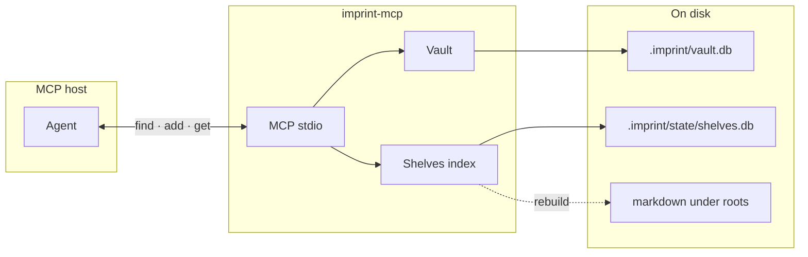

# imprint MCP server

> **Setup:** [README.md](../README.md#quick-start) — install, `imprint init`, optional MCP merge.  
> This page is **reference** (tools, flags, mount snippets).

**imprint-mcp** exposes vault + shelves over [MCP](https://modelcontextprotocol.io/) (stdio). **CLI can read/write the vault; MCP is required for full shelves** (document recall and rule↔doc links).

## MCP vs CLI

| Capability | MCP (shelves on) | CLI `imprint --json` |
| --- | --- | --- |
| Write rules + `sources` | `add` / `supersede` | same |
| Pre-coding recall | `find(scope, query[, query_local])` → rules + **documents** + **links** | `find` → **vault rules only** |
| Rule doc basis | `get r-…` → compact source pointers; `full:true` → excerpts | `get r-…` → vault only |
| Chunk → rules | `get <chunk-id>` → **referenced_rules** + **cited_rules** | not supported |
| Rule graph | desk `/` | host `GET /graph` |

**CLI** `find` / `get`: vault fields (table above). **Agents** pre-coding recall: MCP.

## Link kinds

### Rule ↔ rule (vault, persistent)

| Field | Direction | Write | Read |
| --- | --- | --- | --- |
| `supersedes` | new → old | `supersede` | `get`, `/graph`, desk `/` |
| `related` | rule → rule | vault | same |
| `conflicts_with` | rule → rule | vault | same |
| `referenced_by` | reverse | automatic | `get r-…` |

### Rule ↔ document (persistent)

| Name | Direction | Write | Read (MCP / host / desk) |
| --- | --- | --- | --- |
| **`sources`** | rule → doc | `add` / `supersede` with `[{path, heading?, chunk?}]` — vault only | `get r-…` → **`resolved_sources`** |
| **`referenced_rules`** | doc → rule | automatic vault reverse scan | **`get <chunk-id>`** |
| **`cited_rules`** | doc → rule | `[[r-…]]` / `[imprint:r-…]` in text; rebuild | **`get <chunk-id>`**; desk `/unified` **`cited_by`** |

### `find` `links` (session-only, not persisted)

| `kind` | Meaning |
| --- | --- |
| `sources` | vault `sources` point at a hit chunk |
| `cited_by` | chunk text cites a rule |
| `co_search` | same-query BM25 co-occurrence — aids judgment, **not written back** |

See [imprint-shelves-linking.md](imprint-shelves-linking.md).

## Architecture



| Layer | Role |
| --- | --- |
| **Host** | Cursor, Claude Desktop, etc. spawns `imprint-mcp` and talks over stdin/stdout. |
| **Tools** | One MCP tool per vault command (`find`, `add`, …). **MCP** enriches `find`/`get` when shelves is on; **CLI** `find`/`get` are vault-only. |
| **Vault** | `.imprint/vault.db` (SQLite); `find` / `get` / `add` read and write claim, evidence, **sources**. |
| **Shelves** | Reads `roots` from `imprint.yaml`; `find`+query adds BM25 **documents** and **links**; chunk `get` adds **referenced_rules**. |
| **Judgment** | ADD / REINFORCE / SUPERSEDE / IGNORE and whether to set **sources** stay on the agent. |

Logging goes to **stderr** only so stdout stays clean for MCP framing.

## Install

```bash
go install github.com/SteamedBread2333/imprint/cmd/imprint-mcp@latest
```

Release archives include `imprint-mcp` next to `imprint`. Requires **Go 1.25+** to build from source (MCP SDK dependency).

## Server flags

Parsed before the process enters MCP mode (unknown flags are rejected):

| Flag | Effect |
| --- | --- |
| `--project PATH` | Repo root (parent of `.imprint/`). Vault defaults to `.imprint`; plugin config from `imprint.yaml`. **Use this in Cursor multi-root workspaces.** Alias: `--root`. |
| `--vault PATH` | Vault directory. With `--project`, relative paths join under the project root. |
| `--global` | Use `~/.imprint` (overrides walk-up / `./.imprint` unless `--vault` is set). |
| `--version` | Print version and exit. |
| `-h`, `--help` | Print usage and exit. |

Environment: **`IMPRINT_PROJECT`** (same as `--project`), **`IMPRINT_VAULT`** (CLI walk-up when no `--project` / `--vault` / `--global`).

## Tools

Every tool returns **pretty-printed JSON** in the tool result text. On failure, `isError` is true. Privacy and duplicate rejections include a structured `code`, candidate IDs when applicable, and a remediation `hint`.

| Tool | CLI equivalent | Notes |
| --- | --- | --- |
| `find` | `imprint find` | Compact by default: rule claims/counts plus `{rules,documents,links,conflict_set}`. Optional `query`, `query_local`, `top_k`; `full:true` is audit-only. A query may return at most one penalized dormant `wake_candidate`; only explicit `reinforce` wakes it. |
| `add` | `imprint add` | `claim`, `scope`, `text` required; optional `confidence`, `query_local`, `sources`. Rejects sensitive data, denied source paths, and high-similarity active duplicates. |
| `reinforce` | `imprint reinforce` | `id`, optional `evidence`, optional `query_local` (updates stored field). |
| `supersede` | `imprint supersede` | `old_id`, `claim`, `scope`; optional `reason`, `text`, `query_local` (omit to inherit), `sources` (omit to inherit). |
| `forget` | `imprint forget` | `id`. |
| `get` | `imprint get` | Rule get folds evidence and source text by default. `include_evidence:true` uses `evidence_limit` (default 3); `full:true` is audit-only. Chunk get is unchanged. |
| `list` | `imprint list` | Optional `status`, `scope`, `query`, `min_confidence`, `since`, `limit`. |
| `show` | `imprint show` | Optional `limit`. |
| `sweep` | `imprint sweep` | Optional `decay_days`, `decay_amount`, `dormant_threshold`. |
**Not exposed:** `init` (one-time setup), `export`, `clear` (irreversible; use CLI with `--confirm --yes` if you really need it).

### Agent workflow

1. **Confirm MCP is mounted** (shelves on) — otherwise only vault, no documents / links / resolved_sources.
2. Before coding or style answers → **`find`** with narrow `scope` + **`query`**; when local-language terms differ from `query`, also pass **`query_local`** (both run BM25; same-turn **`add`/`supersede`/`reinforce`** may persist `query_local`).
3. Analyse; classify **ADD / REINFORCE / SUPERSEDE / IGNORE**.
4. On **ADD** when a document hit matches → same-turn **`add`** with **`sources`** (vault only — no markdown edits).
5. Never duplicate an imprint; record only what the user **said**. The vault independently rejects duplicate or sensitive writes.
6. User says forget / don't record → **`forget`** or skip.
7. User asks what is stored → **`show`** or desk (`/`, `/docs`, `/unified`).

## Mounting examples

### Cursor — project vault

Copy or merge into **`.cursor/mcp.json`** (project root). Prefer **`--project ${workspaceFolder}`** so vault and plugins bind to **this repo** even when Cursor spawns MCP with another folder’s cwd (multi-root workspaces).

```json
{
  "mcpServers": {
    "imprint": {
      "command": "imprint-mcp",
      "args": ["--project", "${workspaceFolder}"]
    }
  }
}
```

See [docs/examples/cursor-mcp.json](examples/cursor-mcp.json). After `go install`, **Cmd+Q** and reopen (Reload alone may keep a stale spawn command). stderr should show `imprint-mcp: project`, vault under **this** repo, and `imprint-mcp: shelves enabled=…`. See [shelves-builtin.md](shelves-builtin.md).

### Cursor — global vault

```json
{
  "mcpServers": {
    "imprint": {
      "command": "imprint-mcp",
      "args": ["--global"]
    }
  }
}
```

See [docs/examples/cursor-mcp-global.json](examples/cursor-mcp-global.json).

### Cursor — custom path via environment

```json
{
  "mcpServers": {
    "imprint": {
      "command": "imprint-mcp",
      "env": {
        "IMPRINT_VAULT": "/path/to/my-memory"
      }
    }
  }
}
```

### Cursor — `go run` from a clone (development)

```json
{
  "mcpServers": {
    "imprint": {
      "command": "go",
      "args": ["run", "./cmd/imprint-mcp", "--vault", "./.imprint"],
      "cwd": "/absolute/path/to/imprint"
    }
  }
}
```

### Claude Desktop

Edit `~/Library/Application Support/Claude/claude_desktop_config.json` (macOS) or the platform-equivalent config:

```json
{
  "mcpServers": {
    "imprint": {
      "command": "imprint-mcp",
      "args": ["--global"]
    }
  }
}
```

Restart the host after changing MCP config. Merge [docs/examples/cursor-mcp.json](examples/cursor-mcp.json) into `.cursor/mcp.json` manually — `imprint init` writes editor rules only.

## Verify

```bash
# Build
go build -o imprint-mcp ./cmd/imprint-mcp

# Manual smoke (host normally owns stdio; this just checks startup)
imprint-mcp --version

# Run tests
go test ./internal/mcp/...
```

In Cursor: Settings → MCP → confirm **imprint** is connected; ask the agent to `find` with a scope tag you use in the vault.

## Cursor tool catalog

Cursor snapshots `tools/list` under the project MCP cache (e.g. `~/.cursor/projects/<id>/mcps/<server>/tools/*.json`). Reloading the server can keep an old snapshot, so the agent-facing catalog may omit `query_local` / `sources` even when the running `imprint-mcp` accepts them (`go test ./internal/mcp -run Schema`). Start a **new agent chat** after reload, or delete that cache folder, so `ListTools` is what the agent sees. Extra arguments still reach the server if the host does not strip them.

## See also

- [README.md](../README.md) — vault layout, CLI reference, Cursor rule via `imprint init`
- [correction.md](correction.md) — write loop and worked examples
- [README.zh.md](../README.zh.md) — 中文主文档
- [docs/mcp.zh.md](mcp.zh.md) — 本文中文版
