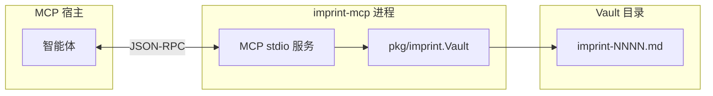

# imprint MCP 服务

> **上手：** [README.zh.md](../README.zh.md#快速开始) — 安装、`imprint init`、可选 MCP。  
> 本文是**参考**（工具列表、参数、挂载示例）。

**imprint-mcp** 经 [MCP](https://modelcontextprotocol.io/)（stdio）暴露 vault 操作。可选 — CLI 始终可用。

## 架构




| 层级        | 作用                                                                            |
| --------- | ----------------------------------------------------------------------------- |
| **宿主**    | Cursor、Claude Desktop 等启动 `imprint-mcp`，经 stdin/stdout 通信。                    |
| **工具**    | 每个 vault 命令对应一个 MCP 工具（`find`、`add` …）。结果为 JSON 文本 — 与 `imprint --json` 结构相同。 |
| **Vault** | 启动时解析一次：`--vault`、`--global`、`IMPRINT_VAULT`、向上查找 `.imprint/memory/`，或 `./.imprint/memory`。 |
| **判断**    | ADD / REINFORCE / SUPERSEDE / IGNORE 仍由智能体负责；服务不会替你决定是否写入。                    |


日志只写 **stderr**，stdout 留给 MCP 帧。

## 安装

```bash
go install github.com/SteamedBread2333/imprint/cmd/imprint-mcp@latest
```

发行包中 `imprint-mcp` 与 `imprint` 并列。从源码构建需要 **Go 1.25+**（MCP SDK 依赖）。

## 服务参数

进入 MCP 模式前解析（未知参数会报错）：


| 参数               | 作用                                                                 |
| ---------------- | ------------------------------------------------------------------ |
| `--project PATH` | 项目根（`.imprint/` 的父目录）。vault 默认 `.imprint/memory`；插件读 `.imprint/imprint.yaml`。**Cursor 多根工作区请用这个。** 别名 `--root`。 |
| `--vault PATH`   | vault 目录。配合 `--project` 时，相对路径挂在项目根下。                              |
| `--global`       | 使用 `~/.imprint`（除非指定 `--vault`）。                                    |
| `--version`      | 打印版本并退出。                                                           |
| `-h`, `--help`   | 打印用法并退出。                                                           |


环境变量：`IMPRINT_PROJECT`（同 `--project`）、`IMPRINT_VAULT`（无 `--project`/`--vault`/`--global` 时 CLI  walk-up）。

## 工具

每个工具返回 **格式化 JSON** 文本。失败时 `isError` 为 true，内容为 `{"error":"…"}`（同 CLI `--json`）。


| 工具          | 对应 CLI              | 说明                                                                                    |
| ----------- | ------------------- | ------------------------------------------------------------------------------------- |
| `find`      | `imprint find`      | `scope`（逗号分隔，AND 过滤），可选 `query`、`top_k`（默认 5）。                                        |
| `add`       | `imprint add`       | 必填 `claim`、`scope`、`text`；可选 `confidence`（0 表示默认 0.6）。                                |
| `reinforce` | `imprint reinforce` | `id`，可选 `evidence`。                                                                   |
| `supersede` | `imprint supersede` | `old_id`、`claim`、`scope`；可选 `reason`、`text`。                                          |
| `forget`    | `imprint forget`    | `id`。                                                                                 |
| `get`       | `imprint get`       | `id` — 含 `evidence_log`、`referenced_by`。                                              |
| `list`      | `imprint list`      | 可选 `status`、`scope`、`query`、`min_confidence`、`since`（YYYY-MM-DD 或 RFC3339）、`limit`。   |
| `show`      | `imprint show`      | 可选 `limit`。                                                                           |
| `sweep`     | `imprint sweep`     | 可选 `decay_days`、`decay_amount`、`dormant_threshold`。                                   |
| `viz`       | `imprint viz`       | 可选 `out`、`format`（`mermaid` / `notes`）、`include_archived`。返回路径与统计。交互式关系图见 desk 插件。 |


**未暴露：** `init`（一次性设置）、`export`、`clear`（不可逆；若确需请用 CLI 并加 `--confirm --yes`）。

### 智能体流程（不变）

1. 写代码或答风格问题前 → 用 **窄** `scope` 调 `find`。
2. 分析需求；分类 **ADD / REINFORCE / SUPERSEDE / IGNORE**。
3. 不重复已有规则；只记录用户**原话**。
4. 用户说忘记 / 不要记 → `forget` 或跳过。
5. 用户要看存了什么 → `show`；条目多时用 `viz` 并打开返回路径。


## 挂载示例


### Cursor — 项目 vault

复制或合并到项目根 `.cursor/mcp.json`。推荐 **`--project ${workspaceFolder}`**，多根工作区时也不依赖 Cursor 的 spawn cwd。

```json
{
  "mcpServers": {
    "imprint": {
      "command": "imprint-mcp",
      "args": ["--project", "${workspaceFolder}"]
    }
  }
}
```

见 [docs/examples/cursor-mcp.json](examples/cursor-mcp.json)。`go install` 后 **Cmd+Q 完全退出再开**（仅 Reload 可能仍用旧 spawn 命令）。

### Cursor — 全局 vault

```json
{
  "mcpServers": {
    "imprint": {
      "command": "imprint-mcp",
      "args": ["--global"]
    }
  }
}
```

见 [docs/examples/cursor-mcp-global.json](examples/cursor-mcp-global.json)。

### Cursor — 环境变量指定路径

```json
{
  "mcpServers": {
    "imprint": {
      "command": "imprint-mcp",
      "env": {
        "IMPRINT_VAULT": "/path/to/my-memory"
      }
    }
  }
}
```


### Cursor — 克隆仓库内 `go run`（开发）

```json
{
  "mcpServers": {
    "imprint": {
      "command": "go",
      "args": ["run", "./cmd/imprint-mcp", "--vault", "./.imprint/memory"],
      "cwd": "/absolute/path/to/imprint"
    }
  }
}
```


### Claude Desktop

编辑 `~/Library/Application Support/Claude/claude_desktop_config.json`（macOS）或各平台对应配置：

```json
{
  "mcpServers": {
    "imprint": {
      "command": "imprint-mcp",
      "args": ["--global"]
    }
  }
}
```

修改 MCP 配置后重启宿主。`imprint init` **不会写入** `mcp.json` — 请自行添加片段以控制挂载哪个 vault。

## 验证

```bash
go build -o imprint-mcp ./cmd/imprint-mcp
imprint-mcp --version
go test ./internal/mcp/...
```

在 Cursor：设置 → MCP → 确认 **imprint** 已连接；让智能体对你 vault 里某个 scope 执行 `find`。

## 参见

- [README.zh.md](../README.zh.md) — vault 布局、CLI、Cursor 规则
- [correction.zh.md](correction.zh.md) — 记忆纠偏与编码场景示例
- [README.md](../README.md) — English main doc
- [docs/mcp.md](mcp.md) — English version of this page

