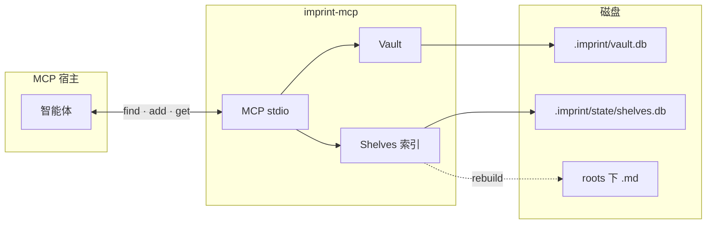

# imprint MCP 服务

> **上手：** [README.zh.md](../README.zh.md#快速开始) — 安装、`imprint init`、可选 MCP。  
> 本文是**参考**（工具列表、参数、挂载示例）。

**imprint-mcp** 经 [MCP](https://modelcontextprotocol.io/)（stdio）暴露 vault + shelves 操作。**CLI 可读写 vault；要完整使用 shelves（文档召回、规则↔文档关联），必须挂载 MCP。**

## MCP vs CLI

| 能力 | MCP（shelves 开） | CLI `imprint --json` |
| --- | --- | --- |
| 写规则 + `sources` | `add` / `supersede` | 同左 |
| 写代码前召回 | `find(scope, query[, query_local])` → rules + **documents** + **links** | `find` → **vault rules only** |
| 查规则文档依据 | `get r-…` → 紧凑来源指针；`full:true` → 正文 | `get r-…` → vault only |
| 查 chunk 被哪些规则引用 | `get <chunk-id>` → **referenced_rules** + **cited_rules** | 不支持 |
| 规则关系图 | desk `/` | host `GET /graph` |

**CLI** `find` / `get`：vault 字段（见上表）。**智能体**写代码前召回：MCP。

## 关联方式

### 规则 ↔ 规则（vault，持久）

| 字段 | 方向 | 写入 | 读取 |
| --- | --- | --- | --- |
| `supersedes` | 新 → 旧 | `supersede` | `get`, `/graph`, desk `/` |
| `related` | rule → rule | vault | 同上 |
| `conflicts_with` | rule → rule | vault | 同上 |
| `referenced_by` | 反向 | 自动 | `get r-…` |

### 规则 ↔ 文档（持久）

| 名称 | 方向 | 写入 | 读取（MCP / host / desk） |
| --- | --- | --- | --- |
| **`sources`** | rule → doc | `add` / `supersede` 传 `[{path, heading?, chunk?}]` — 只写 vault | `get r-…` → **`resolved_sources`** |
| **`referenced_rules`** | doc → rule | 自动（vault `sources` 反查） | **`get <chunk-id>`** |
| **`cited_rules`** | doc → rule | 正文 `[[r-…]]` / `[imprint:r-…]`；rebuild 扫描 | **`get <chunk-id>`**；desk `/unified` **`cited_by`** |

### `find` 的 `links`（当次有效，不持久）

| `kind` | 含义 |
| --- | --- |
| `sources` | vault `sources` 指向本次命中的 chunk |
| `cited_by` | chunk 正文引用规则 |
| `co_search` | 同 query 下 rules 与 documents BM25 共现 — 辅助判断，**不写回 vault** |

详见 [imprint-shelves-linking.zh.md](imprint-shelves-linking.zh.md)。

## 架构




| 层级        | 作用                                                                            |
| --------- | ----------------------------------------------------------------------------- |
| **宿主**    | Cursor、Claude Desktop 等启动 `imprint-mcp`，经 stdin/stdout 通信。                    |
| **工具**    | vault 命令对应 MCP 工具（`find`、`add` …）。**MCP** 在 shelves 开时 enrich `find`/`get`；**CLI** `find`/`get` 仅 vault。 |
| **Vault** | `.imprint/vault.db`（SQLite）；`find`/`get`/`add` 读写 claim、evidence、**sources**。 |
| **Shelves** | 读 `imprint.yaml` 的 `roots`；`find`+query 时 BM25 文档并返回 `documents`、`links`；`get chunk` 返回 `referenced_rules`。 |
| **判断**    | 新增 / 强化 / 替换 / 忽略 与是否写 **sources** 均由智能体负责。 |


日志只写 **stderr**，stdout 留给 MCP 帧。

## 安装

```bash
go install github.com/SteamedBread2333/imprint/cmd/imprint-mcp@latest
```

发行包中 `imprint-mcp` 与 `imprint` 并列。从源码构建需要 **Go 1.25+**（MCP SDK 依赖）。

## 服务参数

进入 MCP 模式前解析（未知参数会报错）：


| 参数               | 作用                                                                 |
| ---------------- | ------------------------------------------------------------------ |
| `--project PATH` | 项目根（`.imprint/` 的父目录）。vault 默认 `.imprint`；插件读 `imprint.yaml`。**Cursor 多根工作区请用这个。** 别名 `--root`。 |
| `--vault PATH`   | vault 目录。配合 `--project` 时，相对路径挂在项目根下。                              |
| `--global`       | 使用 `~/.imprint`（除非指定 `--vault`）。                                    |
| `--version`      | 打印版本并退出。                                                           |
| `-h`, `--help`   | 打印用法并退出。                                                           |


环境变量：`IMPRINT_PROJECT`（同 `--project`）、`IMPRINT_VAULT`（无 `--project`/`--vault`/`--global` 时 CLI  walk-up）。

## 工具

每个工具返回 **格式化 JSON** 文本。失败时 `isError` 为 true。隐私或重复写入错误还会返回结构化 `code`、候选规则 id（如有）和处理 `hint`。


| 工具          | 对应 CLI              | 说明                                                                                    |
| ----------- | ------------------- | ------------------------------------------------------------------------------------- |
| `find`      | `imprint find`      | 默认紧凑返回规则 claim/计数和 `{rules,documents,links,conflict_set}`；可选 `query`、`query_local`、`top_k`，仅审计时用 `full:true`。查询最多补一条降权 dormant `wake_candidate`；明确 `reinforce` 才唤醒。 |
| `add`       | `imprint add`       | 必填 `claim`、`scope`、`text`；可选 `confidence`、`query_local`、`sources`。疑似敏感数据、禁用 source 路径和高相似 active 重复会被拒绝。 |
| `reinforce` | `imprint reinforce` | `id`，可选 `evidence`、`query_local`（更新落库字段）。 |
| `supersede` | `imprint supersede` | `old_id`、`claim`、`scope`；可选 `reason`、`text`、`query_local`（省略则继承）、`sources`（省略则继承）。 |
| `forget`    | `imprint forget`    | `id`。 |
| `get`       | `imprint get`       | 规则默认折叠 evidence 与来源正文；`include_evidence:true` 搭配 `evidence_limit`（默认 3），`full:true` 仅用于审计。chunk get 不变。 |
| `list`      | `imprint list`      | 可选 `status`、`scope`、`query`、`min_confidence`、`since`、`limit`。   |
| `show`      | `imprint show`      | 可选 `limit`。                                                                           |
| `sweep`     | `imprint sweep`     | 可选 `decay_days`、`decay_amount`、`dormant_threshold`。                                   |


**未暴露：** `init`（一次性设置）、`export`、`clear`（不可逆；若确需请用 CLI 并加 `--confirm --yes`）。

### 智能体流程

1. **确认 MCP 已挂载**（shelves 开）— 否则只有 vault，无 documents / links / resolved_sources。
2. 写代码或答风格问题前 → **窄** `scope` + **`query`** 调 **`find`**；本地语言检索词与 `query` 不同时追加 **`query_local`** → rules、`documents`、`links`。
3. 分析需求；分类 **新增 / 强化 / 替换 / 忽略**。
4. **新增** 且 document 命中 → 同轮 `add` 带 **`sources`**；若已提炼本地检索词，同轮写入 **`query_local`**（落库）。
5. 不重复已有 imprint；只记录用户**原话**。vault 还会独立拒绝重复或敏感写入。
6. 用户说忘记 / 不要记 → `forget` 或跳过。
7. 用户要看存了什么 → `show` 或 desk（`/`、`/docs`、`/unified`）。


## 挂载示例


### Cursor — 项目 vault

复制或合并到项目根 `.cursor/mcp.json`。推荐 **`--project ${workspaceFolder}`**，多根工作区时也不依赖 Cursor 的 spawn cwd。

```json
{
  "mcpServers": {
    "imprint": {
      "command": "imprint-mcp",
      "args": ["--project", "${workspaceFolder}"]
    }
  }
}
```

见 [docs/examples/cursor-mcp.json](examples/cursor-mcp.json)。`go install` 后 **Cmd+Q 完全退出再开**（仅 Reload 可能仍用旧 spawn 命令）。

### Cursor — 全局 vault

```json
{
  "mcpServers": {
    "imprint": {
      "command": "imprint-mcp",
      "args": ["--global"]
    }
  }
}
```

见 [docs/examples/cursor-mcp-global.json](examples/cursor-mcp-global.json)。

### Cursor — 环境变量指定路径

```json
{
  "mcpServers": {
    "imprint": {
      "command": "imprint-mcp",
      "env": {
        "IMPRINT_VAULT": "/path/to/my-memory"
      }
    }
  }
}
```


### Cursor — 克隆仓库内 `go run`（开发）

```json
{
  "mcpServers": {
    "imprint": {
      "command": "go",
      "args": ["run", "./cmd/imprint-mcp", "--vault", "./.imprint"],
      "cwd": "/absolute/path/to/imprint"
    }
  }
}
```


### Claude Desktop

编辑 `~/Library/Application Support/Claude/claude_desktop_config.json`（macOS）或各平台对应配置：

```json
{
  "mcpServers": {
    "imprint": {
      "command": "imprint-mcp",
      "args": ["--global"]
    }
  }
}
```

修改 MCP 配置后重启宿主。手动合并 [docs/examples/cursor-mcp.json](examples/cursor-mcp.json) 到 `.cursor/mcp.json` — `imprint init` 只写编辑器规则。

## 验证

```bash
go build -o imprint-mcp ./cmd/imprint-mcp
imprint-mcp --version
go test ./internal/mcp/...
```

在 Cursor：设置 → MCP → 确认 **imprint** 已连接；让智能体对你 vault 里某个 scope 执行 `find`。

## Cursor 工具目录

Cursor 会把 `tools/list` 快照写到项目 MCP 缓存（例如 `~/.cursor/projects/<id>/mcps/<server>/tools/*.json`）。重载服务后快照可能仍是旧的，智能体看到的 schema 会缺少 `query_local` / `sources`，即使正在运行的 `imprint-mcp` 已经接受这些字段（`go test ./internal/mcp -run Schema`）。重载后开**新的 agent 对话**，或删掉该缓存目录，让目录与 `ListTools` 一致。宿主若不剥离多余参数，调用仍可能打到服务端。

## 参见

- [README.zh.md](../README.zh.md) — vault 布局、CLI、Cursor 规则
- [correction.zh.md](correction.zh.md) — 写入循环与场景示例
- [README.md](../README.md) — English main doc
- [docs/mcp.md](mcp.md) — English version of this page

