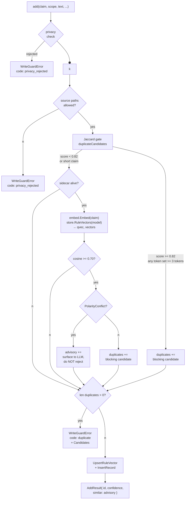
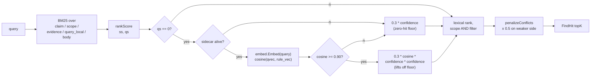

# Semantic duplicate gate

The write-time gate that catches paraphrases and topic-near duplicates that
lexical Jaccard misses. Optional: enabled by setting `plugins.embed.enabled: true`
in `imprint.yaml`. When the sidecar is absent or slow, writes degrade silently
back to the lexical path — **the write never blocks on the embedder**.

The gate has two consumers: the **write path** (reject or admit) and the
**read path** (semantic recall lift). Both share the same embedder and the
same vector store.

## Why lexical Jaccard alone is not enough

Jaccard is set intersection over union on the token sets of two claims.
It ignores word order, frequency, and meaning. On the imprint calibration
corpus the duplicates / conflicts / unrelated groups look like this:

| Group     | Median | Min   | Max   | Notes                                                       |
| --------- | ------ | ----- | ----- | ----------------------------------------------------------- |
| Duplicate | 0.823  | 0.652 | 0.932 | "Always X" ↔ "X is required" — same policy, different words |
| Conflict  | 0.753  | 0.492 | 1.000 | "Prefer tabs" ↔ "Prefer spaces" — opposite policy            |
| Unrelated | 0.528  | 0.432 | 0.644 | Different topics                                             |

The acceptance pair
`"Go exported identifiers must use PascalCase"` ↔
`"Exported things use Pascal Case naming"`
scores **Jaccard 0.38** — below the 0.82 reject threshold, so the lexical
path lets it through. The semantic gate is what catches it (cosine 0.7107
at threshold 0.70).

## Architecture

```
┌──────────────────────────── imprint (Go) ────────────────────────────┐
│                                                                       │
│  pkg/imprint/write_guard.go                                           │
│        │                                                              │
│        │   claims (strings)                                           │
│        ▼                                                              │
│  pkg/imprint/embed.go  (Embedder interface, threshold, model name)     │
│        │                                                              │
│        ▼                                                              │
│  internal/embed/client.go  (HTTP client, 2s timeout, connection pool) │
│        │                                                              │
└────────┼──────────────────────────────────────────────────────────────┘
         │  POST /embed   {"texts":[...], "model":"BAAI/bge-small-zh-v1.5"}
         │  GET  /health
         ▼
┌──── imprint-embed-sidecar (Python, external process) ────────────────┐
│  server.py                                                           │
│      │   ThreadingHTTPServer, lazy model load                      │
│      ▼                                                              │
│  fastembed + onnxruntime                                             │
│      │   BAAI/bge-small-zh-v1.5 (512-dim, ~130MB)                    │
│      ▼                                                              │
│  responses: {"vectors":[[...]], "dim":512, "model":"..."}             │
└─────────────────────────────────────────────────────────────────────┘

                        ┌─────────────────────────────┐
                        │  internal/vault/sqlite      │
                        │  table: rule_vectors        │
                        │  (rule_id, model, dim,      │
                        │   vec BLOB, updated_at)     │
                        └─────────────────────────────┘
```

The Go binary has **no** ONNX / fastembed / sentence-transformers dependency.
Vectors are produced by the sidecar and stored in `rule_vectors`.

## Lifecycle

| Phase      | What happens                                                              |
| ---------- | ------------------------------------------------------------------------- |
| `up`       | `imprint up` starts the sidecar via `./run.sh`; polls `GET /health`       |
| steady     | Go client reuses HTTP keep-alive; sidecar caches the ONNX session in RAM  |
| `down`     | `imprint down` terminates the sidecar; 4174 (or configured port) goes dark |
| cold start | First `POST /embed` triggers model download (~130MB) into `~/.cache/`    |

The sidecar is **not** a daemon — it lives only while `imprint up` keeps it
alive. There is no crash recovery or auto-restart; the write path degrades
back to Jaccard if the sidecar dies mid-session.

## Write-time gate

Every `add` call runs the same sequence. Each gate is independent; the
write is blocked when `len(duplicates) > 0`.



### Gate-by-gate specification

| # | Gate             | Threshold | Hard reject. | Sidecar dep. | What it catches              |
| - | --------------- | --------- | ------------ | ------------ | ---------------------------- |
| 1 | privacy check   | regex     | yes          | no           | PII, secrets, credential-like data |
| 2 | source paths    | allowlist | yes          | no           | denied paths / non-vault writes     |
|  3 | Jaccard         | 0.82      | yes          | no           | near-identical wording        |
|  4 | cosine          | 0.70      | yes (only when polarity clean) | yes     | paraphrases, restructured sentences |
|  5 | polarity        | n/a       | routes 0B+ to advisory | no  | antonyms, negation asymmetry  |

**Critical rule**: gate 4 only rejects when polarity gate 5 is clean.
Cosine + polarity form one logical gate; polarity is what keeps the cosine
gate from rejecting antonyms.

### Why the cosine threshold is 0.70

Calibration on `BAAI/bge-small-zh-v1.5` with 20 pairs per group
(`imprint-embed-sidecar/calibrate.py`) shows:

| Group     | Median | 0.65  | 0.70  | 0.75  | 0.85  |
| --------- | ------ | ----- | ----- | ----- | ----- |
| Duplicate | 0.823  | catch | catch | reject | reject |
| Conflict  | 0.753  | reject (FPR 30%) | reject (FPR 10%) | borderline | miss |

The acceptance pair scores **0.7107** at the real model. Any threshold
≥ 0.85 would miss it. **0.70 is the highest value that still catches the
acceptance pair and stays below the conflict group's 75th percentile.**

**Do not raise this without re-running `calibrate.py`.**

### Polarity gate — `pkg/imprint/polarity.go`

Pure-string check, zero network, sub-millisecond. Two OR-ed signals:

- **Antisymmetric negation**: `"Use X"` vs `"Never use X"` — `hasNegation`
  on the two sides disagrees
- **Known antonym pairs**: `tabs ↔ spaces`, `wrap ↔ bare`,
  `snake_case ↔ camelcase`, `composition ↔ inheritance`,
  `add ↔ skip`, `explicit ↔ ignore`, `pin ↔ floating`, `english ↔ chinese`
- **Token-set swap**: same words, swapped order
  (`"Prefer tabs over spaces"` vs `"Prefer spaces over tabs"` — cosine 1.0)

**`hasNegation` markers** are multi-character on purpose. The bare
single-character `"别"` is excluded because `strings.Contains(s, "别")`
would also fire inside 分别 / 别人 / 特别 / 性别 — none of which negate.
The English set keeps trailing spaces on `"no "` and `"not "` to avoid
matching inside `notify` / `notation`.

## Advisory path — `AddResult.Similar`

When the cosine hit is at level ≥ threshold but polarity marks the pair as
conflict, the candidate lands in `AddResult.Similar` instead of `duplicates`.
**The write succeeds**, the LLM is expected to surface the conflict to the
user and call `link --conflicts` (or `supersede` / `forget`).

```json
{
  "id": "r-2026-09-23-005",
  "confidence": 0.6,
  "path": "...",
  "similar": [
    { "id": "r-2026-09-23-003", "score": 0.927, "claim": "Use tabs for indentation" }
  ]
}
```

| Consumer of `similar` | What it does                                          |
| --------------------- | ----------------------------------------------------- |
| LLM agent             | Asks the user; on consent calls `link --conflicts`    |
| `find` / `rankScore`  | Ignores it — advisories are write-only                |
| Telemetry             | Emits `Op: "embed_advisory"` with the rule-hit count  |

**There is no automatic resolution.** The polarity gate's job is to
prevent a hard reject, not to decide for the user.

## Read-time semantic recall

`find --query "..."` falls back to a zero-lexical-hit floor when nothing
matches lexically. The semantic gate raises the floor when cosine ≥ 0.90
(above the duplicate threshold) — **lexical hits always outrank semantic
ones**, this layer only rescues rules the BM25 pass missed.



A semantic recall lift **always ranks below** a lexical hit. The semantic
layer is rescue-only: it surfaces what BM25 missed, not what BM25 found.
No polarity gate at read time — an antonym pair is still useful context
for the agent to see; we let the LLM arbitrate which to follow.

## Silent degradation

Every embed call is bounded by `embedTimeout = 2s`. The semantics:

| sidecar state                | write gate behavior                                  |
| ---------------------------- | ---------------------------------------------------- |
| enabled, healthy             | full Jaccard + cosine + polarity stack               |
| enabled, call times out      | Jaccard only; telemetry `Op: "embed_unavailable"`     |
| enabled, sidecar crashed     | Jaccard only (the next call reconnects or fails)     |
| disabled (`enabled: false`)  | Jaccard only; no telemetry                           |

**A write never fails because the sidecar is unavailable.** That is the
single invariant this subsystem promises. The write degrades in
precision — paraphrases and restructured duplicates slip through —
but never in availability.

`TestEmbedUnavailableStillWrites` is the regression test. The acceptance
scenario 12 of `cmd/imprint-acceptance` also exercises this path.

## What is stored where

| Lives in                                | Contents                                                     |
| --------------------------------------- | ------------------------------------------------------------ |
| `~/.imprint/vault.db` (table `rule_vectors`) | (rule_id, model, dim, vec BLOB, updated_at)              |
| `~/.cache/imprint/models/`              | ONNX model weights, ~130MB for `BAAI/bge-small-zh-v1.5`      |
| `~/.imprint/plugins/embed/venv`         | Python venv with fastembed + onnxruntime                     |

The vector stays with the vault (project-local) so the gate works on
global + project vaults. Model weights and venv live under the user
home and are shared across all imprint vaults.

## Single-instance constraint

The embed sidecar is a **singleton** — one process, one model, one port
(4174). This is an architectural ceiling, not a bug, and it is worth
naming explicitly because it bounds what users can do with embed.

**What every imprint vault gets, regardless of project:**

- one shared model (`BAAI/bge-small-zh-v1.5`) — the `rule_vectors.model`
  column in every vault must match this value
- one shared port (4174) — only one embed process can be alive at a time
- one shared 512-dim vector space — all cosine comparisons assume the
  same model emitted both vectors

**Why this is fine and never "crosses wires" between projects:**

1. The sidecar is a pure inference service. It never reads a vault,
   never queries a rule, never carries per-project state. Two CLI calls
   from two different project directories both produce the same answer for
   the same text.
2. Vectors are stored in `<project>/.imprint/vault.db` (table
   `rule_vectors`). Different vaults are different SQLite files; there is
   no shared vector database to leak across.
3. The Go code that consumes vectors (`mergeEmbedDuplicatesVec`,
   `rankScore`) reads only the calling process's own vault, so project A's
   `find` never sees project B's `rule_vectors`.

**What single-instance forbids, and how to work around it:**

| Constraint                                        | Workaround                                            |
| ------------------------------------------------- | ----------------------------------------------------- |
| Cannot serve different models per vault           | All vaults share `BAAI/bge-small-zh-v1.5`; switching models orphans every `rule_vectors` row in every vault and triggers a full backfill |
| Cannot run two embers with different models on the same machine | One model wins; the loser writes its configurations and gets a clear 2s timeout error on every embed call |
| Cannot query vectors across vaults (different per-vault `model`) | Cross-vault find is not supported; if you need it, the rule data itself must move (e.g. global personal vault), not the vector store |

**Operational rules:**

- One `imprint-embed-sidecar` process per machine, no matter how many
  vaults or projects live under the user's home.
- `imprint plugin start embed` and the auto-relaunch done by
  `imprint-mcp` are mutual exclusion points: whoever binds port 4174
  first wins; the loser sees the port in use and reuses it instead of
  spawning a duplicate.
- If you ever need multi-model support (bge-small + OpenAI text-embedding-3
  + Cohere, say), the sidecar must be re-architected as a **router**
  that spawns or proxies per-model child processes. That is out of scope
  for the current single-model design.

## Trace correlation

Every event the gate emits carries a `trace_id` (12 hex chars from
crypto/rand). One `add` call produces a trace like:

```
add  trace=873d4cb1895d
├─ embed_unavailable     (skipped if sidecar healthy)
├─ embed_advisory        (only if polarity conflicts)
├─ embed                 (always, on healthy path)
└─ add                   (final event)
```

If you see an `embed_advisory` event with no follow-up `link` event from
the agent, that is a signal the agent skipped the contract step — the
antonym pair sits in the vault without a `conflicts_with` edge and the
conflict-penalty logic in `find` is dormant for that pair.

## Tuning

| Knob                                | Default | Where                          | Notes                                                       |
| ----------------------------------- | ------- | ------------------------------ | ----------------------------------------------------------- |
| `plugins.embed.duplicate_threshold` | 0.70    | `imprint.yaml`                 | Do not raise without re-calibrating            |
| `plugins.embed.timeout_seconds`     | 2       | `imprint.yaml`                 | Cold start of model can take longer                          |
| `plugins.embed.port`                | 4174    | `imprint.yaml`                 | Must match `IMPRINT_PLUGIN_PORT` if set |
| `plugins.embed.model`               | `BAAI/bge-small-zh-v1.5` | `imprint.yaml`    | Model name keys `rule_vectors` rows; changing it orphans the old vectors |
| `pkg/imprint.embed.embedThresh`     | 0.70    | `OpenOptions.EmbedThresh`      | Mirrors the yaml value                                |
| `pkg/imprint/embed.go` `DefaultEmbedTimeoutSeconds` | 2 | constant | Hard ceiling on per-call latency |

## Re-calibration

If you swap models, **rerun `imprint-embed-sidecar/calibrate.py`** before
trusting the threshold. The output is a per-group percentile table; pick
the highest value with zero false-positives on the duplicate group and
zero false-negatives on the acceptance pair. Anything else is
speculation.