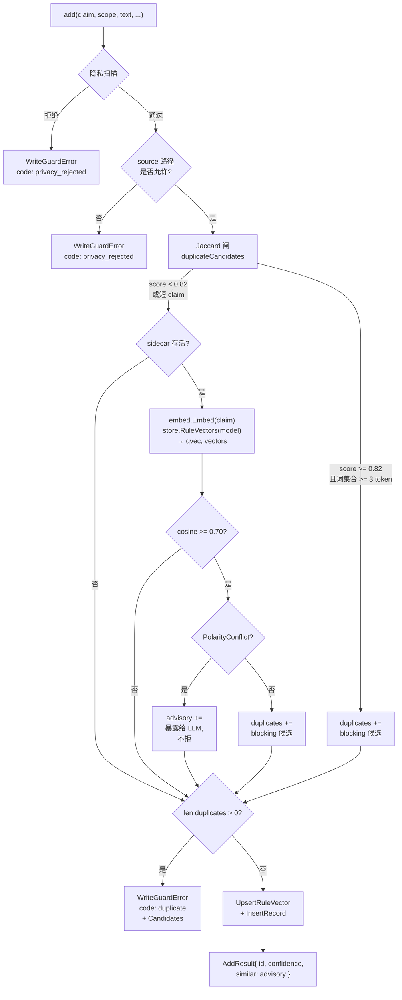
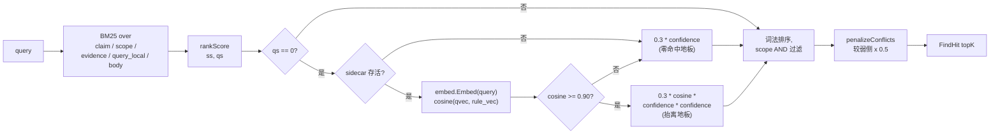

# 语义去重门禁

抓词面 Jaccard 抓不到的改述和话题相近的重复写入。**可选**：在 `imprint.yaml` 设 `plugins.embed.enabled: true` 启用。sidecar 缺席或慢时静默降级回词面路径——**写入永远不会因 embedder 而阻塞**。

门禁有两个消费者：**写路径**（拒或放）和**读路径**（语义召回抬升）。两者共用同一个 embedder 和同一个向量存储。

## 为什么仅词面 Jaccard 不够

Jaccard 是两个 claim 词集合的交集除以并集。它忽略词序、词频、词义。在 imprint 的标定语料上三组数据：

| 组       | 中位数 | 最小   | 最大   | 备注                                                       |
| -------- | ------ | ----- | ----- | ---------------------------------------------------------- |
| 真重复   | 0.823  | 0.652 | 0.932 | "Always X" ↔ "X is required"——同一政策不同词面         |
| 反义冲突 | 0.753  | 0.492 | 1.000 | "Prefer tabs" ↔ "Prefer spaces"——对立政策               |
| 无关     | 0.528  | 0.432 | 0.644 | 不同话题                                                   |

验收对
`"Go exported identifiers must use PascalCase"` ↔
`"Exported things use Pascal Case naming"`
**Jaccard 0.38**——低于 0.82 拒门，所以词面路径放行。语义门禁（余弦 0.7107 / 阈值 0.70）才是抓它的那道闸。

## 架构

```
┌──────────────────────────── imprint (Go) ────────────────────────────┐
│                                                                       │
│  pkg/imprint/write_guard.go                                           │
│        │                                                              │
│        │   claims (字符串)                                            │
│        ▼                                                              │
│  pkg/imprint/embed.go  (Embedder 接口、阈值、模型名)                  │
│        │                                                              │
│        ▼                                                              │
│  internal/embed/client.go  (HTTP 客户端，2s 超时，连接池)            │
│        │                                                              │
└────────┼──────────────────────────────────────────────────────────────┘
         │  POST /embed   {"texts":[...], "model":"BAAI/bge-small-zh-v1.5"}
         │  GET  /health
         ▼
┌──── imprint-embed-sidecar (Python，外部进程) ────────────────────────┐
│  server.py                                                           │
│      │   ThreadingHTTPServer，懒加载模型                            │
│      ▼                                                              │
│  fastembed + onnxruntime                                             │
│      │   BAAI/bge-small-zh-v1.5 (512 维，~130MB)                    │
│      ▼                                                              │
│  响应: {"vectors":[[...]], "dim":512, "model":"..."}                  │
└─────────────────────────────────────────────────────────────────────┘

                        ┌─────────────────────────────┐
                        │  internal/vault/sqlite      │
                        │  表: rule_vectors           │
                        │  (rule_id, model, dim,      │
                        │   vec BLOB, updated_at)     │
                        └─────────────────────────────┘
```

Go 二进制**没有** ONNX / fastembed / sentence-transformers 任何依赖。向量由 sidecar 产生，落库到 `rule_vectors`。

## 生命周期

embed 是**单例 daemon**。`imprint up` / `down` 既不起也不停。进程由 MCP（或 `imprint plugin start embed`）管；停它用 `imprint plugin stop embed`。

| 阶段 | 发生了什么 |
| --- | --- |
| `imprint-mcp` | `plugins.embed` 启用时：对配置端口 `GET /health`。不健康 → MCP 启动时 fork 一次。已健康 → 复用，不拉第二个进程。关编辑器**不会**停 sidecar（没有 parent watch）；下次 MCP 启动时若仍健康就复用。 |
| `plugin start embed` | **每次先 stop 再 fork**（端口上无论谁在听都会被杀）。CLI 退出后新进程继续活着。 |
| `plugin stop embed` | 清掉配置端口上的 LISTEN 进程。 |
| CLI `add` / `find` | 只打 HTTP，不 fork。连接拒绝 → Jaccard。 |
| `up` | 起 host / shelves / desk。**不起也不停** embed。探测端口：在跑就报 running，否则给 start 提示。 |
| `down` | 停 host / desk。embed 继续跑。提示：`imprint plugin stop embed`。 |
| 稳态 | Go 客户端复用 HTTP keep-alive；sidecar 在内存缓存 ONNX session |
| 冷启动 | 首次 `POST /embed` 可能下载模型（~130MB）落 `~/.cache/` |

无崩溃恢复。MCP 只在进程启动时 probe 一次，之后被杀掉不会自动再起。中途挂掉写路径直接降级回 Jaccard。

## 写时门禁

每次 `add` 都跑同一序列。各闸独立，**任意闸命中 blocking 即拒**：



### 各闸规格

| # | 闸        | 阈值     | 是否硬拒 | 是否依赖 sidecar | 抓什么                       |
| - | --------- | -------- | -------- | ---------------- | ---------------------------- |
| 1 | 隐私扫描 | 正则     | 是       | 否               | PII、密钥、凭据式数据         |
| 2 | source 路径 | 白名单 | 是       | 否               | 禁用路径、vault 外的写入       |
| 3 | Jaccard   | 0.82     | 是       | 否               | 词面高度重合                  |
| 4 | 余弦      | 0.70     | 是（仅当极性干净时） | 是 | 改述、句式重构               |
| 5 | 极性      | —        | 把命中项路由到 advisory | 否 | 反义词、否定词不对称          |

**关键规则**：闸 4 只在闸 5 干净时才拒。**余弦 + 极性合一道逻辑闸；极性就是阻止余弦闸误拒反义对的那道闸**。

### 余弦阈值为什么是 0.70

`BAAI/bge-small-zh-v1.5` 上 20 对/组的标定结果（`imprint-embed-sidecar/calibrate.py`）：

| 组       | 中位数 | 0.65  | 0.70  | 0.75  | 0.85  |
| -------- | ------ | ----- | ----- | ----- | ----- |
| 真重复   | 0.823  | catch | catch | reject | reject |
| 反义冲突 | 0.753  | reject (FPR 30%) | reject (FPR 10%) | borderline | miss |

验收对真模型分 **0.7107**。任何 ≥ 0.85 的阈值都会漏拦它。**0.70 是既能拦住验收对、又不越过冲突组 75 分位的最高值**。

**未经重跑 `calibrate.py` 不要调这个值。**

### 极性闸 —— `pkg/imprint/polarity.go`

纯字符串判定、零网络、亚毫秒。两路 OR：

- **否定词不对称**：`"Use X"` vs `"Never use X"` —— 两边 `hasNegation` 不同
- **已知反义词对**：`tabs ↔ spaces`、`wrap ↔ bare`、`snake_case ↔ camelcase`、`composition ↔ inheritance`、`add ↔ skip`、`explicit ↔ ignore`、`pin ↔ floating`、`english ↔ chinese`
- **词序反演**：同词集合但顺序不同（`"Prefer tabs over spaces"` vs `"Prefer spaces over tabs"`——余弦 1.0）

**`hasNegation` 标记都是多字**。故意不带单字 `"别"`，因为 `strings.Contains(s, "别")` 会同时命中 分别 / 别人 / 特别 / 性别——都不是否定。英文里 `"no "` 和 `"not "` 带尾空格，避免命中 notify / notation。

## Advisory 旁路 —— `AddResult.Similar`

余弦命中但极性判定为冲突时，候选落进 `AddResult.Similar` 而不是 `duplicates`。**写入成功**，期待 LLM 把冲突暴露给用户，再调 `link --conflicts`（或 `supersede` / `forget`）。

```json
{
  "id": "r-2026-09-23-005",
  "confidence": 0.6,
  "path": "...",
  "similar": [
    { "id": "r-2026-09-23-003", "score": 0.927, "claim": "Use tabs for indentation" }
  ]
}
```

| `similar` 的消费者 | 做了什么                                              |
| ------------------ | ----------------------------------------------------- |
| LLM agent          | 问用户；同意则调 `link --conflicts`                    |
| `find` / `rankScore` | 忽略——advisory 只在写路径生效                        |
| Telemetry          | 发 `Op: "embed_advisory"`，附 rule-hit 数量           |

**没有自动裁决机制。** 极性闸的职责是阻止硬拒，不是替用户决策。

## 读路径的语义召回

`find --query "..."` 在词法零命中时落到一个地板分数。语义闸在余弦 ≥ 0.90（高于去重阈值）时把地板抬起来——**词法命中永远排在语义命中前面**，这一层只救 BM25 漏的：



语义召回抬升**永远排在词法命中后面**。语义层只做"救援"，不抢词法风头。读路径**没有极性闸**——反义对给 agent 看是有用的上下文，让 LLM 仲裁"该信哪个"。

## 静默降级

每次 embed 调用受 `embedTimeout = 2s` 限制。语义：

| sidecar 状态                  | 写门禁行为                                       |
| ----------------------------- | ------------------------------------------------ |
| 启用 + 健康                   | 完整 Jaccard + 余弦 + 极性栈                      |
| 启用 + 调用超时                | 仅 Jaccard；telemetry `Op: "embed_unavailable"`   |
| 启用 + sidecar 中途崩         | 仅 Jaccard（下一次调用重连或失败）               |
| 禁用（`enabled: false`）       | 仅 Jaccard；无 telemetry                          |

**写入永远不会因 sidecar 不可用而失败**——这是本子系统唯一的不变量。写入精度会降（改述和重构的重复会漏），可用性永远保。

`TestEmbedUnavailableStillWrites` 是回归测试。`cmd/imprint-acceptance` 验收场景 12 也跑这条路径。

## 数据落在哪里

| 落在                                | 内容                                                        |
| ----------------------------------- | ----------------------------------------------------------- |
| `~/.imprint/vault.db`（表 `rule_vectors`） | (rule_id, model, dim, vec BLOB, updated_at)              |
| `~/.cache/imprint/models/`          | ONNX 模型权重，`BAAI/bge-small-zh-v1.5` 约 130MB           |
| `~/.imprint/plugins/embed/venv`     | 含 fastembed + onnxruntime 的 Python venv                    |

向量随 vault 走（项目-local），所以门禁在 global + project vault 都生效。模型权重和 venv 在用户家目录下，所有 imprint vault 共享。

## 单实例约束

embed sidecar 是**单例**——一个进程、一个模型、一个端口（4174）。这是**架构上限**而不是 bug，但值得显式写下来，因为它界定了 embed 能做什么。

**所有 imprint vault 都共享：**

- 一个模型（`BAAI/bge-small-zh-v1.5`）——每个 vault 的 `rule_vectors.model` 列必须等于这个值
- 一个端口（4174）——同一时刻只能有一个 embed 进程在跑
- 一个 512 维向量空间——所有 cosine 比较都假设两边向量出自同一模型

**为什么不会"项目间窜台"：**

1. sidecar 是纯推理服务。**它不读任何 vault，不查任何规则，不带任何项目状态**。两个不同项目目录的 CLI 调用，对同一段文本返回相同的向量。
2. 向量存在 `<project>/.imprint/vault.db`（表 `rule_vectors`）。不同 vault 是不同的 SQLite 文件，没有跨项目共享的向量库可泄露。
3. 消费向量的 Go 代码（`mergeEmbedDuplicatesVec`、`rankScore`）**只读调用进程自己的 vault**——项目 A 的 `find` 永远不会看到项目 B 的 `rule_vectors`。

**单实例禁掉了什么 + 怎么绕：**

| 约束                                       | 绕法                                                                  |
| ------------------------------------------ | --------------------------------------------------------------------- |
| 不能给不同 vault 服务不同模型              | 所有 vault 共享 `BAAI/bge-small-zh-v1.5`；换模型会让所有 vault 的 `rule_vectors` 全部失效，需全量 backfill |
| 不能在同一台机起两个不同模型的 embed       | 只有一个模型胜出；输的那个配的 embed 配置照常，但每次 embed 调用都拿 2s 超时错误 |
| 不能跨 vault 做向量查询（不同 vault 模型不同） | 不支持跨 vault find；想跨项目查，得动 **规则数据**本身（如全局 personal vault），不是动向量层 |

**运维铁律：**

- 一台机器只有一个 `imprint-embed-sidecar` 进程，不管用户家目录下挂了多少 vault 和项目。4174（或 `plugins.embed.config.port`）同一时刻只能有一个监听者。
- `imprint-mcp` **会复用**已健康的监听：启动时 health probe 通过就 return，不 fork。
- `imprint plugin start embed` **不会复用**：先停掉占着该端口的进程，再 fork 一个新的。
- `imprint up`、`imprint down` **都不碰** embed。起停只用 `imprint plugin start embed` / `imprint plugin stop embed`。
- 真要支持多模型（比如 bge-small + OpenAI text-embedding-3 + Cohere），sidecar 必须改造成**路由器**——按模型分派或代理到子进程。当前不在范围。

## Trace 串链路

门禁发的每个事件都带 `trace_id`（crypto/rand 出的 12 hex 字符）。一次 `add` 的 trace 链：

```
add  trace=873d4cb1895d
├─ embed_unavailable     （sidecar 不健康时跳过）
├─ embed_advisory        （极性冲突时才发）
├─ embed                 （健康路径总发）
└─ add                   （最终事件）
```

看到 `embed_advisory` 事件但没后续 `link` 事件——是 agent 跳过契约步骤的信号：反义对进了库但没立 `conflicts_with` 边，`find` 的冲突惩罚逻辑对该对静默。

## 调优

| 旋钮                                | 默认值 | 位置                          | 备注                                                       |
| ----------------------------------- | ------ | ----------------------------- | ---------------------------------------------------------- |
| `plugins.embed.duplicate_threshold` | 0.70   | `imprint.yaml`                | 不重跑 calibrate 不要调                       |
| `plugins.embed.timeout_seconds`     | 2      | `imprint.yaml`                | 冷启动加载模型可能更慢                                       |
| `plugins.embed.port`                | 4174   | `imprint.yaml`                | 与 `IMPRINT_PLUGIN_PORT` 一致（如果设了）                   |
| `plugins.embed.model`               | `BAAI/bge-small-zh-v1.5` | `imprint.yaml`    | 模型名作 `rule_vectors` 的 key，换了会孤立旧向量            |
| `pkg/imprint.embed.embedThresh`     | 0.70   | `OpenOptions.EmbedThresh`     | 镜像 yaml 值                                        |
| `pkg/imprint/embed.go` `DefaultEmbedTimeoutSeconds` | 2 | 常量 | 单次调用延迟硬上限                              |

## 重标定

换模型时**先重跑 `imprint-embed-sidecar/calibrate.py`** 再信阈值。输出是各组百分位表，挑真重复组 FPR=0 且验收对 FN=0 的最高值。其它都是拍脑袋。