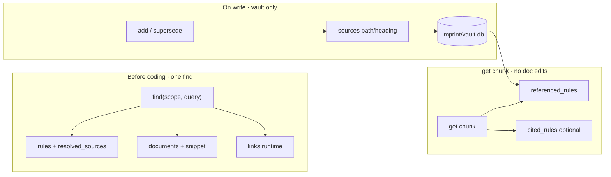

# Shelves

Workspace documentation indexing runs **inside the host** (`imprint up`, or `imprint host serve` for debug) and in **imprint-mcp**.

Shelves builds a **local index over configured directories** so agents **`find` vault imprints and document excerpts in one call**, with optional `sources` links. See [imprint ↔ shelves linking](imprint-shelves-linking.md).

[中文](shelves-builtin.zh.md)

---

## Why shelves (agent perspective)

Each turn, project markdown is available on demand — grep and file reads lack unified ranking, paragraph excerpts, one-shot recall with the vault, and durable links.

| | LLM greps / reads files | shelves |
| --- | --- | --- |
| **With imprint** | Multiple tool calls | One `find` → rules + documents + links |
| **Shape** | Whole files or raw lines | **Chunks** with path, heading, lines, snippet |
| **Ranking** | None unified | BM25 on the same query as vault rules |
| **Durable links** | None | vault `sources` (rule→doc); optional `[[r-…]]` in docs |
| **Cost** | More tokens | Local SQLite index, no embedding API |

Shelves uses **local BM25** over chunked markdown. The win is **integration, structure, locality, and workflow**.



---

## Configuration

In `imprint.yaml`:

```yaml
host:
  listen: 127.0.0.1:9470

shelves:
  enabled: true
  config:
    roots:
      - docs
      - .cursor/rules
    # stateDir: .imprint/state   # optional
```

| Field | Meaning |
| --- | --- |
| `enabled` | When `true`, scan `roots` and serve search. When `false`, stop indexing; cache stays readable. |
| `config.roots` | **Directories to index** (`.md`, `.mdc`, `.txt`), relative to repo root — what shelves **searches** |
| `config.stateDir` | SQLite cache directory. Default: `.imprint/state` (`shelves.db`). |

### Configuring `roots`

- Listed directories: indexed; **`find` with query** returns chunks alongside vault hits.
- Unlisted paths: outside shelves recall (agents can still open files directly).
- **Purpose**: scope the corpus, faster rebuilds, declare which docs to recall before coding.

After changing `roots` or `enabled`, run `imprint up` (or restart `host serve`).

---

## Linking vault imprints via sources

| Direction | Persisted? | Stored in | Edit project markdown? |
| --- | --- | --- | --- |
| imprint → doc | **Yes** | vault `sources` | **No** |
| doc → imprint (reverse) | **Yes** | **Same** — `get chunk` scans vault `sources` → `referenced_rules` | **No** |
| Explicit @ in doc body | Optional | `[[r-…]]` → `cited_rules` | Yes (**optional**) |
| Same-turn `find` | **No** | Response `links` | **No** |

**Default durable bidirectional link: write vault `sources` once.**

- ADD with `sources: [{ path, heading? }]`
- `get r-…` → `resolved_sources`
- `get <chunk>` → `referenced_rules` (reverse from vault, **no doc edits**)

---

## When disabled

`shelves.enabled: false`:

- No scan or rebuild
- `POST /docs/search` → **503**
- MCP `find` with query → **rules only** (no `documents` / `links`)
- `GET /docs/graph`, `/docs/chunks/:id`, `/docs/stats` still read cache

---

## Host API

Default: `http://127.0.0.1:9470`

Handlers time out after **30 seconds** (`503` + `{"error":"timeout"}`) so requests cannot hang indefinitely.

| Method | Path | Notes |
| --- | --- | --- |
| GET | `/health` | Includes `shelves: { enabled, indexed, chunk_count, … }` |
| GET | `/find` | With query + shelves on → rules + documents + links |
| POST | `/docs/search` | `{ query, top_k? }` → `{ hits: [...] }` |
| GET | `/docs/chunks/{id}` | Full chunk + `referenced_rules` + optional `cited_rules` |
| GET | `/docs/graph` | Document structure graph |
| GET | `/docs/stats` | Index metadata |
| POST | `/docs/rebuild` | Force rebuild when enabled |

---

## MCP

Mount **imprint-mcp** only. With shelves enabled and **`find` + query**:

```json
{
  "rules": [{ "id", "resolved_sources": [...], ... }],
  "documents": [{ "id", "path", "heading", "score", "snippet" }],
  "links": [{ "rule_id", "chunk_id", "kind", "score" }]
}
```

Without query, or shelves off: **rules array** only (enriched with `resolved_sources` when rules have `sources`).

`get`: `r-…` → vault record + `resolved_sources`; chunk id → chunk + **`referenced_rules`** (+ `cited_rules` if markdown cites rules).

---

## Desk UI

Desk proxies `/api/docs/*` and `/api/graph/unified` to the host. Three routes — **`/`** (rules graph), **`/docs`** (shelves search), **`/unified`** (rules + files/chunks + `sources` / `cited_by` edges) — each with **its own URL query state** (switching tabs does not carry filters across). Rule detail shows `resolved_sources`; doc chunks show `referenced_rules` / `cited_rules`. **Agents** recall via MCP `find` / `get`; **desk** is for human audit.

---

## See also

| Doc | Topic |
| --- | --- |
| [imprint-shelves-linking.md](imprint-shelves-linking.md) | Link model, storage, agent workflow |
| [mcp.md](mcp.md) | MCP tools and mount |
| [correction.md](correction.md) | When to pass `sources` on add |
