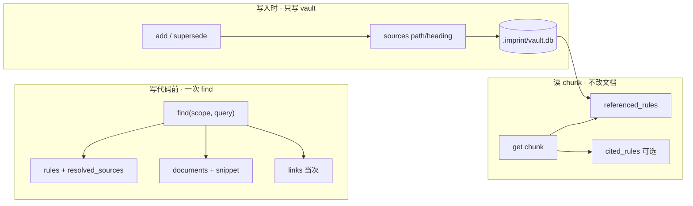

# Shelves

工作区文档索引跑在 **host 进程**（`imprint up` 或调试时 `imprint host serve`）和 **imprint-mcp** 里。

Shelves **在配置的目录里建本地索引**，写代码前一次 `find` 同时召回 vault 里的 imprint 和项目文档段落，并可与 vault 的 `sources` 关联。详见 [imprint ↔ shelves 关联](imprint-shelves-linking.zh.md)。

---

## 为什么需要 shelves（Agent 视角）

项目 markdown 按需读取；grep/读文件缺少统一排序、段落级 excerpt、与 vault 同一次召回、可持久关联。


|                  | 让 LLM 自己翻文件  | shelves                                  |
| ---------------- | ------------ | ---------------------------------------- |
| **与 imprint 协同** | 需多次工具调用      | `find` 一次返回 rules + documents + links    |
| **结果形态**         | 整文件或零散行      | 按标题切 **chunk**，带 path、heading、行号、snippet |
| **排序**           | 无统一 BM25     | 与 vault 规则同一 query 下可对照                  |
| **持久关联**         | 无            | vault `sources`（规则→文档）；可选文档内 `[[r-…]]`   |
| **成本**           | 多读文件、耗 token | 本地 SQLite 索引，无 embedding API             |


Shelves 用 **本地 BM25** 索引分块 markdown。优势在于 **集成、结构化、本地、与 imprint 同流程**。




---


## 配置

在 `imprint.yaml`：

```yaml
host:
  listen: 127.0.0.1:9470

shelves:
  enabled: true
  config:
    roots:
      - docs
      - .cursor/rules
      # - .cursor/skills
    # stateDir: .imprint/state   # 可选
```


| 字段                | 含义                                                          |
| ----------------- | ----------------------------------------------------------- |
| `enabled`         | `true` 时扫描 `roots` 并提供搜索；`false` 时停止索引与搜索，缓存只读保留            |
| `config.roots`    | **要纳入索引的目录**（`.md`、`.mdc`、`.txt`），路径相对仓库根 — **shelves 搜什么** |
| `config.stateDir` | SQLite 缓存目录。默认 `.imprint/state`（`shelves.db`）                   |


### 配置 `roots`

- **列入** `roots` **的目录**：rebuild 后进入 BM25；`find` 带 query 时可与 vault imprint 同屏返回。
- **未列入的路径**：不进 shelves 召回（Agent 仍可用读文件工具单独打开）。
- **用途**：控制索引范围、加快 rebuild、明确写代码前对照哪些文档（如 `docs/`、`.cursor/rules/`）。

改 `roots` 或 `enabled` 后执行 `imprint up`（或重启 `host serve`）。

---


## 与 vault 关联（sources 默认）

关联分 **持久** 与 **临时** 两层：


| 方向               | 持久？   | 写在哪                                                      | 要不要改项目 markdown |
| ---------------- | ----- | -------------------------------------------------------- | --------------- |
| imprint → 文档     | **是** | vault `sources`                                          | **否**           |
| 文档 → imprint（反查） | **是** | **同上** — 读 chunk 时扫 vault `sources` 得 `referenced_rules` | **否**           |
| 文档正文 @ imprint   | 可选    | `[[r-…]]` → shelves `rule_refs` → `cited_rules`          | 是（**可选**，非默认）   |
| 一次 find 内的关系     | **否** | 响应 `links`                                               | **否**           |


**持久双向关联的默认做法：只写 vault** `sources` **一次。**

- 智能体 **新增** 时：`sources: [{ path: "docs/foo.md", heading: "..." }]`
- `get r-…` → `resolved_sources`（imprint → 文档）
- `get <chunk>` → `referenced_rules`（文档 → imprint，**从 vault 反查，不改文档**）

`[[r-…]]` 供维护者在 markdown 里显式 @ imprint 时使用；与 `referenced_rules` 可并存，可选。

---


## 禁用时

`shelves.enabled: false`：

- 不扫描、不 rebuild
- `POST /docs/search` → **503**
- MCP `find` 带 query 时只返回规则（无 `documents` / `links`）
- `GET /docs/graph`、`/docs/chunks/:id`、`/docs/stats` 仍可读磁盘缓存

---


## Host API

默认：`http://127.0.0.1:9470`

Handler 默认 **30 秒**超时（`503` + `{"error":"timeout"}`），请求不会无限 hang。


| 方法   | 路径                  | 说明                                                        |
| ---- | ------------------- | --------------------------------------------------------- |
| GET  | `/health`           | 含 `shelves: { enabled, indexed, chunk_count, … }`         |
| GET  | `/find`             | 与 MCP 类似；带 query 且 shelves 开时返回 rules + documents + links |
| POST | `/docs/search`      | `{ query, top_k? }` → `{ hits: [...] }`                   |
| GET  | `/docs/chunks/{id}` | chunk 全文 + `referenced_rules` + 可选 `cited_rules`          |
| GET  | `/docs/graph`       | 文档结构图                                                     |
| GET  | `/docs/stats`       | 索引元数据                                                     |
| POST | `/docs/rebuild`     | enabled 时强制 rebuild                                       |


---


## MCP

只挂 **imprint-mcp**。shelves 启用且 `find` **带 query** 时，响应示例：

```json
{
  "rules": [
    {
      "id": "r-2026-09-16-003",
      "title": "...",
      "scope": ["python", "naming"],
      "confidence": 0.85,
      "score": 0.92,
      "sources": [{ "path": "docs/correction.md" }],
      "resolved_sources": [
        {
          "path": "docs/correction.md",
          "heading": "Naming",
          "chunk_id": "a1b2c3d4...",
          "snippet": "..."
        }
      ]
    }
  ],
  "documents": [
    { "id", "path", "heading", "score", "snippet" }
  ],
  "links": [
    { "rule_id", "chunk_id", "kind": "sources|cited_by|co_search", "score" }
  ]
}
```

- 默认 MCP `find` 为紧凑形状：规则只返回 claim/计数，不内联 evidence；文档 snippet 约 300 字。`full:true` 仅审计，才可能带 source 正文。
- **无 query** 或 shelves 禁用：仅紧凑 **rules**。
- `get`：规则默认折叠 evidence 与来源正文，只给指针和 `evidence_count`。`include_evidence:true` 展开最近证据（`evidence_limit` 默认 3）；`full:true` 仅审计。chunk id → 文档 chunk + `referenced_rules`（+ `cited_rules` 若正文含 `[[r-…]]`）。

Agent 约定见 `imprint init` 写入的编辑器规则与 [correction.zh.md](correction.zh.md)。

---


## Desk UI

desk 将 `/api/docs/*`、`/api/graph/unified` 代理到 host。三个独立路由 — `/`（规则图）、 `/docs`（shelves 搜索）、 `/unified`（规则 + 文件/chunk + `sources` / `cited_by` 边）— **各自维护 URL 查询参数**，切换标签不会把筛选条件带过去。规则详情展示 `resolved_sources`；文档 chunk 展示 `referenced_rules` / `cited_rules`。**Agent 主路径仍是 MCP** `find` **/** `get`。

---


## 相关文档


| 文档                                                             | 内容                          |
| -------------------------------------------------------------- | --------------------------- |
| [imprint-shelves-linking.zh.md](imprint-shelves-linking.zh.md) | 关联模型、存储位置、Agent 工作流         |
| [mcp.zh.md](mcp.zh.md)                                         | MCP 工具与挂载                   |
| [correction.zh.md](correction.zh.md)                           | 新增 / 强化 / 替换 与 `sources` 时机 |


