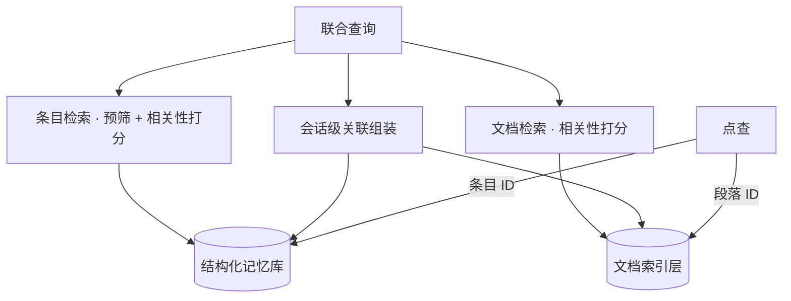
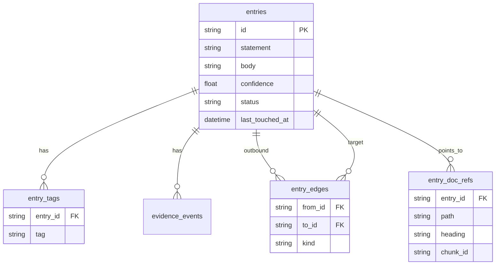
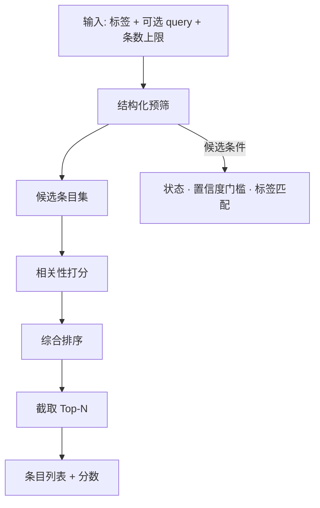
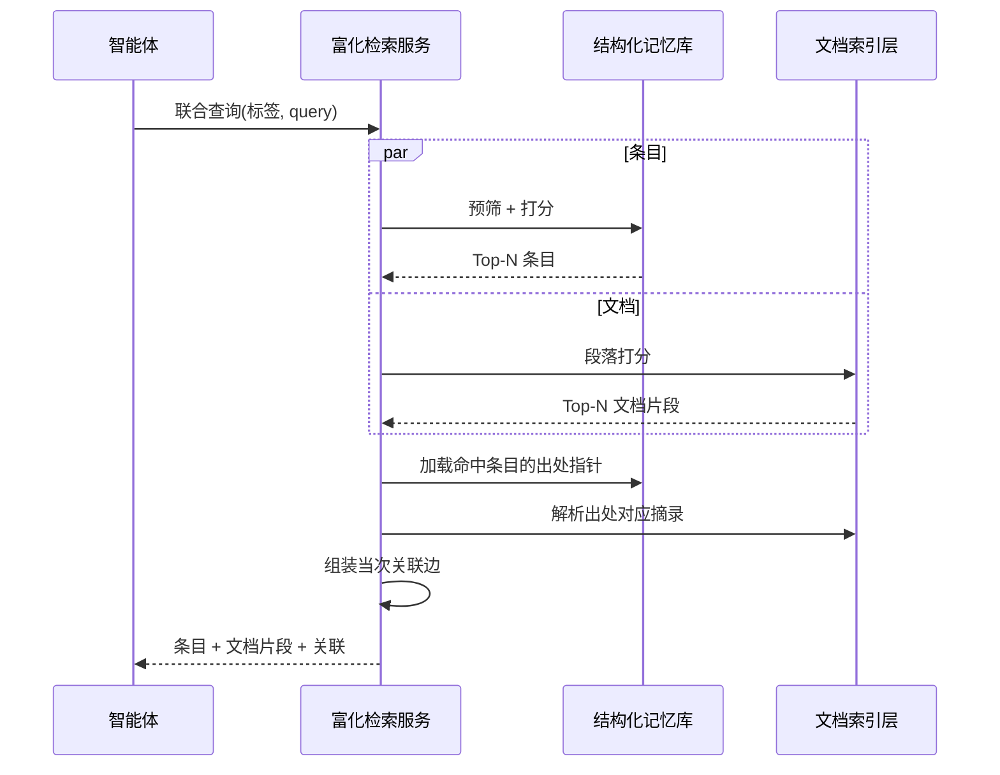
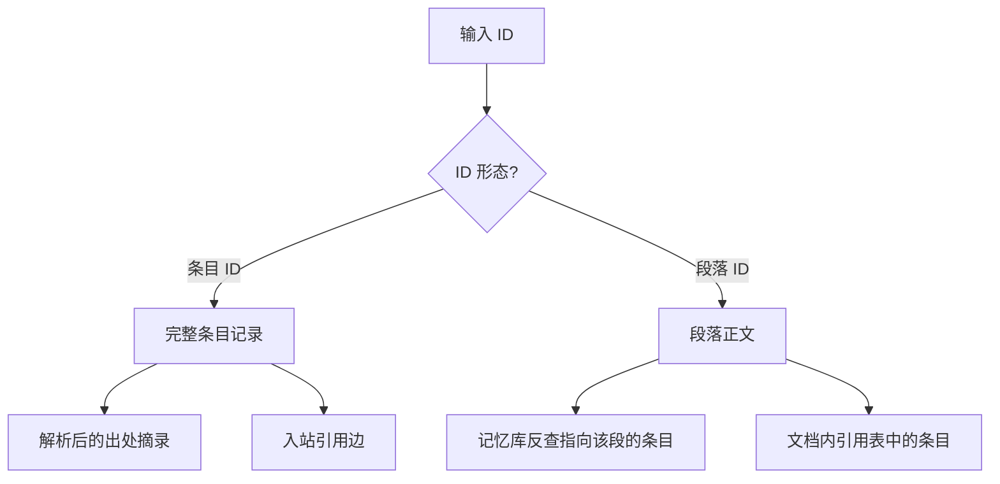
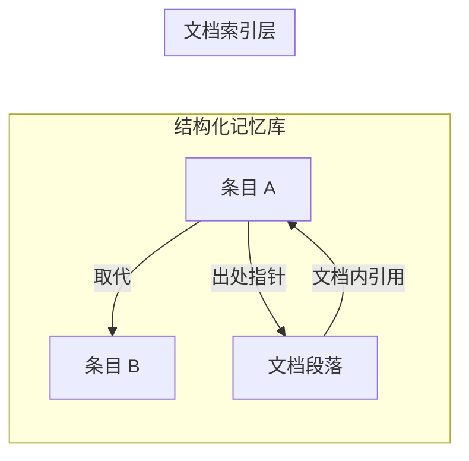
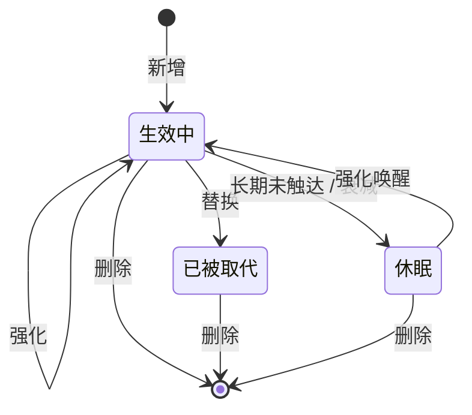

# 智能体记忆系统：数据存储与检索技术说明

> **文档性质：** 架构与方案设计，非已实现产品的参数手册。文中算法、阈值、默认值均为**设计选项**，落地时需按场景标定。

本文描述一种面向 AI 智能体的**双库记忆架构**——**结构化记忆库**与**文档索引层**分离存储、读时合并。侧重存储模型、索引流水线、检索算法与关联机制，不涉及具体产品实现代码。

### 术语对照

| 通用概念 | 职责 |
| --- | --- |
| **结构化记忆库** | 持久化可审计的偏好 / 政策条目（短文本、标签、置信度、条目间关系、指向文档的出处指针） |
| **文档索引层** | 对工作区 Markdown 分块、全文检索、维护文档→条目的反向引用 |
| **出处指针** | 条目上记录的文档路径 / 章节 / 段落标识，用于读时解析摘录 |
| **检索共现** | 同一次查询中条目与文档片段同时命中，仅当次返回，不写入持久存储 |

---

## 1. 总体架构

系统解决两类信息的不同生命周期：

| 存储层 | 存什么 | 典型内容 | 持久化介质（候选） |
| --- | --- | --- | --- |
| **结构化记忆库** | 结构化、可审计的「偏好 / 政策」 | 策略陈述、用户原话依据、置信度、分类标签、条目间关系、条目→文档出处指针 | 嵌入式关系库单文件 |
| **文档索引层** | 工作区 Markdown 的可搜索切片 | 按标题与行数切分的段落（chunk）、全文检索索引、文档→条目引用 | 缓存库 + 内存语料 |

**存储与写入**（两库独立构建，写入路径互不触发）：

**读取与联合检索**（读时合并两库，跨库关联在检索服务内组装）：

**设计原则**

- **条目短、文档长**：结构化记忆库只存策略陈述 + 依据摘要 + 可选文档指针；长文留在项目 Markdown，由文档索引层索引。
- **显式关联优先**：持久关联靠记忆库中的**出处指针**与文档正文中的**内联条目引用标记**；**检索共现**仅作会话辅助，不写回库。
- **接口分层**：轻量本地接口直读写记忆库；协议化服务在文档索引启用时**富化**检索结果（文档片段、解析摘录、当次关联边）。

---

## 2. 结构化记忆库

### 2.1 逻辑数据模型

每条**记忆条目（Entry）**是结构化记忆的最小单元：

| 字段组 | 含义 |
| --- | --- |
| 标识 | 稳定、可读的条目 ID（如日期序列表） |
| 核心内容 | 策略陈述（可执行声明）、可选扩展正文 |
| 分类 | 标签列表——检索时可采用 **AND** 语义（需在设计中明确） |
| 可信度 | 浮点置信度，有上下界；新增时可赋初值，强化/衰减时调整 |
| 状态 | 生效中 / 休眠 / 已被取代 |
| 审计 | 依据事件链（首次写入、强化、取代等） |
| 文档出处 | 路径 + 可选章节标题 + 可选段落 ID |
| 条目关系 | 出站：取代、相关、冲突；入站「被引用」读时计算 |

### 2.2 物理表结构（概念）

**存储策略（设计取向）**

- 标量字段落在条目主表；标签、边、出处、依据为**子表**。
- 全量更新条目时，子表可先删后插；强化操作可仅追加依据行 + 更新标量。
- 嵌入式单写连接，适合单进程智能体场景。

### 2.3 索引与预筛

| 索引对象 | 用途 |
| --- | --- |
| 条目状态 | 快速过滤生效中 / 休眠 / 已被取代 |
| 最后触达时间 | 列表按时间、定期衰减 |
| 标签 | **标签 AND** 预筛：条目须同时拥有查询要求的全部标签 |
| 出处路径 / 段落 ID | 文档反向查条目、点查时解析出处 |

**标签 AND 语义**：若采用 AND，请求多个标签时条目必须全部命中，而非 OR。

---

## 3. 文档索引层

### 3.1 配置与扫描范围

| 配置项 | 说明 |
| --- | --- |
| 是否启用 | 可选模块；关闭时仅使用结构化记忆库 |
| 扫描根目录 | 限定索引目录树，控制语料规模与 rebuild 成本 |
| 缓存目录 | 存放索引持久化缓存 |

**纳入索引的文件类型**：Markdown 及同类纯文本。隐藏目录是否跳过、根目录是否例外——实现时约定即可。

### 3.2 增量重建（指纹）

**指纹算法（候选）**：对每个待索引文件聚合 `相对路径 : 大小 : 修改时间` 的哈希。指纹未变且缓存有效则**跳过全量重建**。

**注意**：结构化记忆库写入**不应**隐式触发文档索引重建；文档变更或显式重建指令才更新索引。

### 3.3 分块（Chunking）策略

1. 按行读取 Markdown。
2. 遇到标题行：结束当前 buffer，以新标题开启 section。
3. 同一 section 内：按**可配置行数上限**或 section 边界 flush 为一个 chunk。
4. 无显式标题时，可用文件名作为 section 标题。
5. 空 buffer 丢弃。

**段落 ID（候选）**：对 `路径 + 起始行 + 结束行 + 标题` 做内容哈希。**路径与行范围不变则 ID 应稳定**；内容微调导致行号变化时 ID 可能轮换，故持久关联优先用**路径 + 章节标题**，段落 ID 为可选精度。

### 3.4 文档 → 条目引用（文档侧持久边）

重建时对每个 chunk 扫描固定格式的**内联条目引用标记**，写入引用表。这是**文档侧持久边**，与记忆库中的**出处指针**方向相反、可并存。

### 3.5 内存模型

索引加载后将 chunk 与引用关系载入内存；**文档检索可在内存语料上扫描**，避免每次查询依赖数据库全文扩展。适合扫描根目录可控、语料规模中等的场景。

---

## 4. 条目检索流水线

### 4.1 整体流程

### 4.2 结构化预筛

在进入相关性打分前缩小语料，典型维度：

- **状态**：检索场景通常仅保留生效中条目；
- **置信度门槛**：低于阈值的条目不参与召回（阈值待定）；
- **标签**：若启用 AND，保证全部标签命中。

### 4.3 相关性打分（条目侧）

**候选算法：** 经典 BM25 或同等轻量词频模型；参数（k1、b）与字段权重**实现时标定**。

**字段加权（设计思路）**——陈述与标签权重大于扩展正文：

| 字段 | 相对权重（示意） |
| --- | --- |
| 策略陈述 | 高 |
| 分类标签 | 中高 |
| 依据原文 | 中 |
| 扩展正文 | 基准 |

**分词（需支持中英混合）**

- 拉丁文：词元化、大小写归一；
- 中文：字 / 二元组等无空格语言策略。

**兜底**：query 子串命中时可给予部分匹配分，避免分词失败导致零召回。

**归一化**：将原始分映射到可比区间，便于与置信度、标签匹配度混合。

### 4.4 综合排序

| 输入组合 | 策略（示意） |
| --- | --- |
| 标签 + query | 标签匹配度与 query 分加权混合，再与置信度融合 |
| 仅标签 | 标签匹配比例与置信度融合 |
| 仅 query | query 分与置信度融合 |
| 皆无 | 以置信度或时间序为主 |

**硬过滤**：标签未满足 AND 或 query 分为零时可剔除，避免噪声进入 Top-N。

---

## 5. 文档检索与联合查询

### 5.1 文档侧打分

当文档索引层已启用且 query 非空：

- 对 chunk 的「标题 + 正文」做与条目侧一致或独立调参的相关性打分；
- 返回段落 ID、路径、标题、分数、**摘要片段**（长度可配置）。

**文档不受条目标签约束**——标签仅过滤结构化记忆库。

### 5.2 协议层合并检索

**无 query 时**：可仅返回条目；若条目带出处指针，仍可尝试附加**解析后的出处摘录**（需文档索引已加载）。

**轻量本地查询**：可仅访问结构化记忆库，不返回文档片段与当次关联。

### 5.3 出处解析

对每个条目上的文档指针：

1. 若有段落 ID → 在索引中精确查找；
2. 否则路径 + 章节标题精确匹配，再尝试标题子串；
3. 索引未覆盖 → 标记「超出索引范围」；
4. 段落 ID 已失效 → 回退路径/标题。

---

## 6. 点查与列表

### 6.1 点查分流

| 查询类型 | 返回增强 |
| --- | --- |
| 条目 | 出站关系 + 入站被引用 + 解析后的文档摘录 |
| 段落 | 出处指针指向该段的条目 + 文档内引用标记 |

### 6.2 列表过滤

可对**全状态**条目做内存过滤（与「检索」不同：检索通常有更窄的状态/置信度策略）：

| 过滤器 | 行为 |
| --- | --- |
| 状态 | 精确匹配 |
| 标签 | AND（若启用） |
| 最低置信度 | 下限 |
| 时间下限 | 最后触达之后 |
| query | 相关性分 > 0 |
| 条数上限 | 截断 |

---

## 7. 关联模型

### 7.1 持久关联

| 类型 | 方向 | 存储位置 | 产生方式 |
| --- | --- | --- | --- |
| 取代 / 相关 / 冲突 | 条目 → 条目 | 记忆库边表 | 替换 / 维护 |
| 被引用（条目间） | 反向 | 读时计算 | 自动 |
| 出处指针 | 条目 → 文档 | 记忆库出处表 | 新增 / 替换时写入 |
| 反向出处 | 文档 → 条目 | 记忆库反查 | 自动 |
| 文档内引用 | 文档 → 条目 | 索引层引用表 | 正文标记 + 重建 |

### 7.2 会话级关联（一次查询返回，不持久）

| 类型 | 含义 |
| --- | --- |
| 出处命中 | 条目出处指针指向本次命中的段落，或记忆库反查命中 |
| 文档引用命中 | 段落正文引用某条条目 |
| 检索共现 | 同 query 下条目 Top-N 与文档 Top-N 的组合，排除已有出处/引用关系的对 |

**检索共现仅辅助判断**，不应视为已建立的持久关联。

---

## 8. 写入生命周期

| 操作 | 设计意图 |
| --- | --- |
| **新增** | 生成 ID；状态=生效中；赋初值置信度；写入首次依据；可选出处指针与出站边 |
| **强化** | 提高置信度；强化计数递增；可将休眠唤醒；追加依据 |
| **替换** | 旧条目标记已被取代；新条目生效并带取代边；宜**继承**旧出处指针（可覆盖） |
| **删除** | 剥离入站边；级联删除条目及子表 |
| **定期衰减** | 长期未触达条目降低置信度；低于阈值可转入休眠 |

置信度初值、强化步长、上限、衰减周期与休眠阈值——均属**待定策略参数**，见 §12。

---

## 9. 统一关联图（审计视图）

可视化服务可组合三类图：

| 图层 | 节点 | 边 |
| --- | --- | --- |
| 条目关系图 | 记忆条目 | 取代 / 相关 / 冲突 |
| 文档层次图 | 目录 → 文件 → 段落 | 同文件相邻段落的顺序边 |
| 跨库统一图 | 上述合并 | 出处指针（条目→段落）、文档内引用（段落→条目） |

用于人工审计条目链与文档引用是否一致，**不参与自动召回排序**。

---

## 10. 性能与权衡

| 技术点 | 策略 | 利弊 |
| --- | --- | --- |
| 标签 AND | 结构化预筛 + 排序阶段二次校验 | 缩小打分语料；语义严格 |
| 条目打分 | 对预筛结果在内存中建索引或扫描 | 语料小则快；条目量大时需依赖标签 |
| 文档打分 | 全 chunk 内存扫描 | 实现简单；扫描根目录过大则变慢 |
| 指纹跳过重建 | 文件元数据聚合哈希 | 避免无变更时重复分块 |
| 单写嵌入式库 | 每库单连接 | 嵌入友好；无并发写扩展 |
| 无向量嵌入 | 词频模型（如 BM25） | 零外部 API 成本；语义近邻弱于 embedding |
| 当次关联 | 有界 Top-N × Top-N | 控制计算量 |
| 段落 ID | 内容寻址 + 路径回退 | ID 随行号变；路径/标题更耐久 |

**典型瓶颈**：扫描根目录过大 → 重建与文档检索变慢；生效中条目过多且标签为空 → 条目侧语料膨胀。设计上宜鼓励**窄标签**控制召回面。

---

## 11. 能力矩阵（接口层对比）

| 能力 | 富化检索 + 文档索引 | 轻量本地接口 |
| --- | --- | --- |
| 写条目 + 出处指针 | 预期支持 | 预期支持 |
| 联合查询含文档片段 + 当次关联 | 预期支持（通常需 query） | 仅条目 |
| 点查解析出处摘录 | 预期支持 | 记忆库字段 |
| 点查段落 + 反向条目 | 预期支持 | 可不支持 |
| 统一关联图 | 可视化服务 | 可视化服务 |

---

## 12. 待定设计参数

下列项在方案阶段**仅列出维度**，具体取值留待原型验证与用户场景标定：

| 维度 | 说明 |
| --- | --- |
| 置信度初值 | 新增条目时的起始可信度 |
| 置信度上下界 | 强化上限、检索/休眠下限 |
| 强化步长 | 每次「再次确认」的增量 |
| 检索 Top-N | 单次返回条目/文档条数上限 |
| 衰减策略 | 未触达时间窗口、每次衰减幅度、转入休眠的阈值 |
| 分块行数上限 | 单 chunk 最大行数 |
| 摘要片段长度 | 返回给智能体的 excerpt 上限 |
| BM25（或同类）参数 | k1、b、字段权重 |
| 排序混合权重 | 标签匹配、query 分、置信度的比例 |

---

## 参考：本仓库实现文档

若需对照某一开源实现的命名与接口，见：

- [文档索引配置](shelves-builtin.zh.md)
- [条目与文档关联设计](imprint-shelves-linking.zh.md)
- [记忆写入循环](correction.zh.md)
- [协议化接口挂载](mcp.zh.md)
