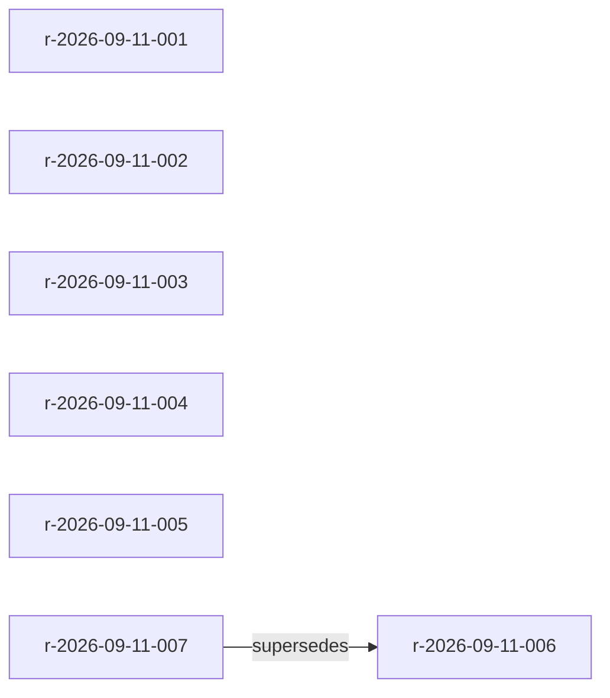

# imprint MCP 调试记录

日期：2026-09-11  
二进制：`./imprint` 1.0.0（构建于本次调试前，`CGO_ENABLED=0`）  
Vault：`./memory/`  
协议：MCP JSON-RPC 2.0 / NDJSON stdio（`imprint mcp`）  
请求脚本：[`mcp_requests.jsonl`](mcp_requests.jsonl) · 复现：`bash tests/mcp_smoke.sh`（写入 `tests/mcpvault/`，不碰 `./memory/`）  
原始应答：[`mcp_responses.jsonl`](mcp_responses.jsonl)

## 1. 环境与接入方式

本会话里 Cursor 注入的 MCP 命名空间只有 `cursor` / `cursor-ide-browser` / `plugin-figma-figma` / `user-excel` / `user-browser-tools` / `user-Playwright`，**没有 imprint 工具**。

原因：

| 现象 | 说明 |
|---|---|
| 终端前台跑 `./imprint mcp` | 进程在等 stdin，**不会**挂到 Cursor Agent |
| `~/.cursor/mcp.json` | 只有 excel / browser-tools / Playwright |
| 项目级配置此前缺失 | Agent 看不到 `imprint_*` |

已补上项目配置，重载 MCP 后 Agent 应能直接调工具：

- [`.cursor/mcp.json`](../.cursor/mcp.json) — stdio server，`--vault` 指向 `./memory`
- [`.cursor/rules/imprint-memory.mdc`](../.cursor/rules/imprint-memory.mdc) — `alwaysApply: true`，要求按 scope find、gatekeeper 四分类后再写

调试数据全部通过 **MCP 工具调用** 写入（同一套 `imprint mcp` 实现），再用 CLI `--json` 交叉验证。

## 2. 握手

| id | method | 结果 |
|---|---|---|
| 1 | `initialize` | `protocolVersion=2024-11-05`，`serverInfo={name:imprint, version:1.0.0}` |
| — | `notifications/initialized` | 无响应（通知） |
| 2 | `ping` | `{}` |
| 3 | `tools/list` | **10** 个工具，与 PROMPT.md §21 同名 |

工具列表：`imprint_add` `imprint_find` `imprint_reinforce` `imprint_supersede` `imprint_forget` `imprint_list` `imprint_get` `imprint_sweep` `imprint_show` `imprint_viz`

20 条 RPC 全部 `isError=false`，无 JSON-RPC `error`。

## 3. 写入的规则（用户明确说过的项目决策）

| id | 分类 | claim | scope | conf | 证据 |
|---|---|---|---|---|---|
| r-2026-09-11-001 | ADD → REINFORCE | Go only，不要 Python 包装 | `go`, `proj:imprint` | 0.90 → **0.95** | 「没有Python代码，纯Go」 |
| r-2026-09-11-002 | ADD | `CGO_ENABLED=0` 静态二进制 | `go`, `build` | 0.85 | Go static binary, zero runtime |
| r-2026-09-11-003 | ADD | 多规则打进 imprint-NNNN.md 分片 | `imprint`, `storage` | 0.85 | portable packed markdown |
| r-2026-09-11-004 | ADD | CLI 不用 Cobra | `go`, `cli` | 0.80 | 标准库解析 flags |
| r-2026-09-11-005 | ADD | 对外只叫 imprint | `git`, `branding` | 0.70 | always call it imprint |
| r-2026-09-11-006 | ADD → SUPERSEDE | Go unexported camelCase | `go`, `naming` | 0.60 | 已归档 |
| r-2026-09-11-007 | SUPERSEDE 新生 | exported PascalCase / unexported camelCase | `go`, `naming` | 0.60 | `supersedes: [r-2026-09-11-006]` |

契约核对：

- `imprint_add` → `{id, confidence, path}`（`path` 是分片文件 `imprint-NNNN.md`，不是一规则一文件）
- `imprint_reinforce` → `{id, confidence, reinforcement_count}`（001：count=1，conf 封顶 0.95）
- `imprint_supersede` → `{id: r-2026-09-11-007, superseded_old_id: r-2026-09-11-006}`
- 006 从活跃分片挪到 `archive/imprint-0001.md`，`status=superseded`

## 4. 召回

MCP `imprint_find(scope=["go"])`（reinforce / supersede 之前）命中 001、002、004、006，**不含** 003（scope 无 `go`）。AND 语义：`["go","naming"]` 只命中 006。

supersede 之后 CLI 交叉验证：

```json
[{"id":"r-2026-09-11-007","title":"Go exported names use PascalCase; unexported names use camelCase","scope":["go","naming"],"confidence":0.6,"score":0.96}]
```

006 不再被 find 召回（superseded + archive）。`imprint_sweep` 返回 `{decayed:0, archived:0}`（全部刚写入）。

## 5. 可观测性

- `imprint_get r-2026-09-11-001`：`evidence_log` 含 `original` + `reinforce` 两条。
- `imprint_list status=active`：6 条 active（不含 006）。
- `imprint_list status=superseded`：仅 006。
- `imprint_viz format=mermaid include_archived=true`：7 节点，边 `007 -- supersedes --> 006`。
- `imprint_viz format=html`：`tests/mcpvault/dashboard.html`（20053 bytes，7 rules）。活跃规则在 `imprint-0001.md`，006 在 `archive/imprint-0001.md`。



## 6. 问题与后续

1. **Cursor 未挂上 imprint MCP**（本 Agent 会话）。不要在终端里空跑 `./imprint mcp`；用 [`.cursor/mcp.json`](../.cursor/mcp.json) 后在 Cursor Settings → MCP 重载。重载成功时工具名应为 `imprint_add` 等。
2. **当前磁盘上的 `./imprint` 早于 timestamp truncate 提交**，frontmatter 仍带纳秒。`make build` 后再写会变成整秒 RFC3339。
3. **文件权限 `0600`**：`os.WriteFile(..., 0644)` 仍受 umask `0077` 影响。若希望 vault 对其他进程可读，write 后应 `chmod 0644`。
4. **NDJSON 本测通过**；LSP `Content-Length` 帧在 `internal/mcp` 单测里覆盖，本次 smoke 未再打一遍。
5. Vault 在 `.gitignore` 的 `/memory/` 下，规则写在 `imprint-NNNN.md` 分片里，不进 git；只把协议与调试记录留在仓库。
6. **分片打包**（2026-09-11 后）：多条规则写进同一个 `imprint-0001.md`，满 32768 行或 1 MiB 再开新文件。旧的 `r-YYYY-MM-DD-NNN.md` 在 `Open` 时自动合并。`tests/mcp_smoke.sh` 打到 `tests/mcpvault/`（gitignore），不再写 `./memory/`。

## 7. 复现

```bash
make build
bash tests/mcp_smoke.sh
./imprint --vault ./memory list
./imprint --vault ./memory find --scope go,naming
```

Agent 侧：启用项目 MCP 后，先 `imprint_find(scope=["go"])`，再按 [`.cursor/rules/imprint-memory.mdc`](../.cursor/rules/imprint-memory.mdc) 决定是否写入。
